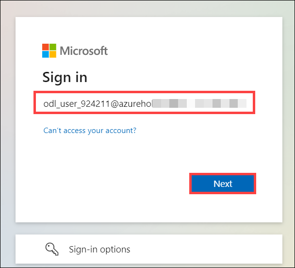
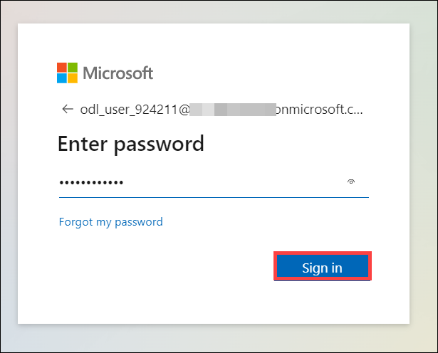
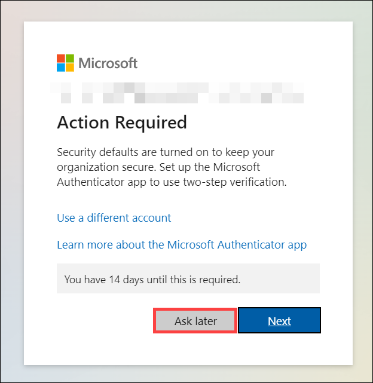
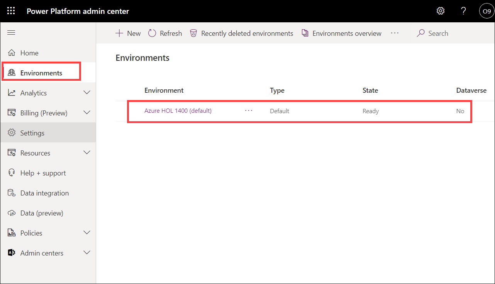
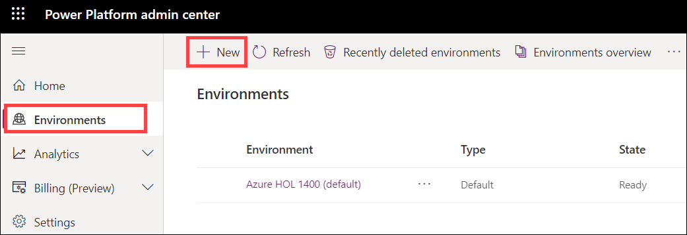
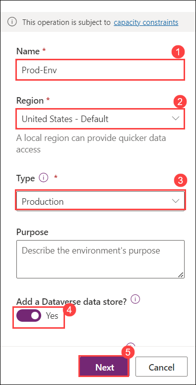
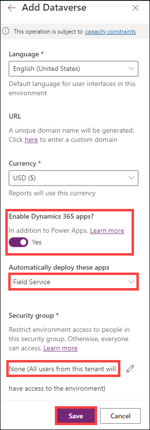

# Practice Lab - Setup Dynamics 365 for Field Service

## Scenario

Worldwide Industries (WWI) provides IT and networking services to its customers. Their services range from phone system and network installations to telephoning systems and security system installations. They are going to be leveraging Dynamics 365 for Field Service for the installation and servicing of these systems for their customers. You are the system implementor that has been tasked with configuring the application to support the rollout of the application. You will be adding and configuring some products that can be installed and setting up skills and characteristics that will be used as part of the implementation.

In this practice lab, you will validate and set up your tenant.

## Exercise 1 - Access the Dynamics 365 application

### Task 1 – Log in to the Power Platform admin center

1. Access <https://admin.powerplatform.microsoft.com> 

1. Enter your username and password, which can be found under the environment details tab.

    

    

1. On the **Action Required** page, select **Ask Later**. and select **No** on the **Stay Signed in** page.

    

    

1. Feel free to explore the Power Platform admin center but **do not make any changes.**

### Task 2 – Create a Dynamics 365 Environment

1. On the Power Platform admin center, On the navigation pane, select **Environments**. Now on the environments page, you will see a **default environment present**. Do not **use**, **modify** or **delete** the **default** environment.

    

1. Now to create a new environment, select **+ New**.

    

1. On the **new environment** page, specify the following settings and click on **save**:

    |Setting|Value|
    |---|---|
    |Name|**Prod-Env**|
    |Region|**United States**|
    |Type|**Production**|
    |Add a Dataverse data store?|**Enabled** and select Next|

    

    |Setting|Value|
    |---|---|
    |Enable Dynamics 365 apps?|**Enabled**| 
    |Automatically Deploy these apps| Select **Field Service** from the dropdown|
    |Security group|click on **+ Select** and select the **None** option from the list and click on **Done**|

    
   
> **Note**: Wait for the Environment to get ready before you continue with this lab.

### Task 3 – Access the Dynamics 365 application

1. On the Power Platform admin center, select the **Prod-Env** environment.

1. Select the **Open** located on the command bar.

1. From the list of available Dynamics 365 apps, select the **Field Service** app.

    

1. Spend a few minutes exploring the application.

> **Result:** You have successfully created your Dynamics 365 environment. 

