# Practice Lab 1 - Configure Dynamics 365 Field Service

## Scenario

Worldwide Industries (WWI) provides IT and networking services to their customers. Their services range from phone system and network installations to telephoning systems and security system installations. They are going to be leveraging Dynamics 365 for Field Service for installation and servicing of these systems for their customers. You are the system implementor that has been tasked with configuring the application to support the rollout of the application. You will be adding and configuring some products that can be installed and setting up skills and characteristics that will be used as part of the implementation.

   >Note: The **[DeploymentId]/[DID] can be found under the environment details tab in the user name (example: `odl_user_xxxxxx.onmicrosoft.com`) **xxxxxx** is the [DeploymentID]**.

## Exercise 1 – Map Configuration

### Task 1 - Enable Bing Maps to use with Resource Scheduling

To ensure that you are able to take full advantage of the full scheduling and mapping capabilities available with Field Service, you need to ensure that it is configured to use a mapping provider. Bing Maps is the default map provider, but additional providers could be enabled.  We will be using Bing Maps.

1. In the **Dynamics 365 Field Service app**, click the **Service (1)** area in the bottom-left of the sitemap, and select **Resources (2)** from the list. 

    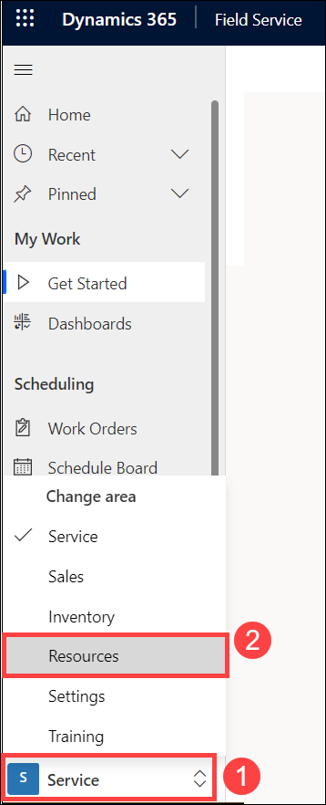

1. In the **Administration** group select **Scheduling Parameters (1)** and open the **Resource Scheduling (2)** record.

    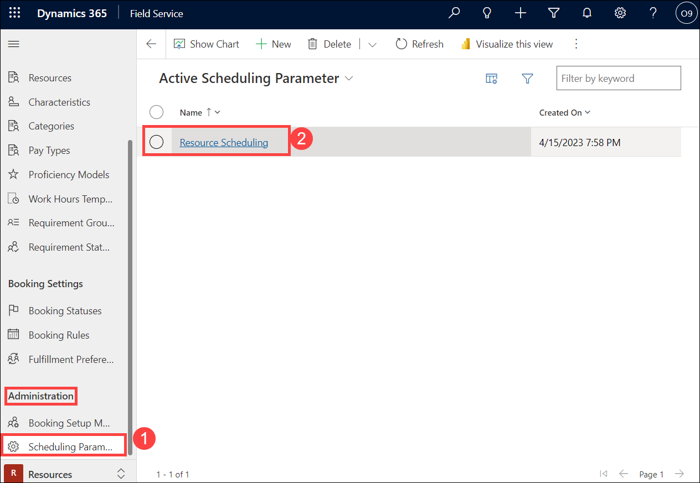

1. Locate the **Connect to Maps** field. This should be set to **Yes**.

1. If **Connect to Maps** is set to **No**, set it to **Yes** and click **OK** from the popup.

1. Click **Save and Close**.

## Exercise 2 - Configure Territories

In this exercise, you will adding territories that will be used when scheduling resources and work orders.

### Task 1 - Define Territories

1. In the **Dynamics 365 Field Service app**, click the bottom-left of the sitemap (1) and select **Settings (2)** from the list.

    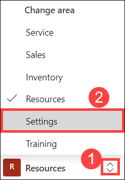

1. On the **Settings** page, in the **General** group select **Territories (1)**.

1. Click **+ New (2)** located on the command bar.

    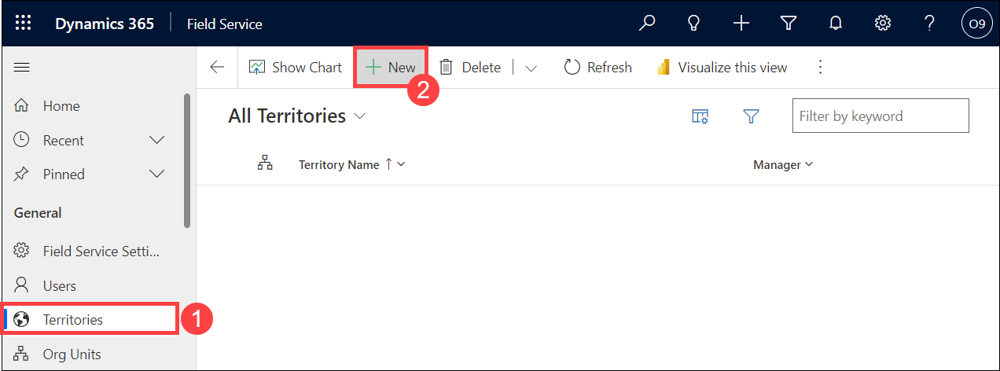

1. Enter **odl_user_DID_North** for **Territory Name** and click **Save**. Click **+ New**.

1. Enter **odl_user_DID_South** for **Territory Name** and click **Save**. Click **+ New**.

1. Enter **odl_user_DID_East** for **Territory Name** and click **Save**. Click **+ New**.

1. Enter **odl_user_DID_West** for **Territory Name** and click **Save & Close**.

1. You will now have four Territories with your prefix.

    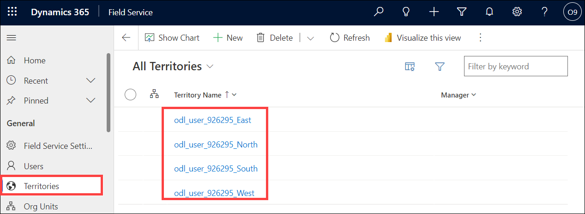

   >Note: The **[DeploymentId]/[DID] can be found under the environment details tab in the user name (example: `odl_user_xxxxxx.onmicrosoft.com`) **xxxxxx** is the [DeploymentID]**.

## Exercise 3 - Create Products

In this exercise, you will adding products and services for use on work orders and add them to the price list.

### Task 1 - Add Inventory Product

1. In the **Dynamics 365 Field Service app**, click the bottom-left of the sitemap and select **Settings (1)** from the list.

1. On the **Settings** page, in the **General** group select **Products (2)**.

1. Click **Add Product(3)**.

    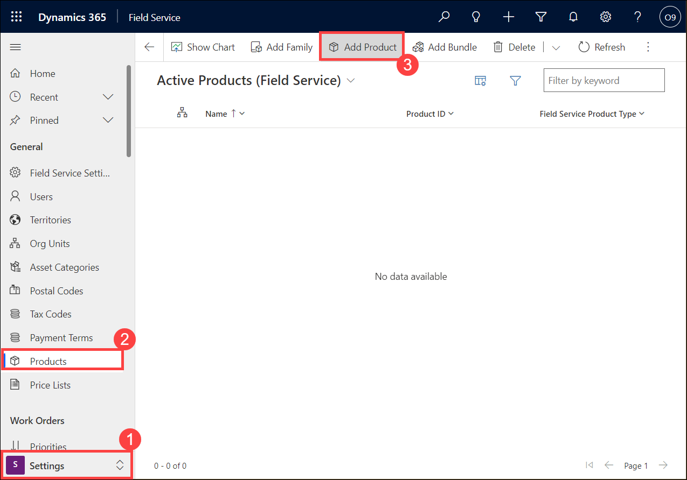

1. Enter **odl_user_DID_Remote_Printer** for **Name**.

1. Enter **odl_user_DID_Print-Serv-1234** for **Product ID**.

1. Select **Default Unit** for **Unit Group**.

1. Select **Primary Unit** for **Default Unit**.

1. Set **Decimals Supported** to **2**.

    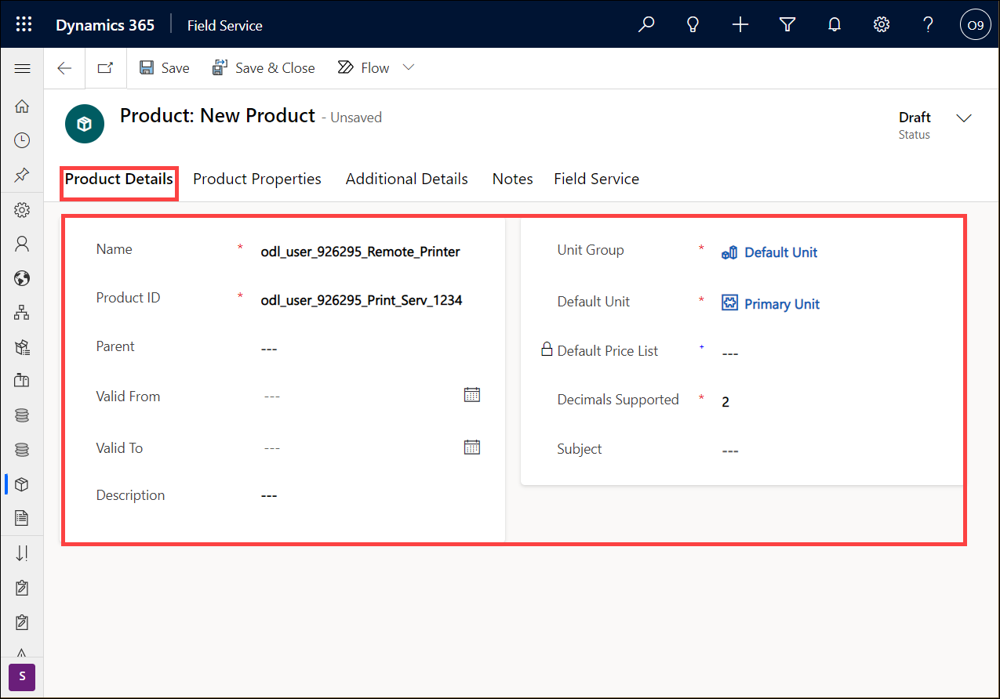

1. Select the **Field Service (1)** tab.

1. Set **Field Service Product Type** to **Inventory (2)**.

1. Click **Save**. (You may see a warning that a default price list has not been set. You can ignore this.)

1. Click **Publish** and click **Confirm** from the popup.

1. Click **Save & Close(3)**

    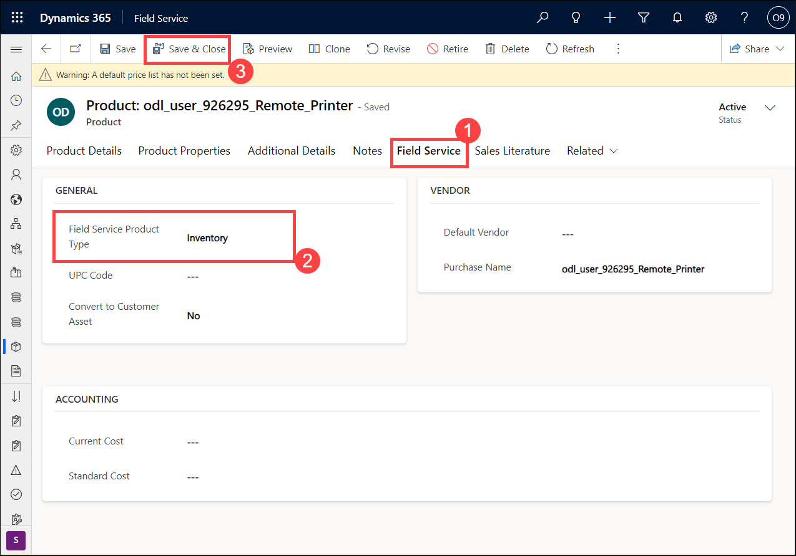

### Task 2 - Add Non-Inventory Product

1. Click **Add Product**.

1. Enter **odl_user_DID_Monthly_Printer_Maintenance** for **Name (1)**.

1. Enter **odl_user_DID_Print-Maint** for **Product ID (2)**.

1. Select **Default Unit** for **Unit Group (3)**.

1. Select **Primary Unit** for **Default Unit (4)**.

1. Set **Decimals Supported (5)** to **2**.

    

1. Select the **Field Service** tab.

1. Set **Field Service Product Type (1)** to **Non-Inventory**.

1. Click **Save (2)**. (You may see a warning that a default price list has not been set. You can ignore this.)

1. Click **Publish (3)** and click **Confirm** from the popup.

1. Click **Save & Close (4)**

    

### Task 3 - Add Service Product

1. Click **Add Product**.

1. Enter **odl_user_DID_Printer_Service_Fee** for **Name (1)**.

1. Enter **odl_user_DID_Printer_Service_Fee** for **Product ID (2)**.

1. Select **Default Unit** for **Unit Group (3)**.

1. Select **Primary Unit** for **Default Unit (4)**.

1. Set **Decimals Supported** to **2 (5)**.

    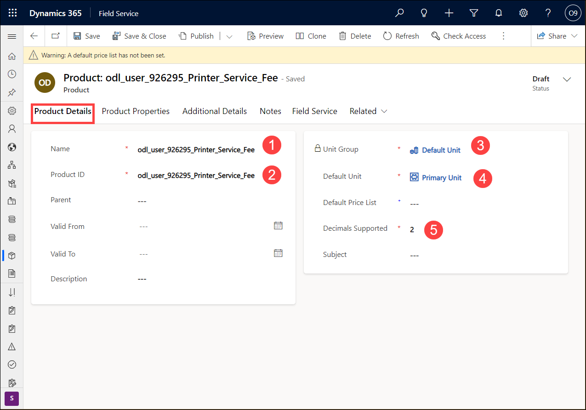
    
1. Select the **Field Service** tab.

1. Set **Field Service Product Type** to **Service**.

1. Click **Save**. (You may see a warning that a default price list has not been set. You can ignore this.)

1. Click **Publish** and click **Confirm** from the popup.

1. Click **Save & Close**

    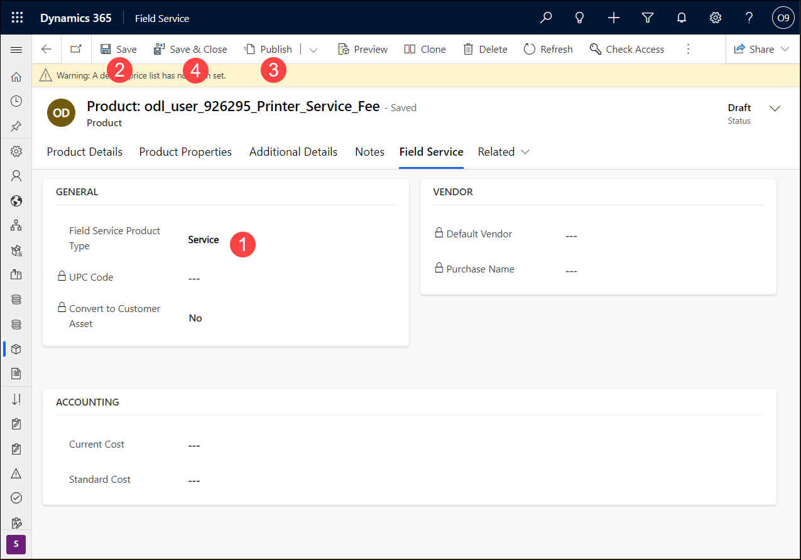

### Task 4 - Add Products to a Price List

1. In the **Dynamics 365 Field Service app**, click the bottom-left of the sitemap and select **Settings (1)** from the list.

1. On the **Settings** page, in the **General** group select **Price Lists (2)**.

1. Click **+ New (3)**.

    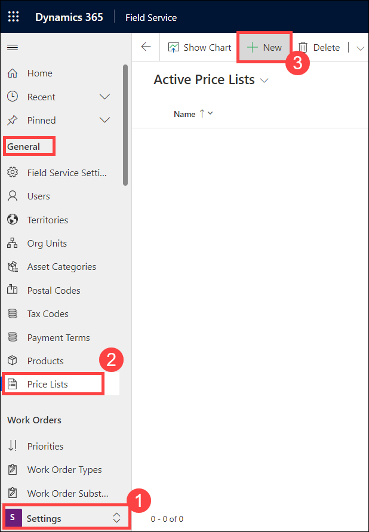

1. Enter **odl_user_DID_Price_List** for **Name (1)**.

1. Click **Save (2)**.

    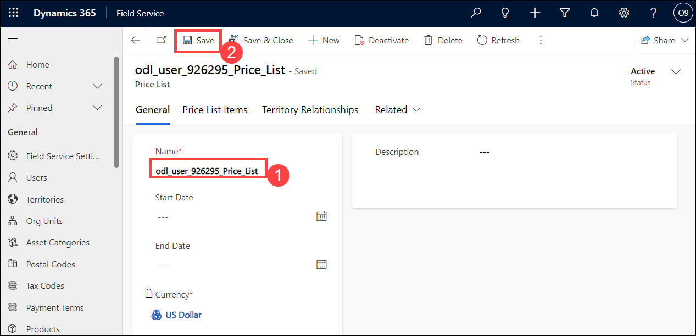

1. Select the **Price List Items (1)** tab.

1. Click **+ New Price List Item (2)**.

    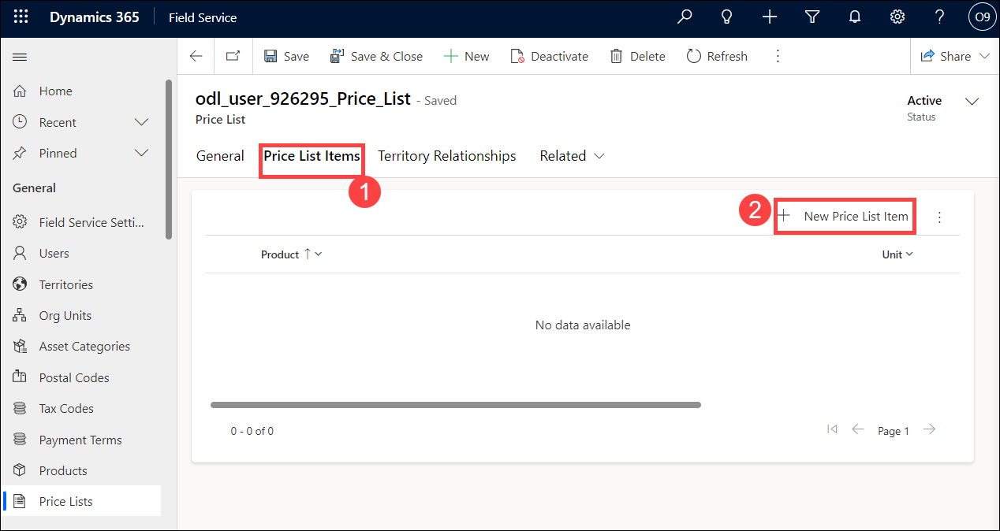

1. Select the **odl_user_DID_Remote_Printer (1)** product you created in Task 1.

1. Select **Primary Unit** for **Unit (2)**.

    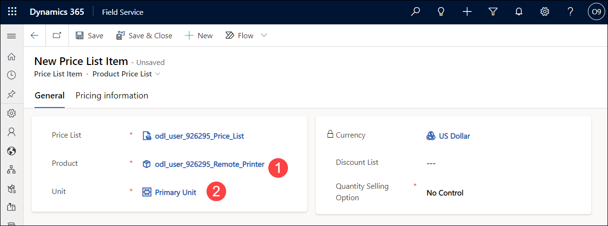

1. Select the **Pricing Information** tab.

1. Select **Currency Amount** from the **Pricing Method (1)** drop-down field.

1. Enter **1000.00** for **Amount (2)**.

1. Click **Save & Close (3)**.

    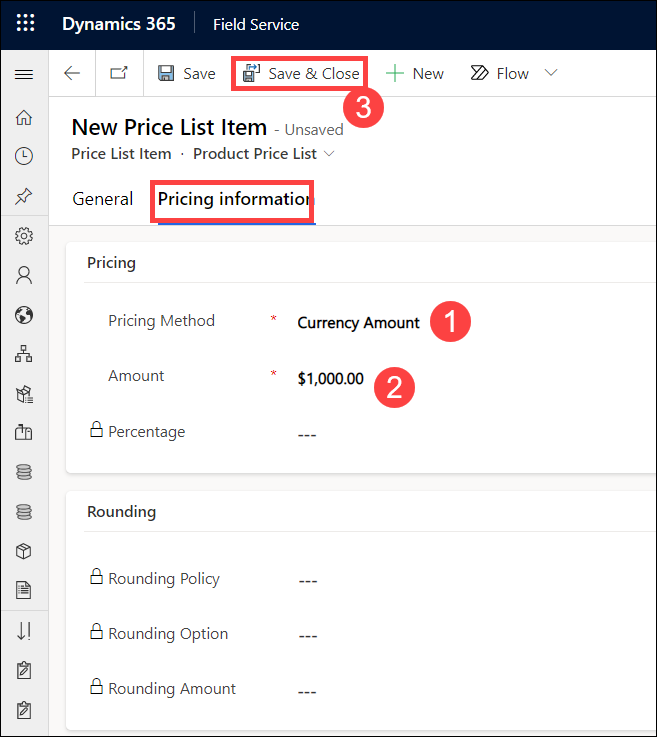

1. Click **+ New Price List Item**.

1. Select the **odl_user_DID_Monthly_Printer_Maintenance (1)** product you created in Task 2.

1. Select **Primary Unit** for **Unit (2)**.

    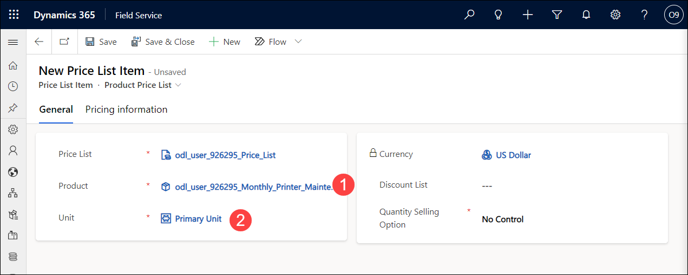

1. Select the **Pricing Information** tab.

1. Select **Currency Amount** from the **Pricing Method (1)** drop-down field.

1. Enter **750.00** for **Amount (2)**.

1. Click **Save & Close (3)**.

    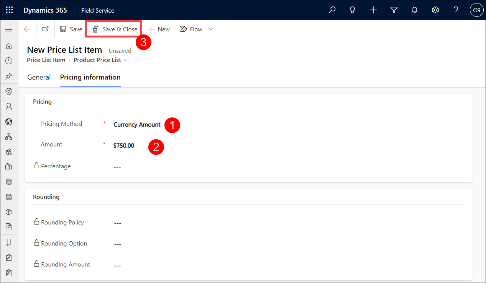

1. Click **+ New Price List Item**.

1. Select the **[your prefix] Printer Service Fee (1)** product you created in Task 3.

1. Select **Primary Unit** for **Unit (2)**.

    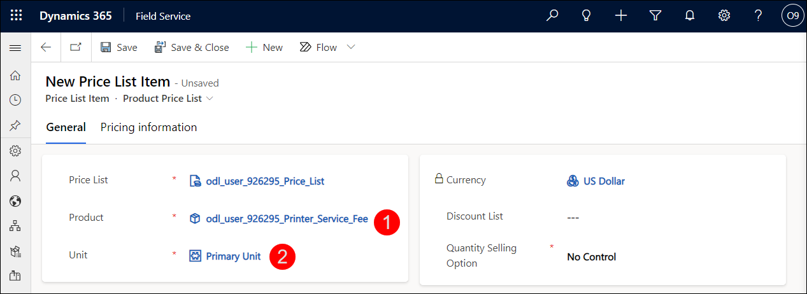

1. Select the **Pricing Information** tab.

1. Select **Currency Amount** from the **Pricing Method (1)** drop-down field.

1. Enter **150.00** for **Amount (2)**.

1. Click **Save & Close (3)**.

    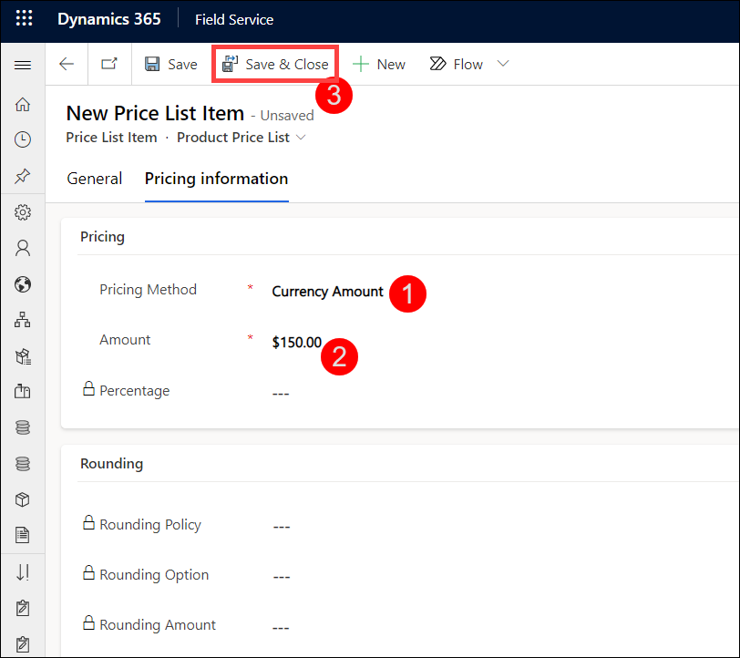

1. Click **Related (1)** on the Price List and select **Field Service Price List Items (2)**.

    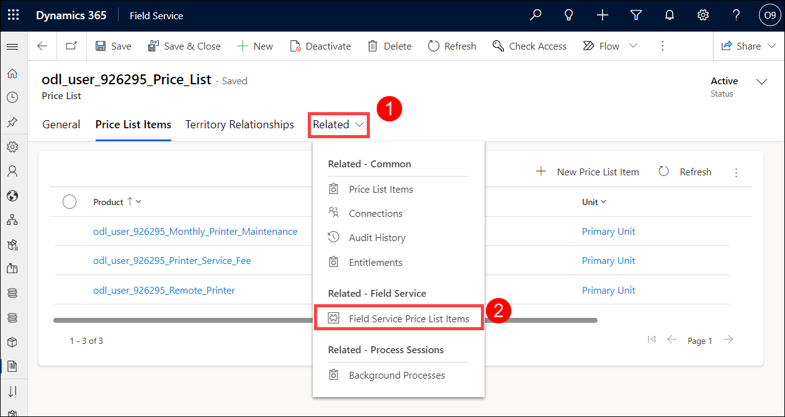

1. Click **+ New Field Service Price List Item**.

    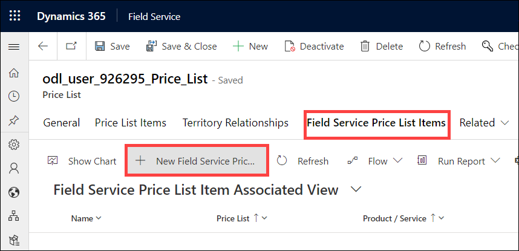

1. Enter **odl_user_DID_Printer_Service_Fee** for **Name (1)**.

1. Select **Yes** from the **Flat Fee (2)** drop-down field.

1. Select the **odl_user_DID_price_list** you created in Task 4.

1. Select the **odl_user_DID_Printer_Service_Fee (3)** product you created in Task 3.

1. Click **Save & Close (4)**.

    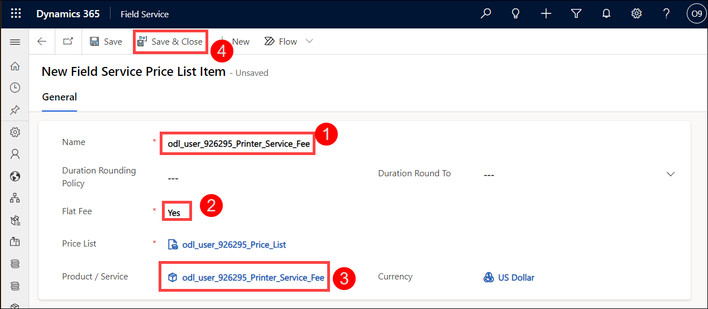