# Practice Lab 2 - Skills and Characteristics

## Lab scenario

Each technician that goes out to service customers may have a number of different skills and roles assigned to them. There are three primary roles that a technician may have:

- Installation Specialist
- Site Inspector
- Security Analyst

Additionally, each technician may have specific skills or Certifications that relate to a specific product or service. The most common certifications might be any of the following:

- **CISM:** Certified Information Security Manager
- **CISSP:** Certified Information Systems Security Professional
- **G SEC:** GIAC Security Essentials

Since some of your customers are government agencies, technicians may need to have specific security clearance levels. These can range from Level One to Level Five.

## Lab objective
+ Exercise 1 - Configure Dynamics 365 for Field Service Skills and Characteristics

## Estimated timing: 20 minutes

## Exercise 1 - Configure Dynamics 365 for Field Service Skills and Characteristics

### Task 1 – Proficiency Models

In this task, you will create a proficiency model that contains the five different security clearance levels and a proficiency model for skill level.

1. In the **Dynamics 365 Field Service app**, click the **Service (1)** area in the bottom-left of the sitemap, and select **Resources (2)** from the list. 

    

1. In the **Resource** section, select **Proficiency Models (1)**.

1. Click **+ New (2)** located on the command bar.

    

1. Enter **Security Level (1)** for **Name**.

1. Enter **1 (2)** for **Min Rating Value**.

1. Enter **5 (3)** for **Max Rating Value**.

1. Click **Save (4)**.

    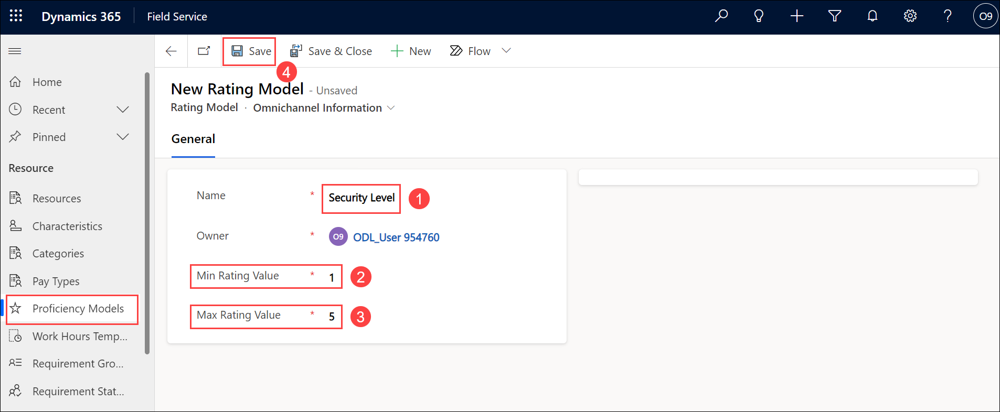

1. If Rating Values are not shown in a sub-gird on the General tab, click **Related** and select **Rating Values**.

1. Click **+ New Rating Value(2)**.

    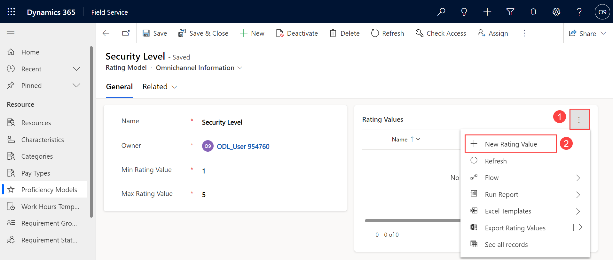

1. Enter **Level 1 Security** for **Name (1)**.

1. Enter **1** for **Value (2)**.

1. Click **Save & Close (3)**.

    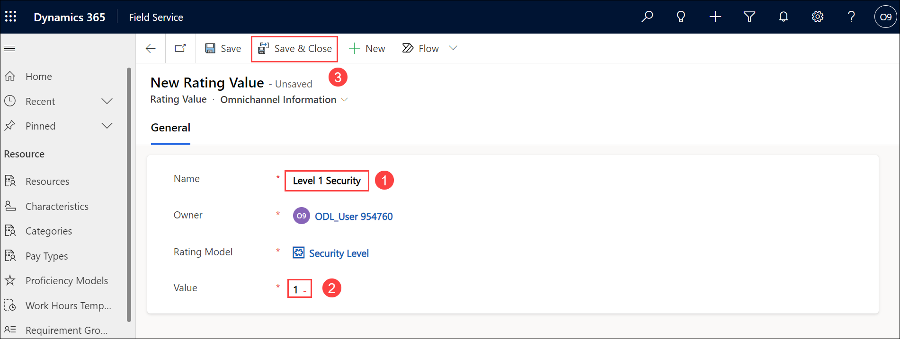

1. Repeat steps 9-12 and create the **New Rating Value** records listed in the table below.

    | **Name** | **Value** |
    |----------------|---------------|
    | Level 2 Security       | 2         |
    | Level 3 Security           | 3      |
    | Level 4 Security          | 4       |
    | Level 5 Security           | 5       |
   
1. You should now have a total of 5 rating values. Click **Save & Close (1)** again.

    

1. In the **Dynamics 365 Field Service app**, click the **Service (1)** area in the bottom-left of the sitemap, and select **Resources (2)** from the list. 

    

1. In the **Resource**, select **Proficiency Models (1)**.

1. Click **+ New (2)** located on the command bar.

    

1. Enter **Proficiency** for **Name**.

1. Enter **1** for **Min Rating Value**.

1. Enter **3** for **Max Rating Value**.

1. Click **Save**.

1. If Rating Values are not shown in a sub-gird on the General tab, click **Related** and select **Rating Values**.

1. Click **+ New Rating Value (2)**.

    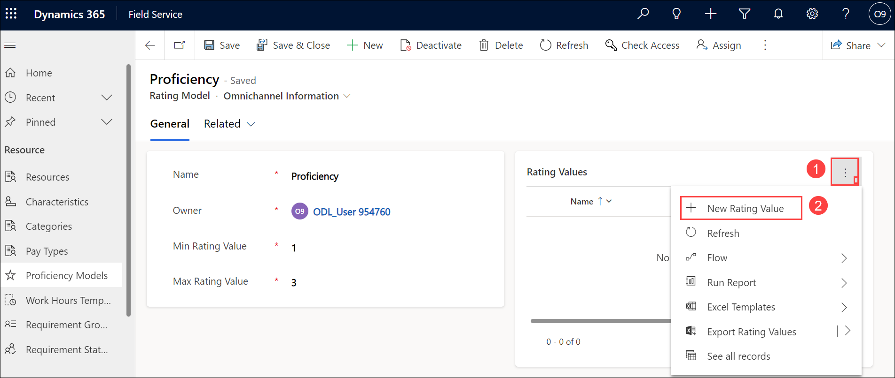

1. Enter **Familiar** for **Name (1)**.

1. Enter **1** for **Value (2)**.

1. Click **Save & Close (3)**.

    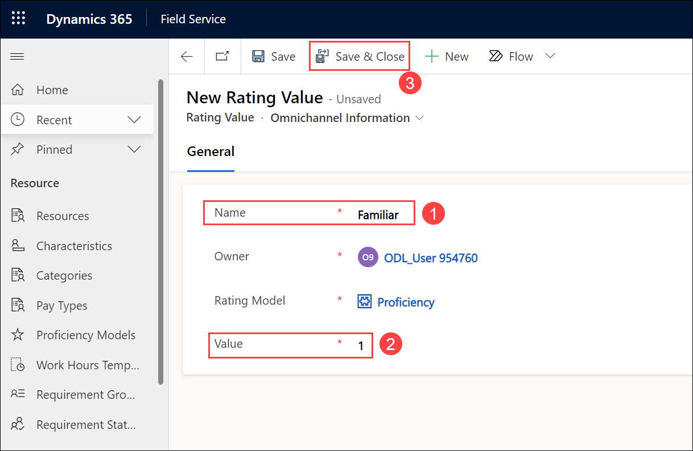

1. Repeat steps 23-26 and create the **New Rating Value** records listed in the table below.

    | **Name** | **Value** |
    |----------------|---------------|
    | Proficient           | 2      |
    | Expert          | 3       |
   
1. You should now have a total of 3 rating values (1). Click **Save & Close (1)** again.

    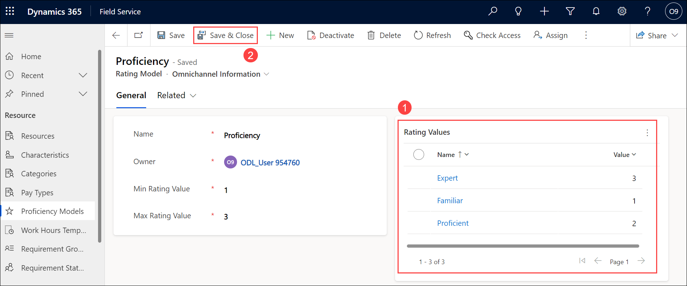
    
> **Congratulations** on completing the task! Now, it's time to validate it. Here are the steps:
> - Select the **Lab Validation** tab located at the upper right corner of the lab guide section.
> - Hit the Validate button for the corresponding task. If you receive a success message, you can proceed to the next task. 
> - If not, carefully read the error message and retry the step, following the instructions in the lab guide.
> - If you need any assistance, please contact us at labs-support@spektrasystems.com. We are available 24/7 to help you out.

### Task 2 - Define a Security Clearance skill

In this task, you will create a building security skill that will be used in conjunction with the Proficiency Model you defined in the previous task.

1. Click on the name of the app in the top left of the application next to Dynamics 365 and from the list of published apps, select the **Resource Scheduling** app.

    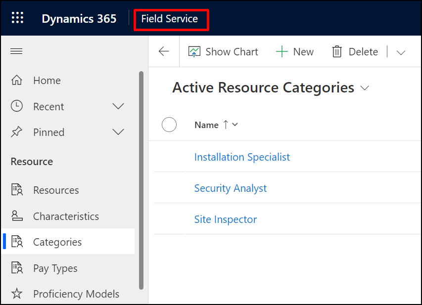

    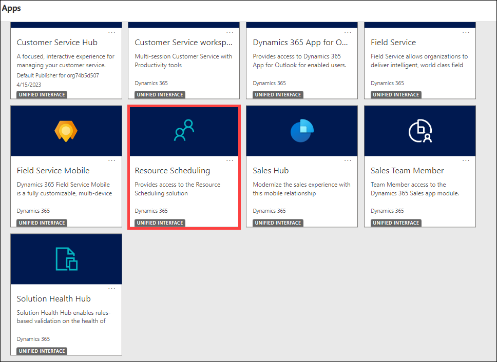

1. In the **Resource Scheduling app (1)**, click the **Settings (2)** area in the bottom-left of the sitemap

    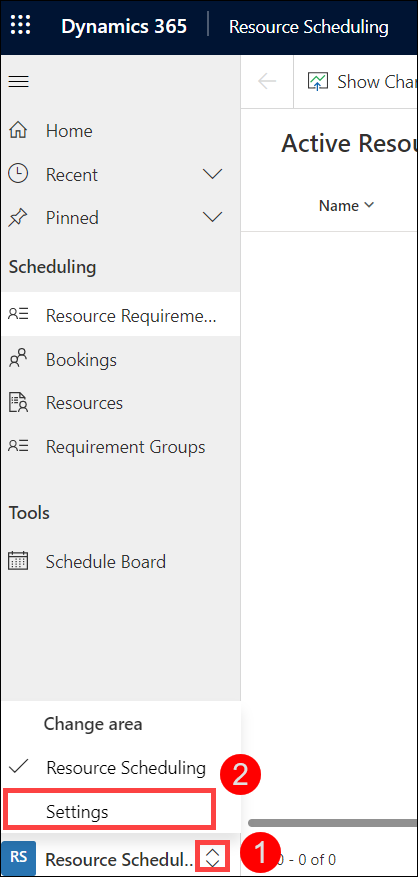

1. In the **Resource** section, select **Skills (1)**.

1. Click **+ New (2)**.

    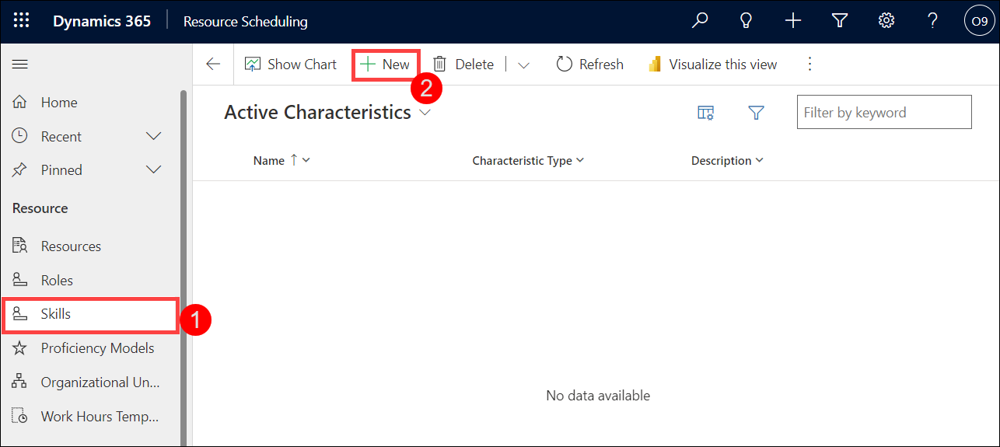

1. Enter **Building Security** for **Name (1)**.

1. Select **Skill** from the **Characteristic Type (2)** drop-down field.

1. Click **Save & Close (3)**.

    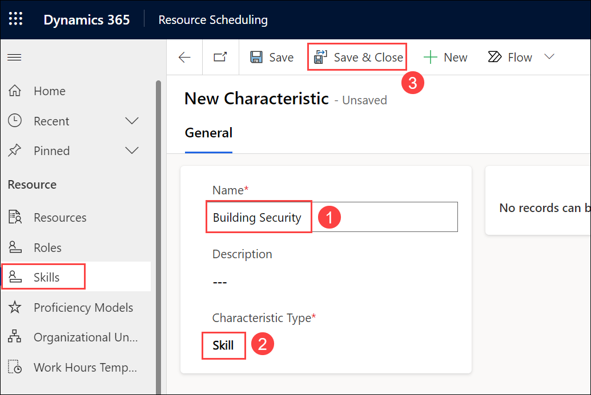

### Task 3 - Define Security certifications

In this task you will be adding the **CISM:** Certified Information Security Manager, **CISSP:** Certified Information Systems Security Professional, and **GSEC:** GIAC Security Essentials certifications and resource skills.

1. In the **Resource Scheduling app (1)**, click the **Settings (2)** area in the bottom-left of the sitemap

    

1. In the **Resource** section, select **Skills (1)**.

1. Click **+ New (2)**.

    

1. Enter **CISM** for **Name (1)**.

1. Enter **Certified Information Security Manager** for **Description (2)**.

1. Select **Certification** from the **Characteristic Type (3)** drop-down field.

1. Click **Save & Close (4)**.

    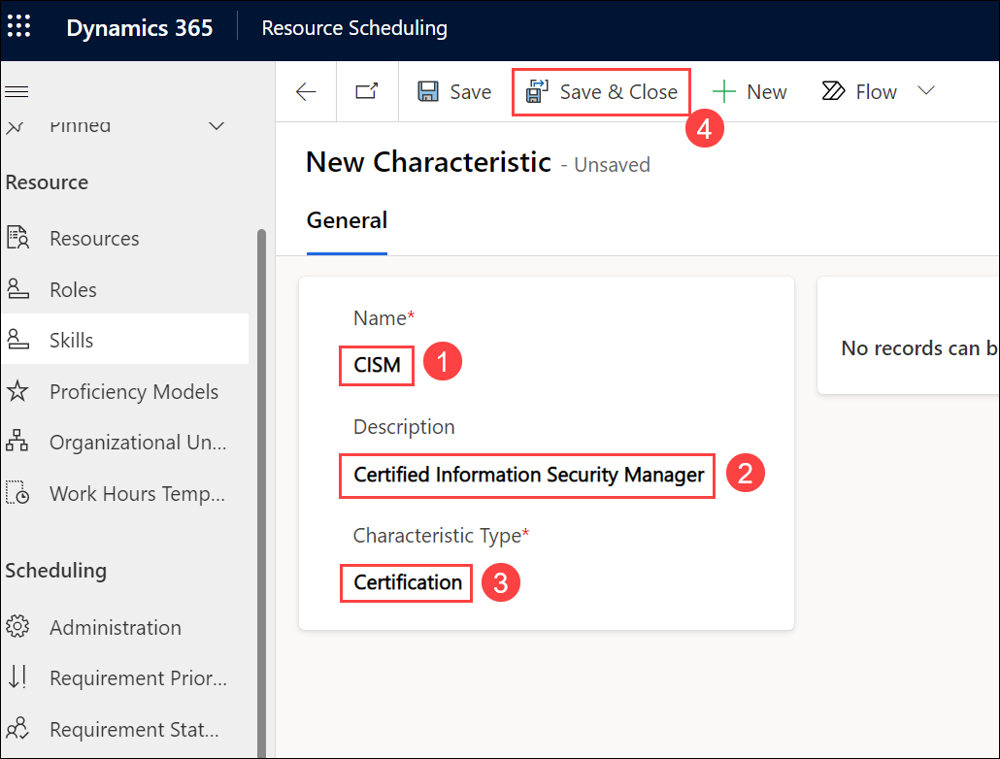

1. Repeat steps 3-7 and create the **+ New** records listed in the table below.

    | **Name**                 | **Description** | **Characteristic Type**  |
    |--------------------------|-------------------------|----------------|
    | CISSP     | Certified Information Systems Security Professional       | Certification | 
    | G SEC | GIAC Security Essentials       | Certification |  

1. You should now have a total of 3 skill values.

### Task 4 - Define Resource Roles (Categories)

In this task, you will be adding the Installation Specialist, Site Inspector, and Security Analyst resource roles.

1. In the **Resource Scheduling app (1)**, click the **Settings (2)** area in the bottom-left of the sitemap

    

1. In the **Resource** section, select **Roles (1)**.

1. Click **+ New**.

    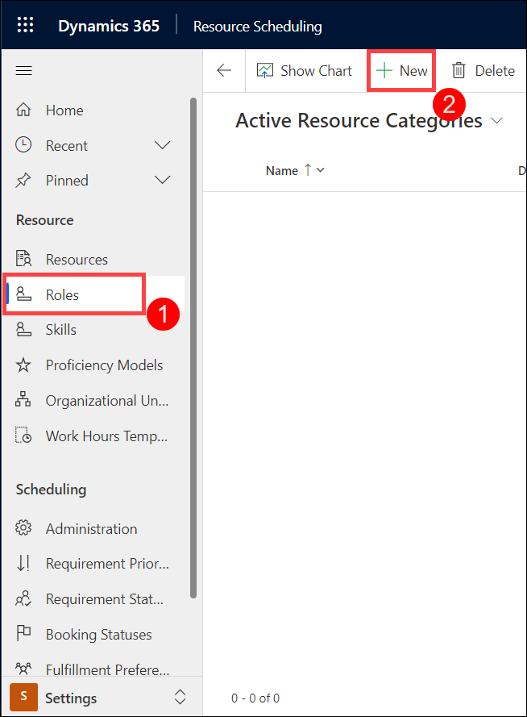

1. Enter **Installation Specialist** for **Name**.

1. Enter **Installation Specialist** for **Description**.

1. Click **Save & Close**.

    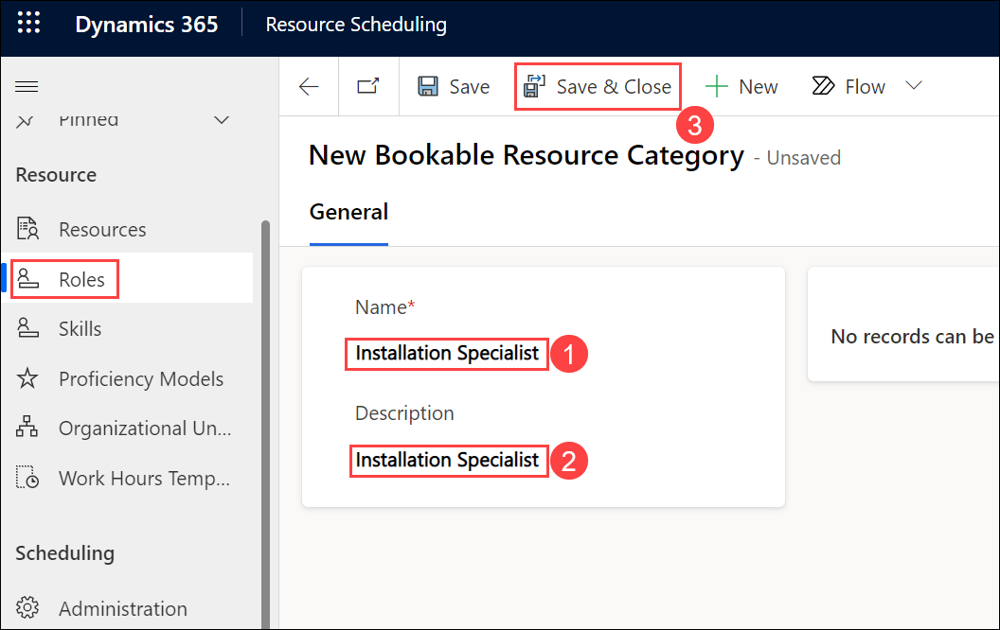
    
1. Repeat steps 3-6 and create the **+ New** records listed in the table below.

    | **Name** | **Description** |
    |----------------|---------------|
    | Site Inspector | Site Inspector|
    | Security Analyst | Security Analyst|
    
1. You should now have a total of 3 Role values.

1. Click on the name of the app in the top left of the application next to Dynamics 365 and from the list of published apps, select the **Field Service** app.

    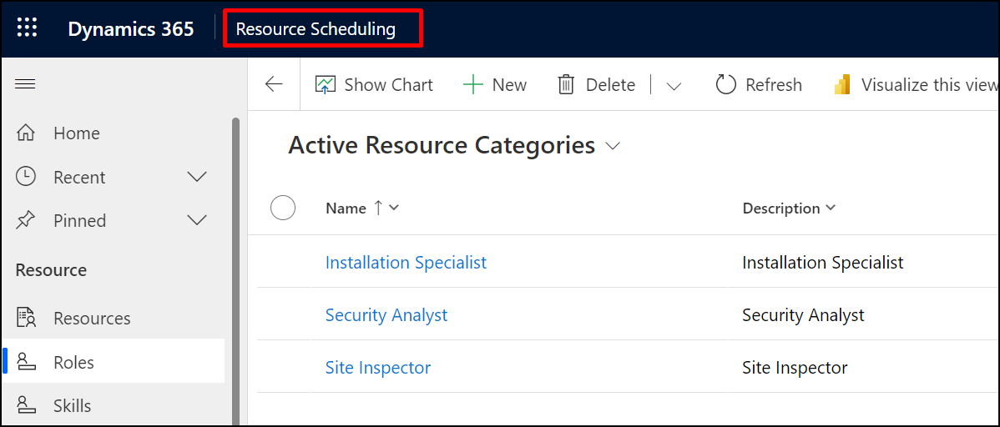

    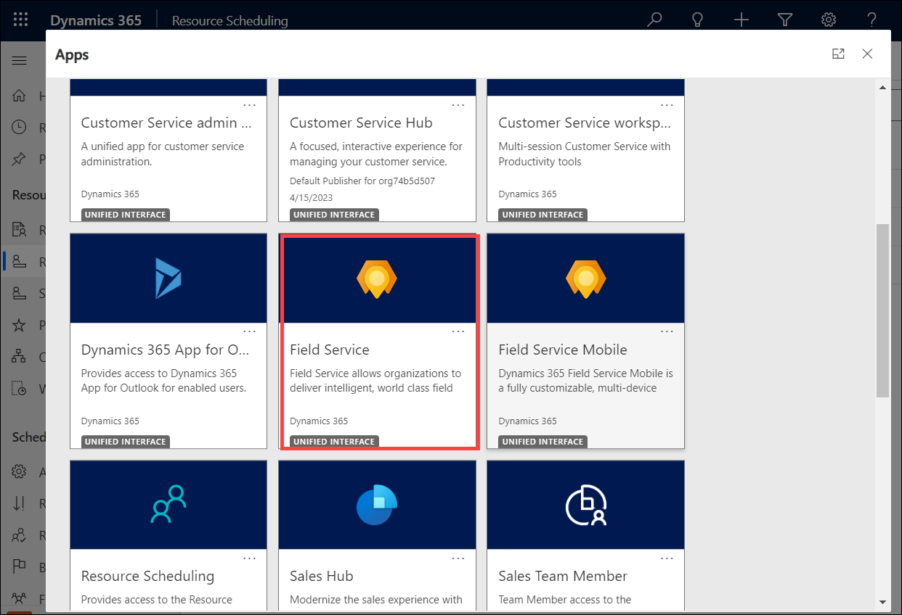

1. In **Field Service** app, Navigate to **Services** -> **Resource** -> **Categories**.

    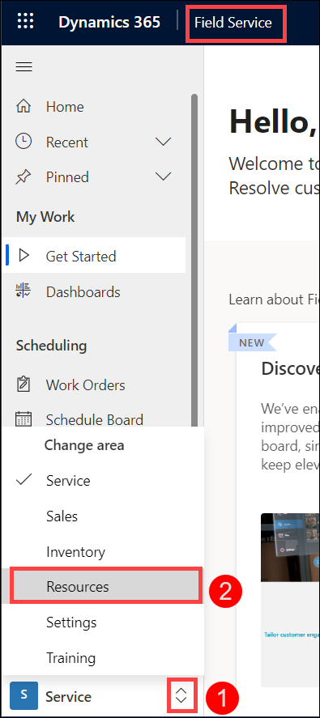

1. Verify the roles you created are listed under Active Resource Categories.

    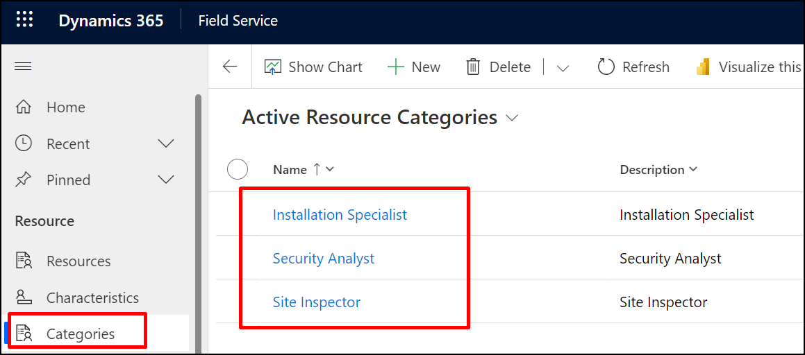
    
> **Congratulations** on completing the task! Now, it's time to validate it. Here are the steps:
> - Select the **Lab Validation** tab located at the upper right corner of the lab guide section.
> - Hit the Validate button for the corresponding task. If you receive a success message, you can proceed to the next task. 
> - If not, carefully read the error message and retry the step, following the instructions in the lab guide.
> - If you need any assistance, please contact us at labs-support@spektrasystems.com. We are available 24/7 to help you out.

**Result:** You have successfully configured your Dynamics 365 Field service Skills and Characteristics. 

### Review
In this lab, you have completed:
- Proficiency Models
- Define a Security Clearance skill
- Define Security certifications and Define Resource Roles

### **Proceed with the next Lab.**
