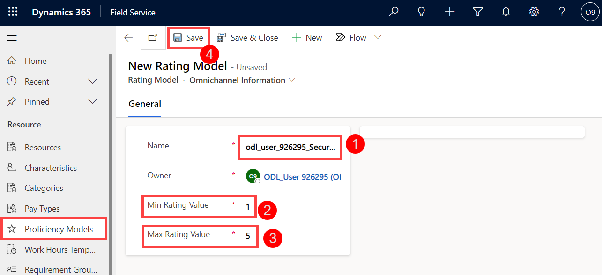
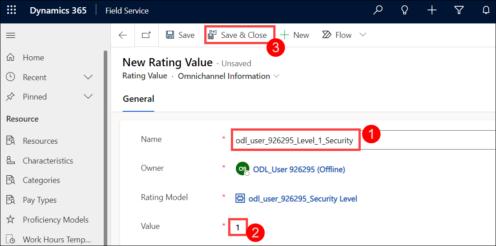
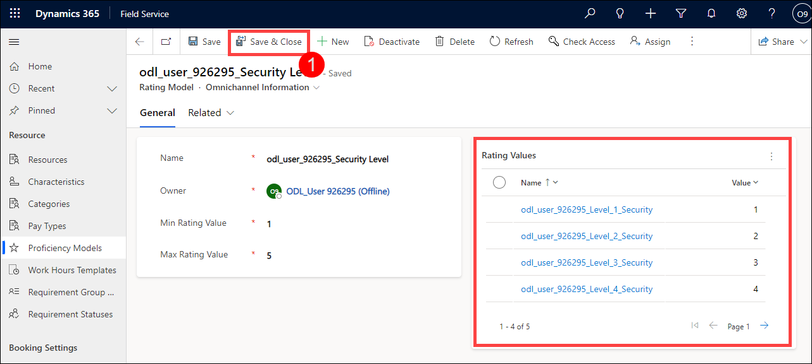
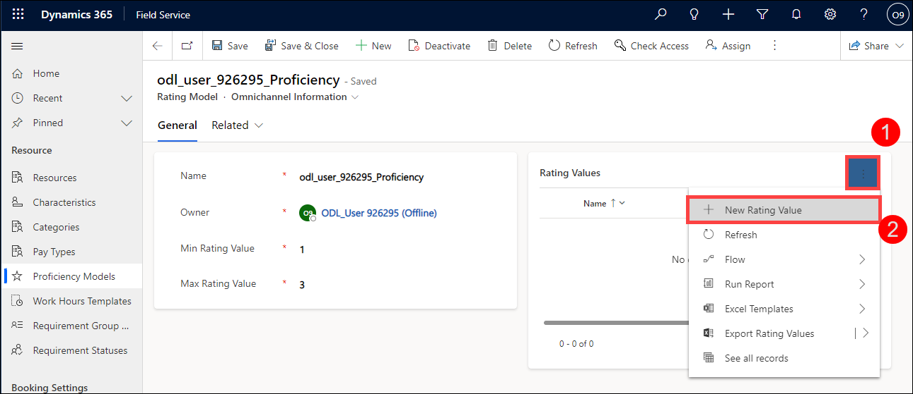
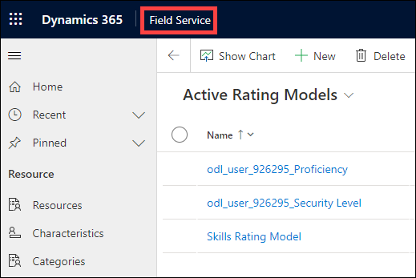
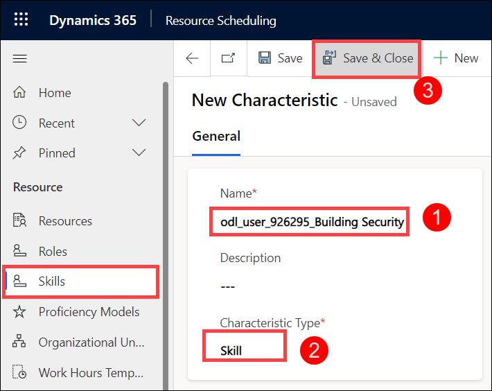
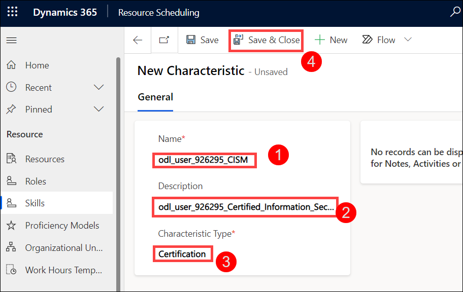
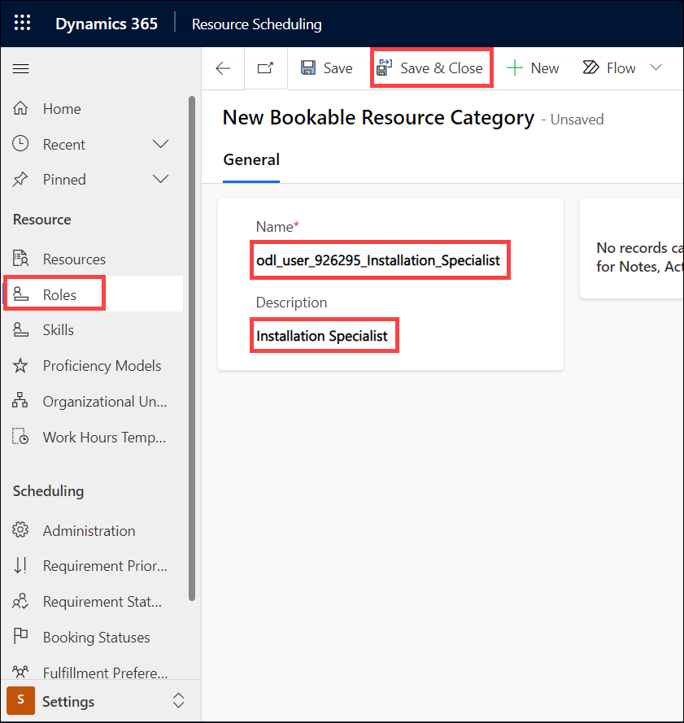
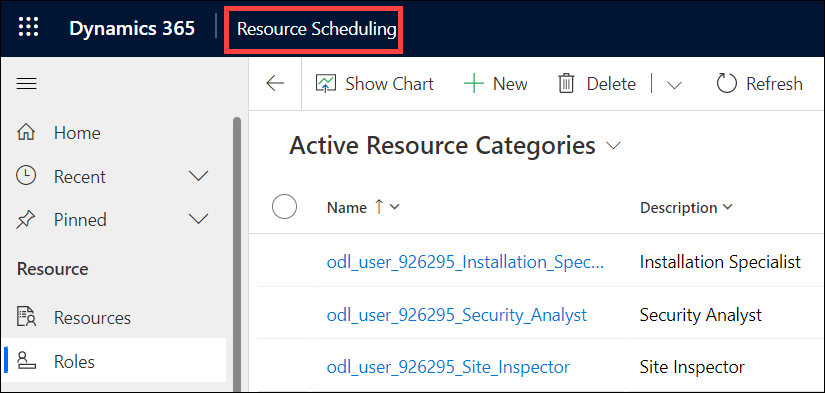
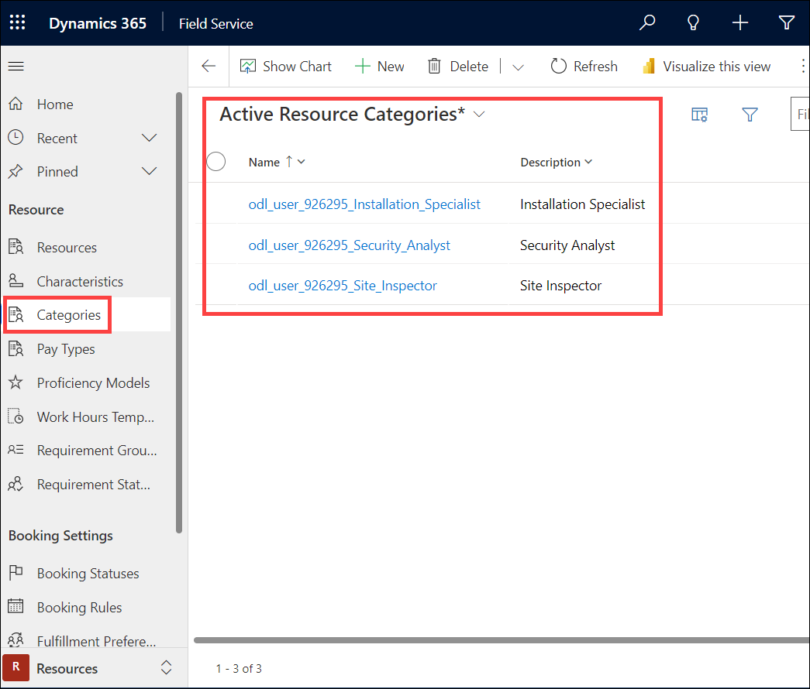

# Practice Lab 2 - Skills and characteristics

## Exercise 1 - Configure Dynamics 365 for Field Service Skills and Characteristics

Each technician that goes out to service customers may have a number of different skills and roles assigned to them. There are three primary roles that tech may have:

- Installation Specialist
- Site Inspector
- Security Analyst

Additionally, each technician may have specific skills or Certifications that relate to a specific product or service. The most common certifications might be any of the following:

- **CISM:** Certified Information Security Manager
- **CISSP:** Certified Information Systems Security Professional
- **G SEC:** GIAC Security Essentials

Since some of your customers are government agencies, technicians may need to have specific security clearance levels. These can range from Level one to Level five.

   >Note: The **[DeploymentId]/[DID] can be found under the environment details tab in the user name (example: `odl_user_xxxxxx.onmicrosoft.com`) **xxxxxx** is the [DeploymentID]**.

### Task 1 – Proficiency Models

In this task you will create a proficiency model that contains the five different security clearance levels and a proficiency model for skill level.

1. In the **Dynamics 365 Field Service app**, click the **Service (1)** area in the bottom-left of the sitemap, and select **Resources (2)** from the list. 

    

1. In the **Resource** group select **Proficiency Models (1)**.

1. Click **+ New (2)** located on the command bar.

    

1. Enter **odl_user_DID_Security Level (1)** for **Name**.

1. Enter **1 (2)** for **Min Rating Value**.

1. Enter **5 (3)** for **Max Rating Value**.

1. Click **Save (4)**.

    

1. If Rating Values are not shown in a sub-gird on the General tab, click **Related** and select **Rating Values**.

1. Click **+ New Rating Value(2)**.

    

1. Enter **odl_user_DID_Level_1_Security** for **Name (1)**.

1. Enter **1** for **Value (2)**.

1. Click **Save & Close (3)**.

    

1. Click **+ New Rating Value**.

1. Enter **odl_user_DID_Level_2_Security** for **Name**.

1. Enter **2** for **Value**.

1. Click **Save & Close**.

1. Click **+ New Rating Value**.

1. Enter **odl_user_DID_Level_3_Security** for **Name**.

1. Enter **3** for **Value**.

1. Click **Save & Close**.

1. Click **+ New Rating Value**.

1. Enter **odl_user_DID_Level_4_Security** for **Name**.

1. Enter **4** for **Value**.

1. Click **Save & Close**.

1. Click **+ New Rating Value**.

1. Enter **odl_user_DID_Level_5_Security** for **Name**.

1. Enter **5** for **Value**.

1. Click **Save & Close**.

1. You should now have a total of 5 rating values. Click **Save & Close (1)** again.

    

1. In the **Dynamics 365 Field Service app**, click the **Service (1)** area in the bottom-left of the sitemap, and select **Resources (2)** from the list. 

    

1. In the **Resource** group select **Proficiency Models (1)**.

1. Click **+ New (2)** located on the command bar.

    

1. Enter **odl_user_DID_Proficiency** for **Name**.

1. Enter **1** for **Min Rating Value**.

1. Enter **3** for **Max Rating Value**.

1. Click **Save**.

1. If Rating Values are not shown in a sub-gird on the General tab, click **Related** and select **Rating Values**.

1. Click **+ New Rating Value (2)**.

    

1. Enter **odl_user_DID_Familiar** for **Name (1)**.

1. Enter **1** for **Value (2)**.

1. Click **Save & Close (3)**.

    

1. Click **+ New Rating Value**.

1. Enter **odl_user_DID_Proficient** for **Name**.

1. Enter **2** for **Value**.

1. Click **Save & Close**.

1. Click **+ New Rating Value**.

1. Enter ***odl_user_DID_Expert** for **Name**.

1. Enter **3** for **Value**.

1. Click **Save & Close**.

1. You should now have a total of 3 rating values (1). Click **Save & Close (1)** again.

    

### Task 2 - Define a Security Clearance skill

In this task you will create a building security skill that will be used in conjunction with the Proficiency Model you defined in the previous task.

1. Click on the name of the app in the top left of the application next to Dynamics 365 and from the list of published apps, select the **Resource Scheduling** app.

    

    

1. In the **Resource Scheduling app (1)**, click the **Settings (2)** area in the bottom-left of the sitemap

    

1. In the **Resource** group select **Skills (1)**.

1. Click **+ New (2)**.

    

1. Enter **odl_user_DID_Building_Security** for **Name (1)**.

1. Select **Skill** from the **Characteristic Type (2)** drop-down field.

1. Click **Save & Close (3)**.

    

### Task 3 - Define Security certifications

In this task you will be adding the **CISM:** Certified Information Security Manager, **CISSP:** Certified Information Systems Security Professional, and **GSEC:** GIAC Security Essentials certifications and resource skills.

1. In the **Resource Scheduling app (1)**, click the **Settings (2)** area in the bottom-left of the sitemap

    

1. In the **Resource** group select **Skills (1)**.

1. Click **+ New (2)**.

    

1. Enter **odl_user_DID_CISM** for **Name (1)**.

1. Enter **odl_user_DID_Certified_Information_Security_Manager** for **Description (2)**.

1. Select **Certification** from the **Characteristic Type (3)** drop-down field.

1. Click **Save & Close (4)**.

    

1. Click **+ New**.

1. Enter **odl_user_DID_CISSP** for **Name**.

1. Enter **odl_user_DID_Certified_Information_Systems_Security_Professional** for **Description**.

1. Select **Certification** from the **Characteristic Type** drop-down field.

1. Click **Save & Close**.

1. Click **+ New**.

1. Enter **odl_user_DID_G_SEC** for **Name**.

1. Enter **odl_user_DID_GIAC_Security_Essentials** for **Description**.

1. Select **Certification** from the **Characteristic Type** drop-down field.

1. Click **Save & Close**.

### Task 4 - Define Resource Roles (Categories)

In this task, you will be adding the Installation Specialist, Site Inspector, and Security Analyst resource roles.

1. In the **Resource Scheduling app (1)**, click the **Settings (2)** area in the bottom-left of the sitemap

    

1. In the **Resource** group select **Roles (1)**.

1. Click **+ New**.

    

1. Enter **odl_user_DID_Installation_Specialist** for **Name**.

1. Enter **Installation Specialist** for **Description**.

1. Click **Save & Close**.

    

1. Click **+ New**.

1. Enter **odl_user_DID_Site_Inspector** for **Name**.

1. Enter **Site Inspector** for **Description**.

1. Click **Save & Close**.

1. Click **+ New**.

1. Enter **odl_user_DID_Security_Analyst** for **Name**.

1. Enter **Security Analyst** for **Description**.

1. Click **Save & Close**.

1. Click on the name of the app in the top left of the application next to Dynamics 365 and from the list of published apps, select the **Field Service** app.

    

    

1. Navigate to **Resources** -> **Resource** -> **Categories**.

    

1. Verify the roles you created are listed under Active Resource Categories.

    
