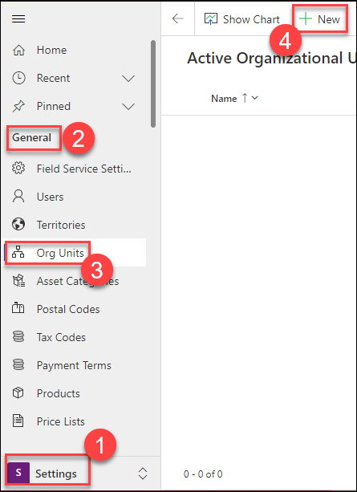
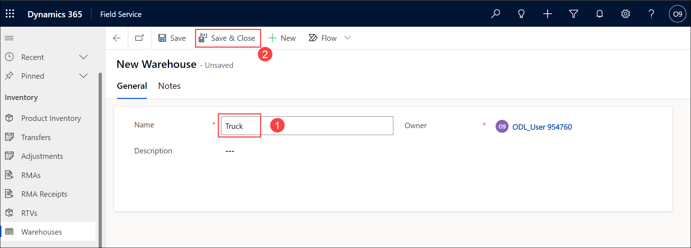
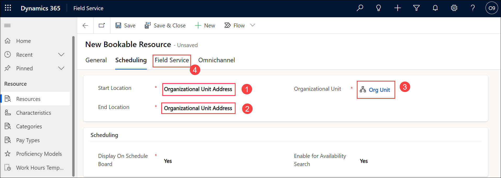
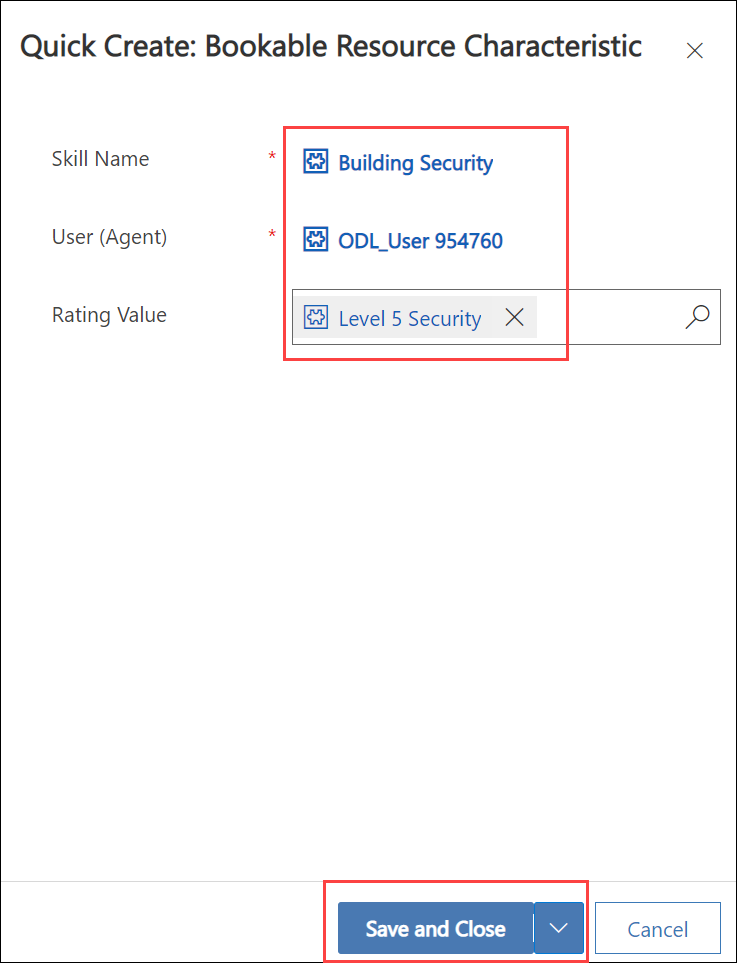
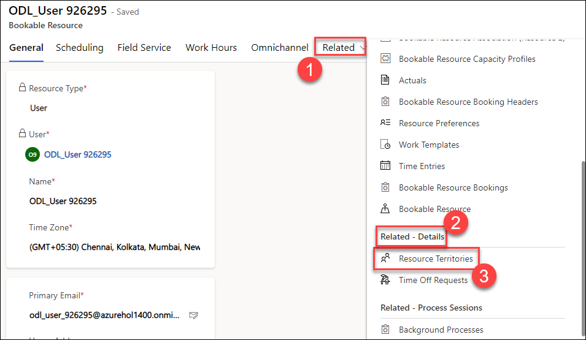
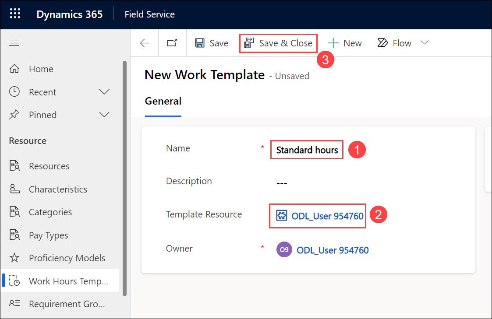

# Practice Lab 3 - Resources

## Lab scenario
Configure Dynamics 365 Field Service for resource management. Set time zones, create base locations, and define working hours. Create bookable resources with characteristics and categories to optimize resource allocation and scheduling efficiency.

## Lab objectives
In this lab, you will perform:
+ Exercise 1 – Base location
+ Exercise 2 – Configure resources

## Estimated timing: 20 minutes

## Exercise 1 – Base location

In this exercise, you will create the location where resources will start and end their day.

### Task 1 - Set Time Zone

1. In the **Dynamics 365 Field Service app** page, Click the **Settings (1)** icon in the navigation bar and select **Personalization Settings (2)**.

    

1. Select your **Time Zone (1)** and click **OK (2)**.

    

1. Click on **Home** at the top of the left-hand side navigation.

1. In the **Dynamics 365 Field Service app**, click the **Service (1)** area in the bottom-left of the sitemap, and in the **Scheduling (2)** section, select **Schedule Board (3)**.

    

1. Click on the **Scheduler Settings (1)** gear icon on the Schedule Board.

1. Select your **Time Zone (2)**

    

### Task 2 - Create Organizational Unit

1. In the **Dynamics 365 Field Service app**, click the **Settings (1)** area in the bottom-left of the sitemap, and in the **General (2)** section, select **Org Units (3)**.

1. Click **+ New (4)**.

   

1. Enter **Org Unit** for **Name**.

1. Select the **Scheduling** tab.

1. Enter **47.70939** for Latitude and **-122.31784** for Longitude.

1. Click **Save & Close**

    

### Task 3 - Create a Warehouse for a Truck

1. In the **Dynamics 365 Field Service app**, click the **Inventory (1)** area in the bottom-left of the sitemap, and in the **Inventory (2)** section, select **Warehouses (3)**.

1. Click **+ New (4)**.

    

1. Enter **Truck (1)** for **Name**.

1. Click **Save & Close (2)**

    

## Exercise 2 – Configure resources

### Task 1 - Create a Bookable Resource for your user record

1. In the **Dynamics 365 Field Service app**, click the **Resources (1)** area in the bottom-left of the sitemap, and in the **Resource (2)** section, select **Resources (3)**.

1. Click **+ New (4)**.

    

1. Select **User (1)** from the **Resource Type** drop-down field.

1. Select your **own account** for the **User (2)**.

1. Select your Time Zone for **Time Zone (3)**.

1. Select the **Scheduling (4)** tab.

    

1. Select **Organizational Unit Address (1)** from the **Start Location** drop-down field.

1. Select **Organizational Unit Address (2)** from the **End Location** drop-down field.

1. Select the **Org Unit (3)** organizational unit you created in Exercise 1 for **Organizational Unit**.

1. Select the **Field Service (4)** tab

    

1. Set the **Hourly Rate (1)** field to **175**.

1. Select the **Truck (2)** you created in Exercise 1 for **Warehouse**.

1. Select **Yes (3)** from the **Time Off Approval Required (3)** drop-down field.

1. Click **Save (4)**.

    

1. Select the **General** tab

1. If Resource Characteristics are not shown in a sub-grid on the General tab, click **Related** and select **Resource Characteristics**.

1. Click **+ New Bookable Resource Characteristic**.

    

1. Select the **Building Security** you created in the previous lab for **Skill Name**.

1. Select the **Level 5 Security** you created in the previous lab for **Rating Value**.

1. Click **Save and Close**.

    

 1. Repeat steps 17-20 and create the **New Bookable Resource Characteristic** records listed in the table below.

    | **Skill Name** | **Rating Value** |
    |----------------|---------------|
    | CISM       | Proficient         |
    | CISSP           | Expert      |
       
1. You should now have a total of 3 Resource Characteristics.

1. Select the **General** tab.

1. If **Resource Category Assns** are not shown in a sub-gird on the General tab, click **Related** and select **Resource Category Assns**.

1. Click **+ New Bookable Resource Category Assn**.

1. Select the **Installation Specialist** you created in the previous lab for **Resource Category**.

1. Click **Save & Close**.

1. Click **+ New Bookable Resource Category Assn**.

    

1. Select the **Security Analyst** you created in the previous lab for **Resource Category**.

1. Click **Save and Close**.

1. Click **Related** and select **Resource Territories** under the **Related-Details** section.

    

1. Click **+ New Resource Territory**.

1. Select the **North** record you created in the previous lab for **Territory**.

1. Click **Save & Close**.

1. Click the **Work Hours** tab.

1. In the Calendar view, click **+ New** drop-down arrow and select **Working hours**.

1. Select the first of the current month for the **date (1)**.

1. Select **Every Week (2)** from the **Repeat** drop-down field.

1. Check **Mo** to **Fr** and Uncheck **Su** and **Sa**.

1. Set the **Work Hour (3)** to **9:00 AM** to **5:00 PM**

1. Select your Time Zone (4).

1. Click **Save (5)**.

    

1. Click **Save & Close**.

### Task 2 - Create a Working Hours template

1. In the **Dynamics 365 Field Service app**, click the **Resources (1)** area in the bottom-left of the sitemap, and in the **Resource** Section, select **Work Hours Templates (2)**.

1. Click **+ New (3)**.

    

1. Enter **Standard hours** for **Name (1)**.

1. Select your own account for **Template resource (2)**.

1. Click **Save & Close (3)**.

    
    
> **Congratulations** on completing the task! Now, it's time to validate it. Here are the steps:
> - Select the **Lab Validation** tab located at the upper right corner of the lab guide section.
> - Hit the Validate button for the corresponding task. If you receive a success message, you can proceed to the next task. 
> - If not, carefully read the error message and retry the step, following the instructions in the lab guide.
> - If you need any assistance, please contact us at labs-support@spektrasystems.com. We are available 24/7 to help you out.

**Result:** You have successfully configured your Resources by creating a location where resources will start and end their day.

### Review
In this lab, you have completed:

- Set Time Zone and create Organizational Unit
- Create a Warehouse for a Truck
- Create a Bookable Resource for your user record
- Create a Working Hours template

### Proceed with the next Lab.
