# Practice Lab 3 - Resources

## Exercise 1 – Base location

In this exercise you will create the location where resources will start and end their day.

### Task 1 - Set Time Zone

1. Click the **Settings (1)** icon in the navigation bar and select **Personalization Settings (2)**.

    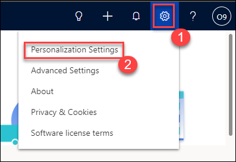

1. Select your **Time Zone (1)** and click **OK (2)**.

    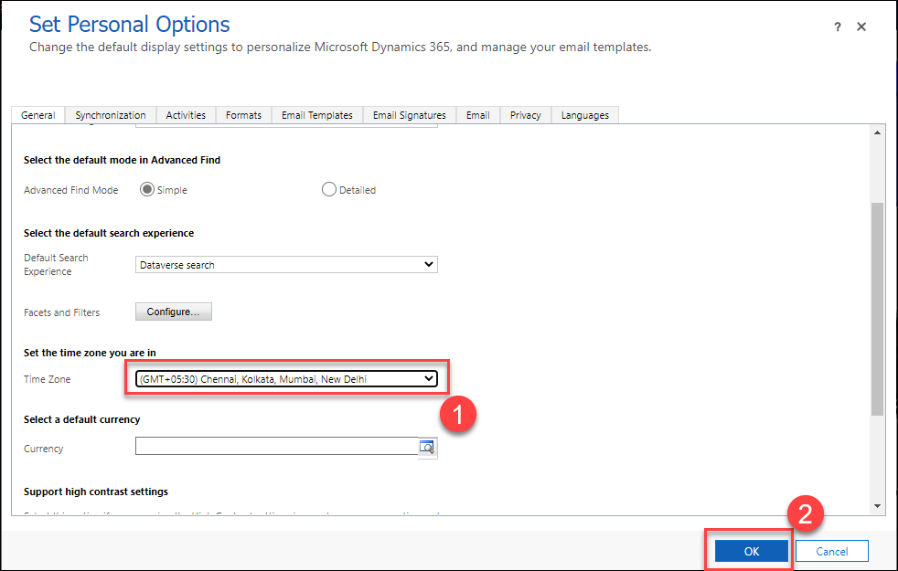

1. Click on **Home** at the top of the left-hand side navigation.

1. In the **Dynamics 365 Field Service app**, click the **Service (1)** area in the bottom-left of the sitemap, and in the **Scheduling (2)** group select **Schedule Board (3)**.

    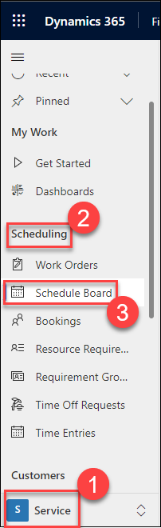

1. Click on the **Scheduler Settings (1)** gear icon on the Schedule Board.

1. Select your **Time Zone (2)**

    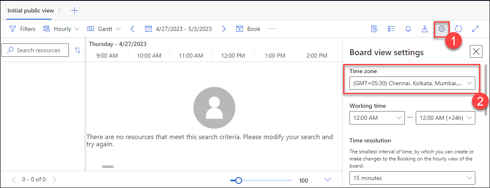

### Task 2 - Create Organizational Unit

1. In the **Dynamics 365 Field Service app**, click the **Settings (1)** area in the bottom-left of the sitemap, and in the **General (2)** group select **Org Units (3)**.

1. Click **+ New (4)**.

    

1. Enter **odl_user_DID_Org Unit** for **Name**.

1. Select the **Scheduling** tab.

1. Enter **47.70939** for Latitude and **-122.31784** for Longitude.

1. Click **Save & Close**

    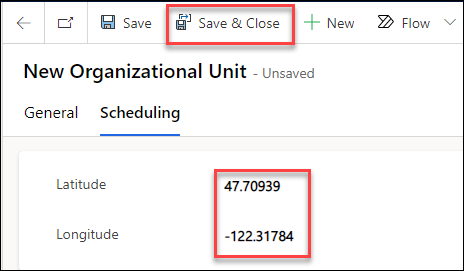

### Task 3 - Create a Warehouse for a Truck

1. In the **Dynamics 365 Field Service app**, click the **Inventory (1)** area in the bottom-left of the sitemap, and in the **Inventory (2)** group select **Warehouses (3)**.

1. Click **+ New (4)**.

    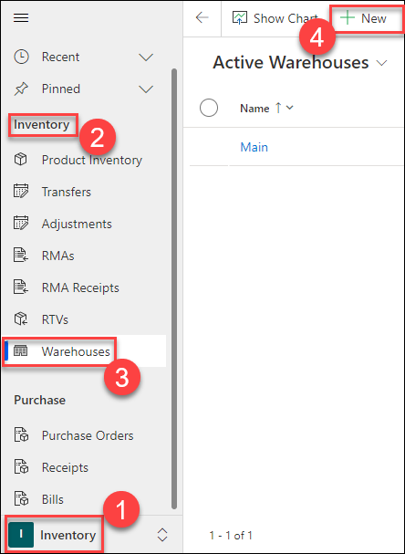

1. Enter **odl_user_DID_Truck** for **Name**.

1. Click **Save & Close**

    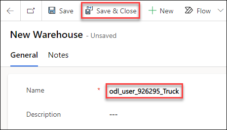

## Exercise 2 – Configure resources

### Task 1 - Create a Bookable Resource for your user record

1. In the **Dynamics 365 Field Service app**, click the **Resources (1)** area in the bottom-left of the sitemap, and in the **Resource (2)** group select **Resources (3)**.

1. Click **+ New (4)**.

    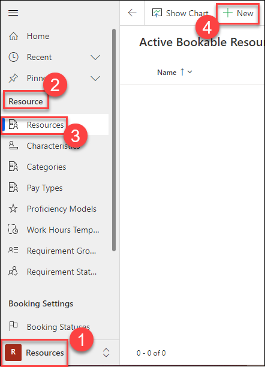

1. Select **User (1)** from the **Resource Type** drop-down field.

1. Select the user record you are signed in as ex. **ODL_User [DeploymentID]** for the **User (2)**.

1. Select your Time Zone for **Time Zone (3)**.

1. Select the **Scheduling (4)** tab.

    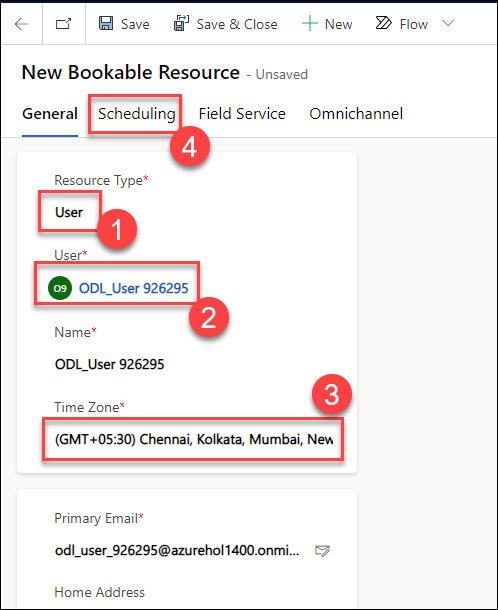

1. Select **Organizational Unit Address (1)** from the **Start Location** drop-down field.

1. Select **Organizational Unit Address (2)** from the **End Location** drop-down field.

1. Select the **odl_user_DID_Org Unit (2)** organizational unit you created in Exercise 1 for **Organizational Unit**.

1. Select the **Field Service (4)** tab

    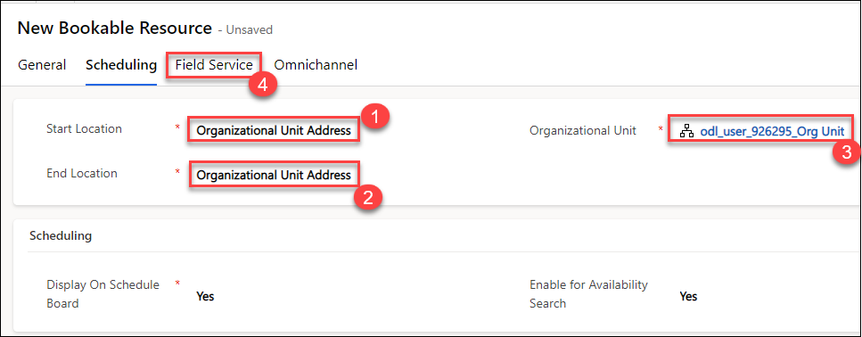

1. Set the **Hourly Rate (1)** field to **175**.

1. Select the **odl_user_DID_Truck (2)** you created in Exercise 1 for **Warehouse**.

1. Select **Yes** from the **Time Off Approval Required (3)** drop-down field.

1. Click **Save (4)**.

    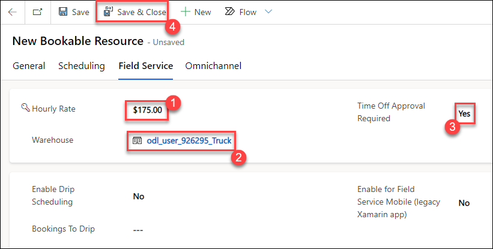

1. Select the **General** tab

1. If Resource Characteristics are not shown in a sub-grid on the General tab, click **Related** and select **Resource Characteristics**.

1. Click **+ New Bookable Resource Characteristic**.

    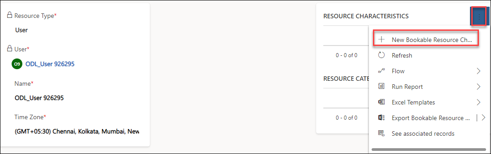

1. Select the **odl_user_DID_Building_Security** you created in the previous lab for **Skill Name**.

1. Select the **odl_user_DID_Level_5_Security** you created in the previous lab for **Rating Value**.

1. Click **Save and Close**.

    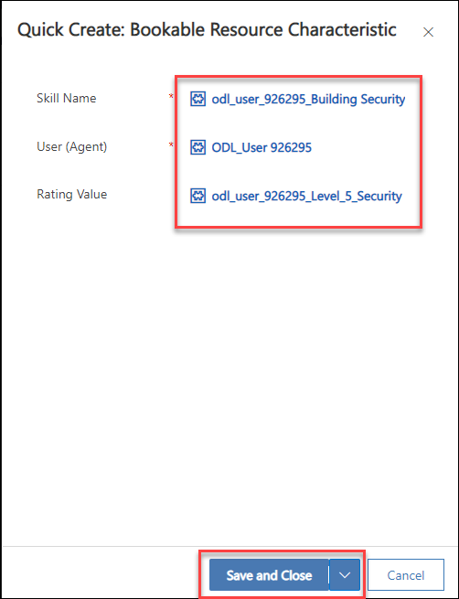

1. Click **+ New Bookable Resource Characteristic**.

1. Select the **odl_user_DID_CISM** you created in the previous lab for **Skill Name**.

1. Select the **odl_user_DID_Proficient** you created in the previous lab for **Rating Value**.

1. Click **Save and Close**.

1. Click **+ New Bookable Resource Characteristic**.

1. Select the **odl_user_DID_CISSP** you created in the previous lab for **Characteristic**.

1. Select the **odl_user_DID_Expert** you created in the previous lab for **Rating Value**.

1. Click **Save and Close**.

1. Select the **General** tab

1. If **Resource Category Assns** are not shown in a sub-gird on the General tab, click **Related** and select **Resource Category Assns**.

1. Click **+ New Bookable Resource Category Assn**.

1. Select the **[your prefix] Installation Specialist** you created in the previous lab for **Resource Category**.

1. Click **Save & Close**.

1. Click **+ New Bookable Resource Category Assn**.

    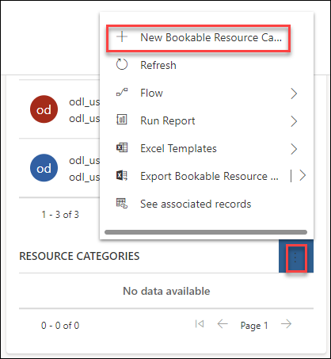

1. Select the **odl_user_DID_Security Analyst** you created in the previous lab for **Resource Category**.

1. Click **Save and Close**.

1. Click **Related** and select **Resource Territories** under the **Related-Details** section.

    

1. Click **+ New Resource Territory**.

1. Select the **odl_user_DID_North** record you created in the previous lab for **Territory**.

1. Click **Save & Close**.

1. Click the **Work Hours** tab.

1. In the Calendar view, click **+ New** drop-down arrow and select **Working hours**.

1. Select the first of the current month for the **date (1)**.

1. Select **Every Week (2)** from the **Repeat** drop-down field.

1. Check **Mo** to **Fr** are checked

1. Uncheck **Su** and **Sa**.

1. Set the **Work Hour (3)** are set to **9:00 AM** to **5:00 PM**

1. Select your Time Zone (4).

1. Click **Save (5)**.

    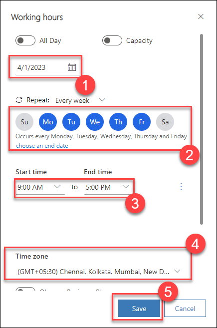

1. Click **Save & Close**.

### Task 2 - Create a Working Hours template

1. In the **Dynamics 365 Field Service app**, click the **Resources** area in the bottom-left of the sitemap, and in the **Resource** group select **Work Hours Templates**.

1. Click **+ New**.

    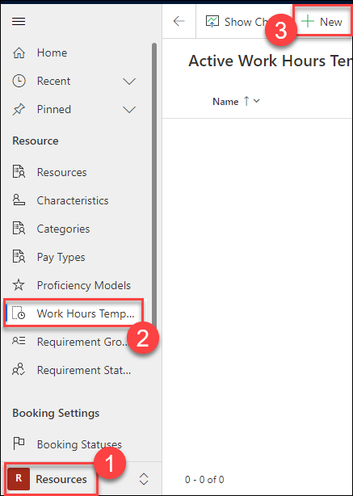

1. Enter **odl_user_DID_Standard hours** for **Name (1)**.

1. Select your user for **Template resource (2)**.

1. Click **Save & Close (3)**.

    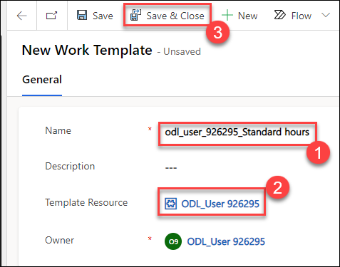
