# Practice Lab 4 - Incident types

## Exercise 1 – Create an Incident Type

In this exercise, you will create and populate an Incident Type as a template for creating work orders.

   
### Task 1 - Work Order Type

1. In the **Dynamics 365 Field Service app**, click the **Service (1)** area in the bottom-left of the sitemap, and select **Settings (2)** from the list. 

    

1. In the **Work Orders** group select **Work Order Types  (1)**.

1. Click **+ New (2)**.

    

1. Enter **Service Call** for **Name (1)**.

1. Select **Yes** from the **Incident Required (2)** drop-down field.

1. Select the **Price List** record you created in the previous lab for **Price List (3)**.

1. Click **Save & Close (4)**

    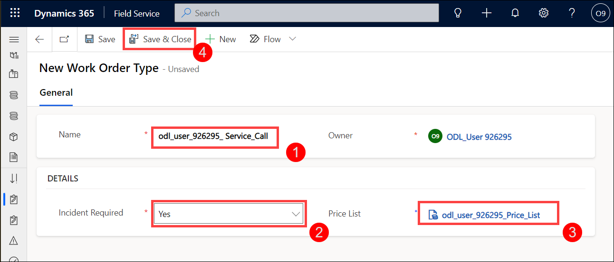

1. Click **+ New**.

1. Enter **Inspection** for **Name**.

1. Select **No** from the **Incident Required** drop-down field.

1. Select the **Price List** record you created in the previous lab for **Price List**.

1. Click **Save & Close**

    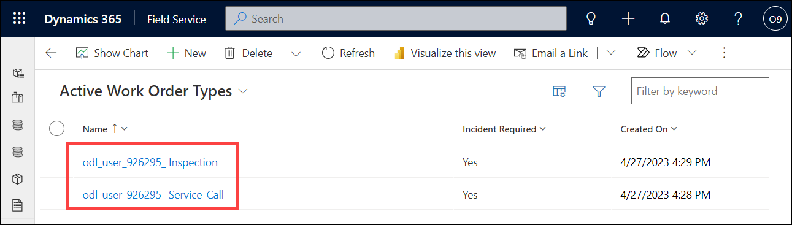

### Task 2 – Service Task Types

1. In the **Work Orders** group select **Service Task Types**.

    

1. Click **+ New**.

1. Enter **Clean Printer Assembly** for **Name(1)**.

1. Select **30 Minutes** for **Estimated Duration (2)**.

1. Click **Save and Close. (3)**

    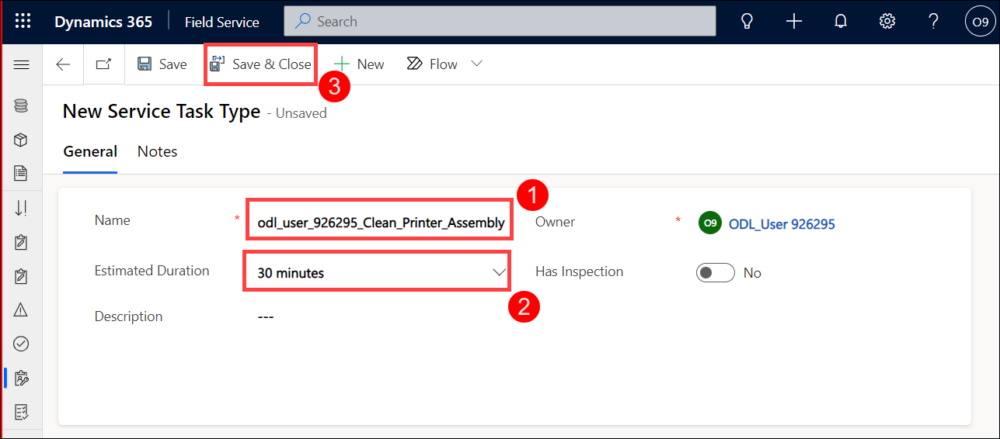

1. Click **+ New**.

1. Enter **Replace Toner** for **Name**.

1. Select **15 Minutes** for **Estimated Duration**.

1. Click **Save and Close.**

1. Click **+ New**.

1. Enter **Final Test** for **Name**.

1. Select **15 Minutes** for **Estimated Duration**.

1. Click **Save and Close.**

1. Click **+ New**.

1. Enter **Inspection** for **Name**.

1. Select **45 Minutes** for **Estimated Duration**.

1. Click **Save and Close.**

    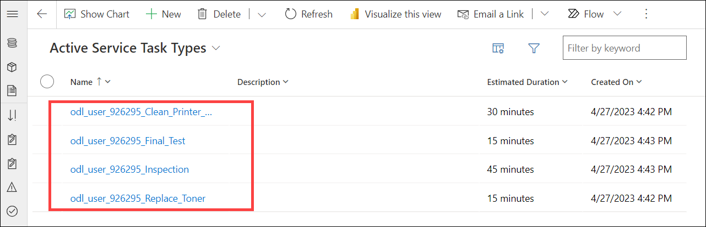

> **Congratulations** on completing the task! Now, it's time to validate it. Here are the steps:
> - Select the **Lab Validation** tab located at the upper right corner of the lab guide section.
> - Hit the Validate button for the corresponding task. If you receive a success message, you can proceed to the next task. 
> - If not, carefully read the error message and retry the step, following the instructions in the lab guide.
> - If you need any assistance, please contact us at labs-support@spektrasystems.com. We are available 24/7 to help you out.

### Task 3 – Incident Type

1. In the **Work Orders** group select **Incident Types**.

    

1. Click **+ New**.

1. Enter **Service Printer** for **Name**.

    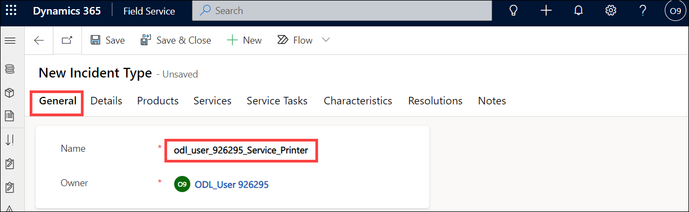

1. Select the **Details (1)** tab.

1. Select the **Service Call** work order type you created in Task 1 for **Default Work Order Type (2)**.

1. Select **Yes** from the **Copy Incident Items to Agreement (3)** drop-down field.

1. Click **Save (4)**.

    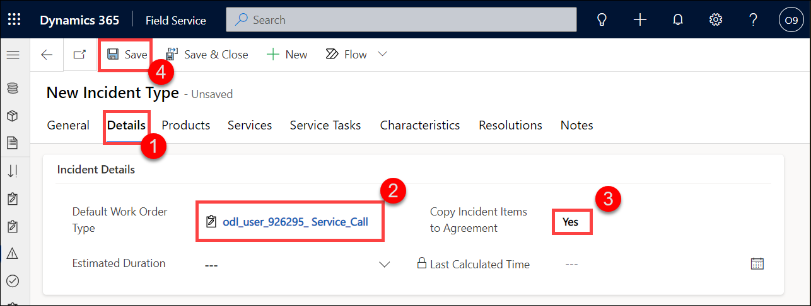

1. Select the **Service Tasks (1)** tab.

1. Click **+ New Incident Type Service Task (2)**.

    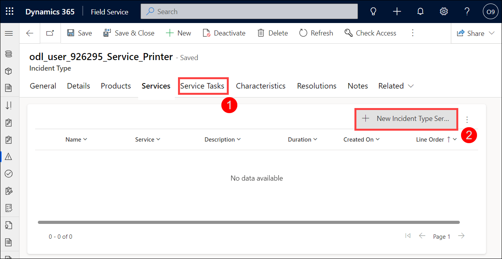

1. Enter **Clean Printer Assembly** for **Name(1)**.

1. Select the **Clean Printer Assembly** service task type you created in Task 2 for **Task Type (2)**.

1. Click **Save and Close (3)**.

    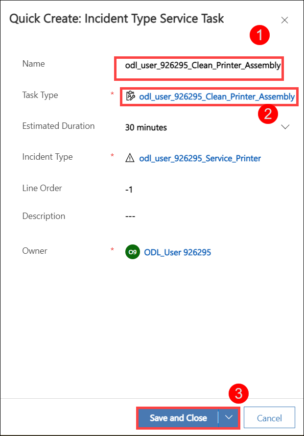

1. Click **+ New Incident Type Service Task**.

1. Enter **Replace Toner** for **Name**.

1. Select the **Replace Toner** service task type you created in Task 2 for **Task Type**.

1. Click **Save and Close**.

1. Click **+ New Incident Type Service Task**.

1. Enter **Replace Final Test** for **Name**.

1. Select the **Final Test** service task type you created in Task 2 for **Task Type**.

1. Click **Save and Close**.

    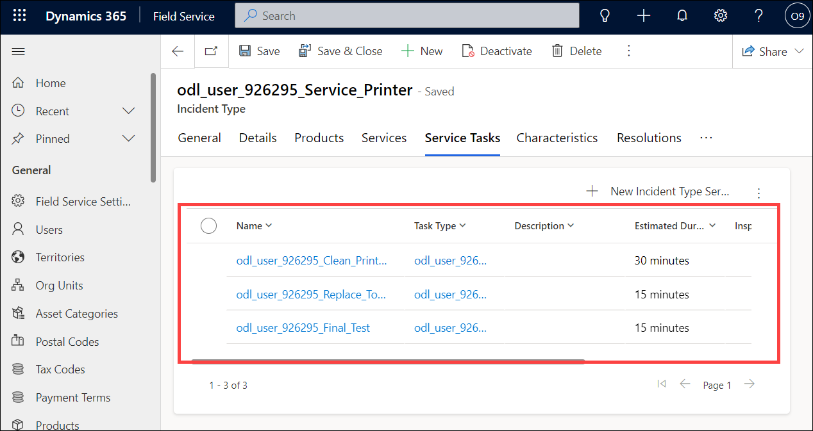

1. Select the **Products (1)** tab.

1. Click **+ New Incident Type Product (2)**.

    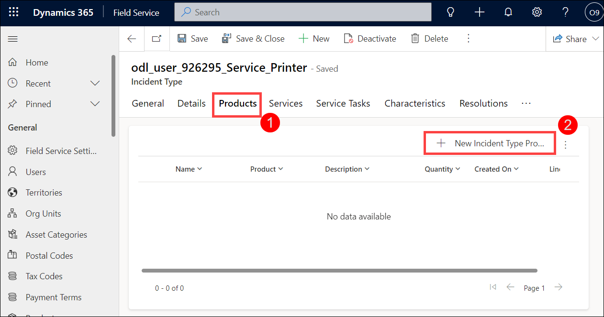

1. Enter **Remote Printer** for **Name (1)**.

1. Select the **Remote Printer** product you created in a previous lab for **Product (2)**.

1. Select the **Primary Unit** for **Unit (3)**.

1. Enter **1** for **Quantity (4)**. 

1. Click **Save and Close (5)**.

    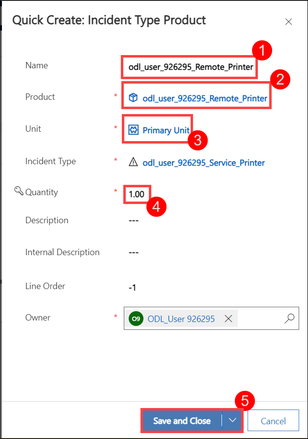

1. Select the **Services (1)** tab.

1. Click **+ New Incident Type Service (2)**.

    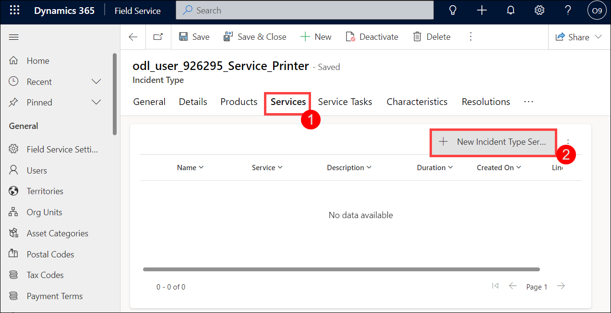

1. Enter **Printer Service Fee** for **Name (1)**.

1. Select the **Printer Service Fee** product you created in a previous lab for **Service (2)**.

1. Select the **Primary Unit** for **Unit (3)**.

1. Click **Save and Close (4)**.

    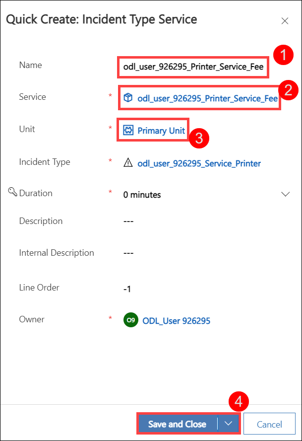

1. Select the **Characteristics (1)** tab.

1. Click **+ New Incident Type Characteristic**.

    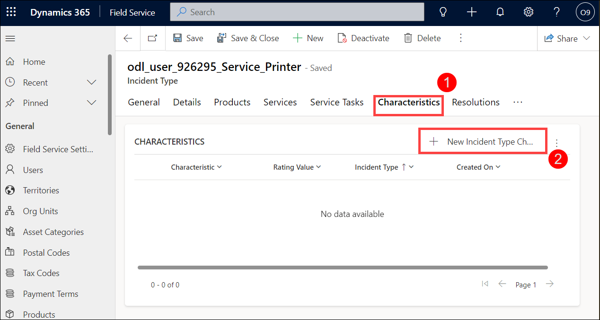

1. Select the **CISM** characteristic you created in a previous lab for **Characteristic (1)**.

1. Select the **Familiar** rating you created in a previous lab for **Rating Value (2)**. Click on the search icon to see all the rating values if you are unable to locate the rating.

1. Click **Save and Close (3)**.

    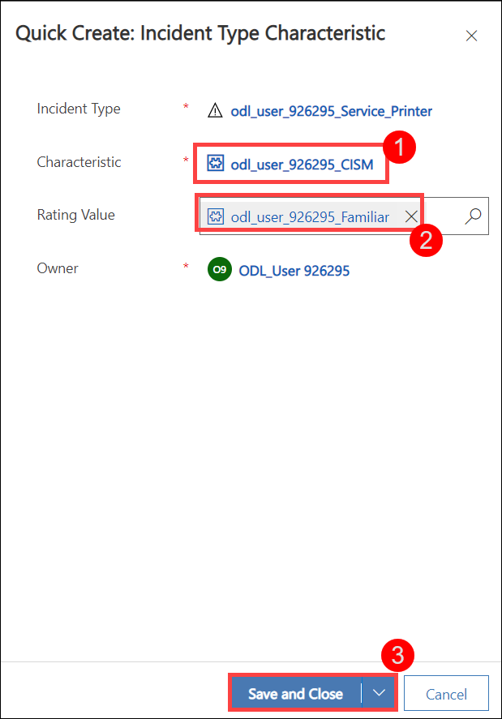

1. Select the **Characteristics** tab.

1. Click **+ New Incident Type Characteristic**.

1. Select the **Building Security** characteristic you created in a previous lab for **Characteristic**.

1. Select the **Level 2 Security** rating you created in a previous lab for **Rating Value**. Click on the search icon to see all the rating values if you are unable to locate the rating.

1. Click **Save and Close**.

## Exercise 2 – Test the Incident Type

In this exercise, you will create a work order by using the incident type.

### Task 1 - Create Customer

1. In the **Dynamics 365 Field Service app**, click the **Settings (1)** area in the bottom-left of the sitemap, and select **Service (2)** from the list. 

    

1. In the **Customers** group select **Accounts (1)**.

1. Click **+ New (2)**.

    

1. Enter **Relecloud** for **Account Name**. Click **Save**.

1. Click **Save & Close**.

1. Click on **Contacts** in the **Customers** group of the sitemap.

1. Click **+ New** located on the command bar.

1. Enter **Jane** for **First Name**.

1. Enter **Doe** for **Last Name**.

1. Select the **Relecloud** account you created in Task 1 for **Account Name**.

1. Click **Save & Close**.

### Task 2 – Create a new Work Order using an Incident Type

1. In the **Dynamics 365 Field Service app**, On the **Service** app, and in the **Scheduling** group select **Work Orders**.

    

1. Click **+ New**.

1. Select the **Relecloud** account you created in Task 1 for **Service Account (1)**.

1. Select the **Service Call** you created in a previous lab for **Work Order Type (2)**.

1. Select the **Service Printer** incident type you created in a previous lab for **Primary Incident Type (3)**.

1. Click **Save (4)**.

    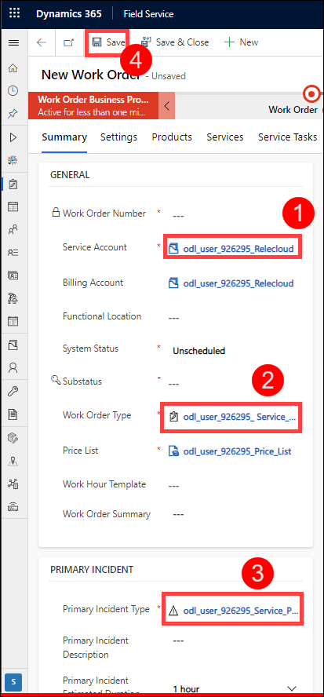

1. Wait about 30 seconds to a minute and click **Refresh** in the command bar.

1. Select the **Products** tab and verify that the **Remote Printer Product** was added.

    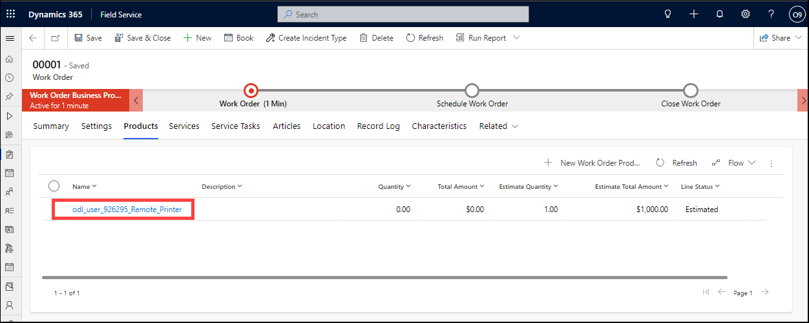

1. Select the **Services** tab and verify that the **Printer Service Fee** was added.

    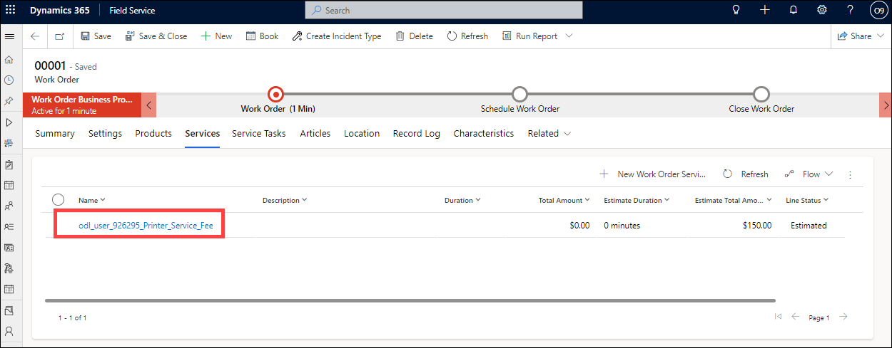

1. Select the **Service Tasks** tab and verify that the three tasks were added.

1. Click **Related** and select **Characteristics**.

    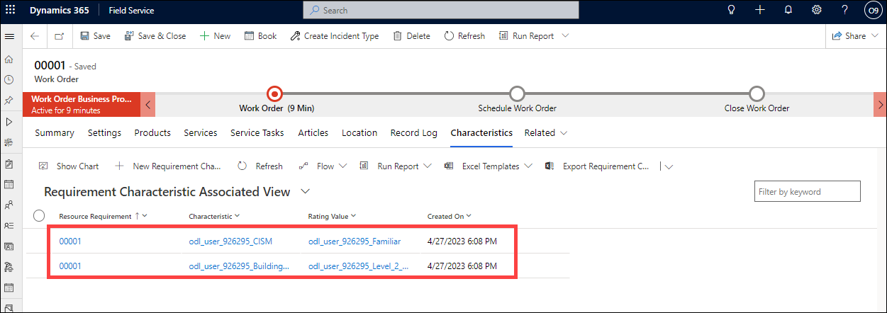

1. Verify that the two Characteristics defined on the Incident Type were added.

> **Congratulations** on completing the task! Now, it's time to validate it. Here are the steps:
> - Select the **Lab Validation** tab located at the upper right corner of the lab guide section.
> - Hit the Validate button for the corresponding task. If you receive a success message, you can proceed to the next task. 
> - If not, carefully read the error message and retry the step, following the instructions in the lab guide.
> - If you need any assistance, please contact us at labs-support@spektrasystems.com. We are available 24/7 to help you out.

**Result:** You have successfully created/populated an Incident Type as a template and also created a work order by using the incident type.
