# Practice Lab 6 - Agreements

## Lab scenario
In this lab, you will configure a preventative maintenance agreement within your Dynamics 365 Field Service environment. This agreement is designed to trigger monthly work orders for maintenance tasks and bill customers on a quarterly basis. 

## Lab objective
+ Exercise 1 - Create an Agreement
  
## Estimated timing: 20 minutes

## Exercise 1 - Create an Agreement

In this exercise, you will be defining a preventative maintenance agreement that will generate Work orders monthly and bill customers quarterly.

### Task 1 - Create Agreement

1. In the **Dynamics 365 Field Service app**, click the **Service**.

    

1. In the **Service Delivery** group select **Agreements**.

1. Click **+ New**.

    

1. Select the **Relecloud** account you created in a previous lab for **Service Account (1)**.

1. Select the **Price List** price list created in a previous lab for **Price List (2)**.

1. Select the first day of the current month for the **Start Date (3)**.

1. Select the **End Date (3)** to 12 months after the start date.

1. Set **Duration** to **365 days (3)**.

1. Click **Save (4)**.

    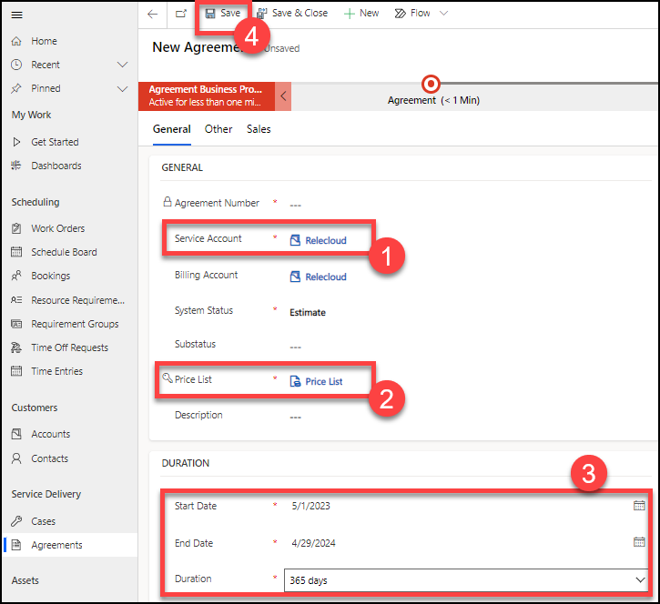

### Task 2 - Setup an Automated Booking for the Agreement

1. In the agreement created in Task 1, click on the ellipsis (...) in the **Booking Setup** section, and select **+ New Agreement Booking Setup**.

    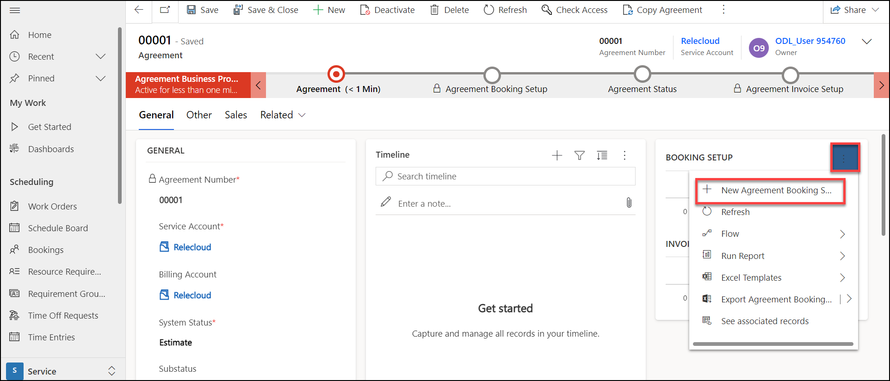

1. Enter **Monthly Printer Service** for **Name (1)**.

1. Select **Yes** for **Auto Generate Work Order (2)**.

1. Select **60** for **Generate Work Order Days in Advance (4)**.

1. Select the **Low** priority you created in a previous lab for **Priority  (5)**.

1. Select the **Service Call** work order type you created in a previous lab for **Work Order Type (3)**.

1. Select **No** for **Auto Generate Booking (6)**.

1. Select **1 Hour** for **Estimated Duration (7)**.

1. Enter **3** for **Pre Booking Flexibility (8)**.

1. Enter **3** for **Post  Booking Flexibility (8)**.

1. Select **9:00 AM** for **Time Window Start (9)**.

1. Select **12:00 PM** for **Time Window End: (9)**.

1. Click **Save (10)**.

    

1. In the **Incidents** section click on the ellipsis (...) and select **+ New Agreement Booking Incident**.

    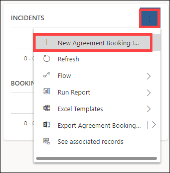

1. Select the **Service Printer** incident type you created in a previous lab for **Incident Type**.

1. Click **Save and Close**.

    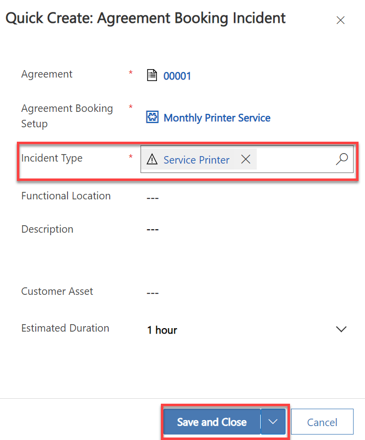

1. Click **Booking Recurrence** in the command bar.

    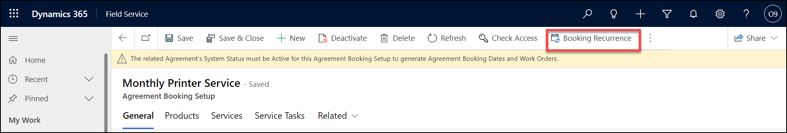

1. Select **Monthly** from **Repeat (1)** drop-down list.

1. Select **End after (#specified) occurrences** from the **End Date Behavior (2)** drop-down list.

1. Enter **12** for **Number of occurrences (3)**.

1. Click **OK  (4)**.

    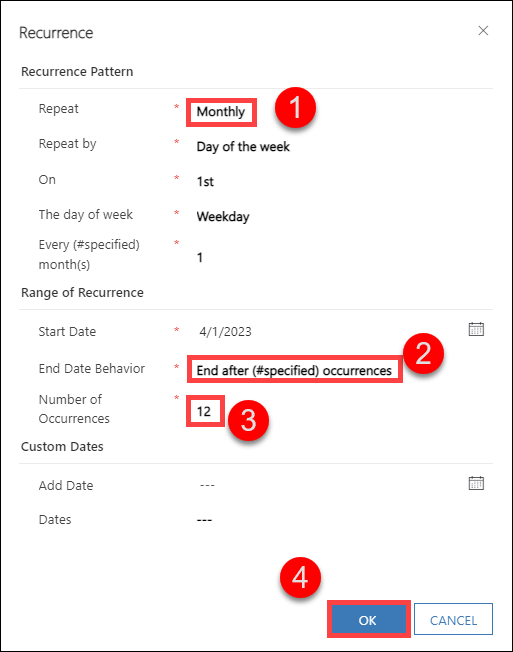

1. Click **Save & Close**.

1. In the business process flow select **Agreement** (1), click **Next Stage (2)** and select the Agreement Booking Setup you created. And select the **Agreement booking setup (3)**.

    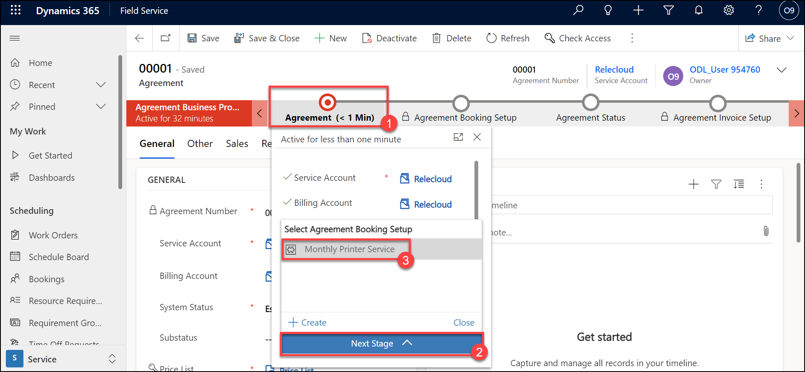

1. In the **Agreement Booking Setup** flow, click Next Stage.

    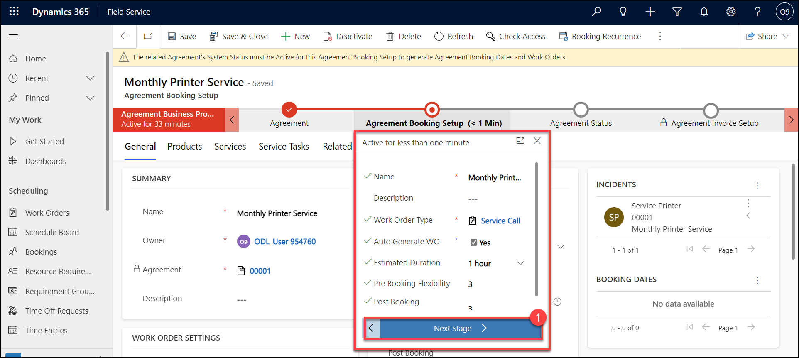

### Task 3 - Setup an Automated Invoice for the Agreement

1. In the agreement created in Task 1, click on the ellipsis (...) in the **Invoice Setup** section, and select **+ New Agreement Invoice Setup**.

    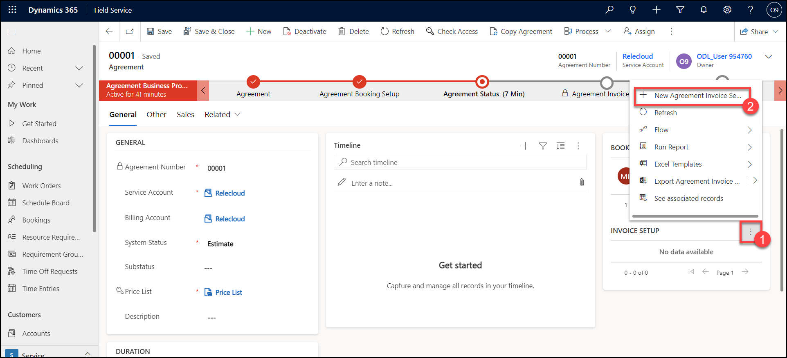

1. Enter **Quarterly Invoice** for **Name**.

1. Click **Save**.

    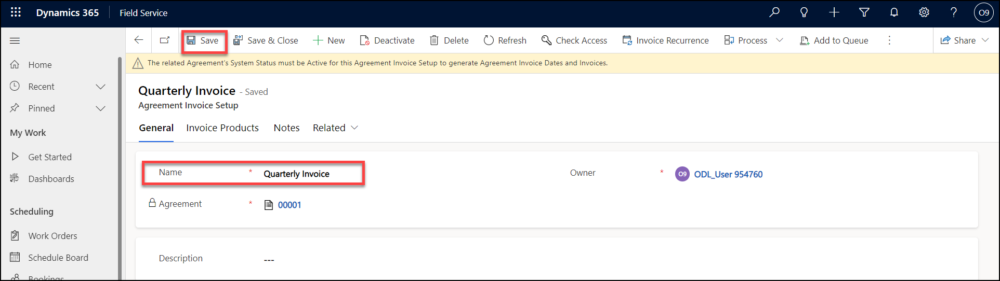

1. Select the **Invoice Products** tab.

1. Click **+ New Agreement Invoice Product (1)**.

    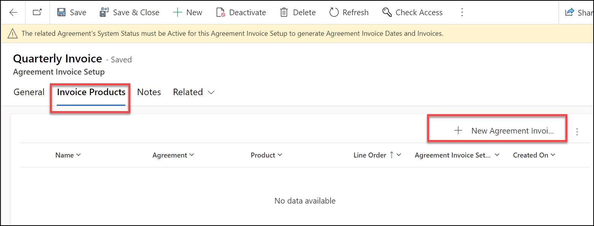

1. Select the **Monthly Printer Maintenance** product you created in a previous lab for **Product**.

1. Select the **Primary Unit** for **Unit**.

    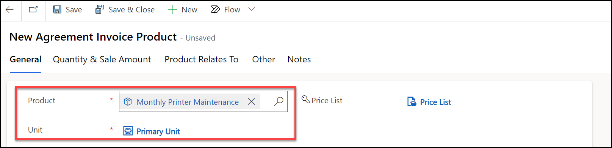

1. Select the **Quantity & Sale Amount** tab.

1. Enter **3** for **Quantity (1)**.

1. Click **Save & Close (2)**.

    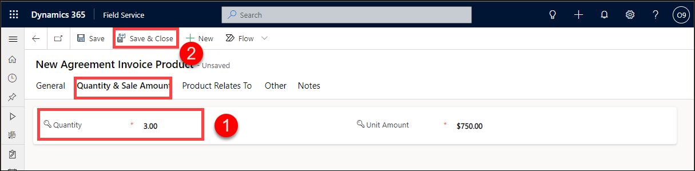

1. Click **Save & Close**.

1. In the **Agreement Status** flow, click **Next Stage (1)** and select the **Agreement Invoice Setup (2)**.

    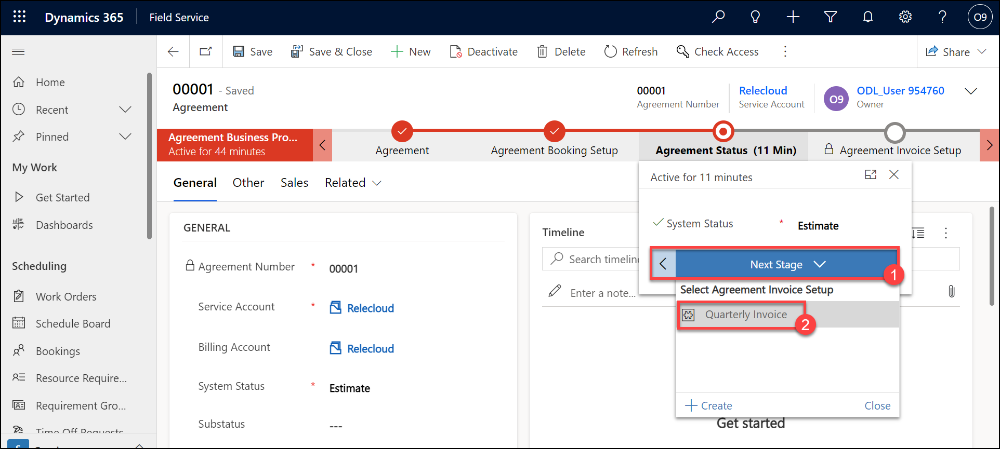

1. In the business process flow, click **Next Stage**.

    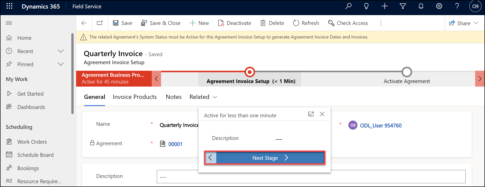

### Task 4 - Generate work orders

1. Return to the agreement created in Task 1.

1. Select **Active** from the **System Status (1)** drop-down field.

    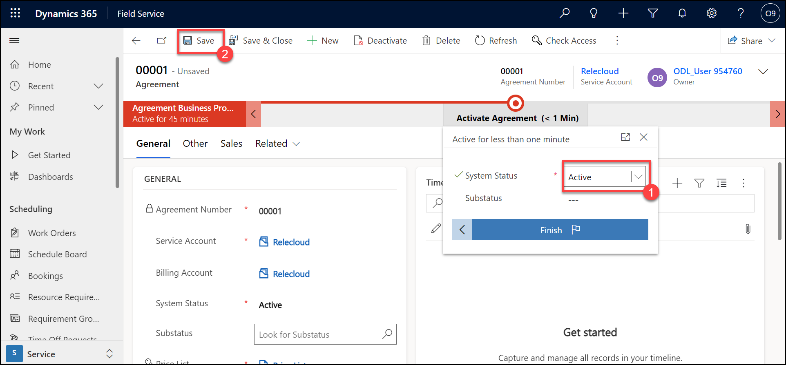

1. Click **Save (2)**.

1. In the **Booking Setup** section, open the Agreement Booking Setup you created in Task 2.

    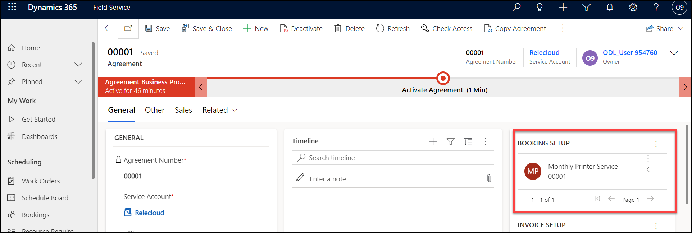

1. Verify there are booking dates listed.

    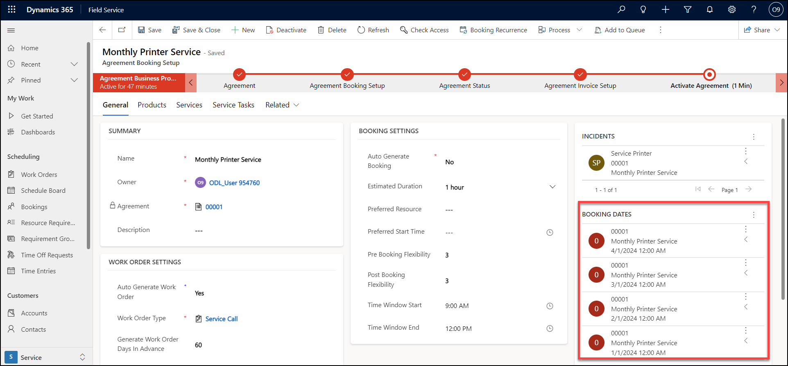

> **Congratulations** on completing the task! Now, it's time to validate it. Here are the steps:
> - Select the **Lab Validation** tab located at the upper right corner of the lab guide section.
> - Hit the Validate button for the corresponding task. If you receive a success message, you can proceed to the next task. 
> - If not, carefully read the error message and retry the step, following the instructions in the lab guide.
> - If you need any assistance, please contact us at labs-support@spektrasystems.com. We are available 24/7 to help you out.

**Result:** You have successfully created an agreement and have set up an automated invoice/automated booking for the agreement. Then you have generated a work order successfully.

### Review
In this lab, you have completed:

- Create Agreement
- Setup an Automated Booking for the Agreement
- Setup an Automated Invoice for the Agreement
- Generate work orders

### **Proceed with the next Lab.**
