# Practice Lab 7 - Inspections

## Exercise 1 - Create and use an Inspection Template

In this exercise you will be defining an inspection template and adding it to a server type task.

   >Note: The **[DeploymentId]/[DID] can be found under the environment details tab in the user name (example: `odl_user_xxxxxx.onmicrosoft.com`) **xxxxxx** is the [DeploymentID]**.

### Task 1 - Create Inspection Template

1. In the **Dynamics 365 Field Service app**, click the **Resources (1)** area in the bottom-left of the sitemap, and select **Settings (2)** from the list. 

    

1. In the **Work Orders** group select **Inspection Templates (1)**.

1. Click **+ New (2)**.

    

1. Enter **odl_user_DID_Printer_Inspection** for **Name for Inspection (1)**.

1. Click on **TextBox (2)** to add question.

1. Enter **Serial number** for **Question1 (3)** title.

1. Toggle **Required (4)** to On.

1. Click **Advanced (5)**.

    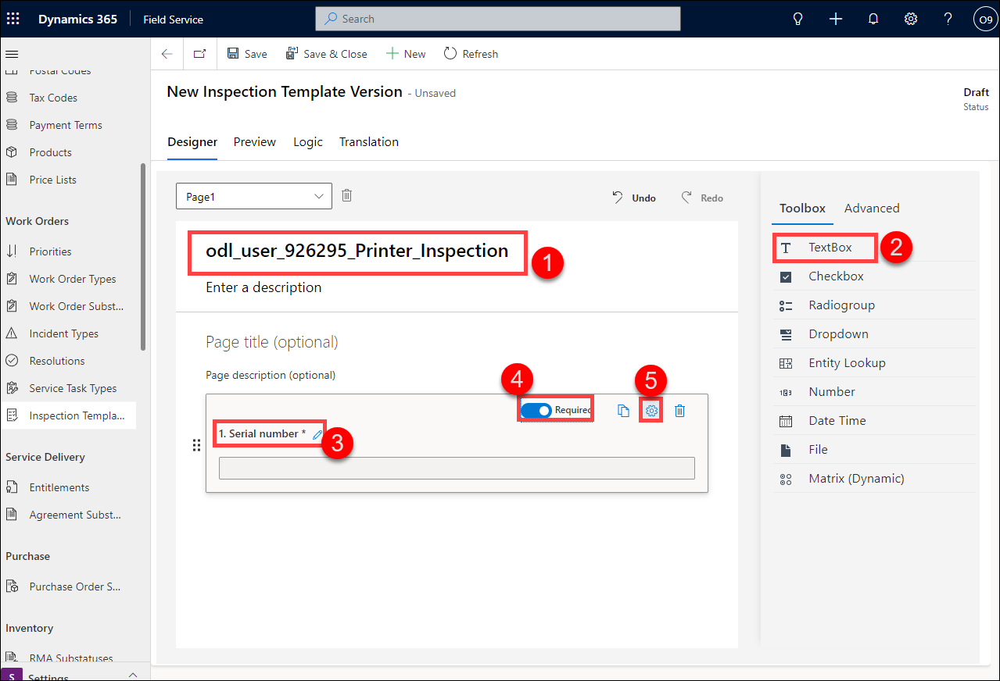

1. Select **Barcode** for **Input type**.

    

1. Select **Toolbox (1)** tab.

1. Click on **Dropdown (2)** to add question.

1. Enter **Condition (3)** for **Question2** title.

1. Toggle **Required (4)** to On.

1. Change **Item 1** to **Poor (5)**.

1. Change **Item 2** to **Satisfactory (5)**.

1. Change **Item 3** to **Good (5)**.

    

1. Click on **Number (1)** to add question.

1. Enter **Page Count (2)** for **Question3** title.

1. Select the **Advanced (3)** tab.

    

1. Toggle **Whole Number** to On.

    

1. Select the **Toolbox** tab.

1. Click on **TextBox (1)** to add question.

1. Enter **Comments (2)** for **Question4** title.

1. Select the **Advanced (3)** tab.

    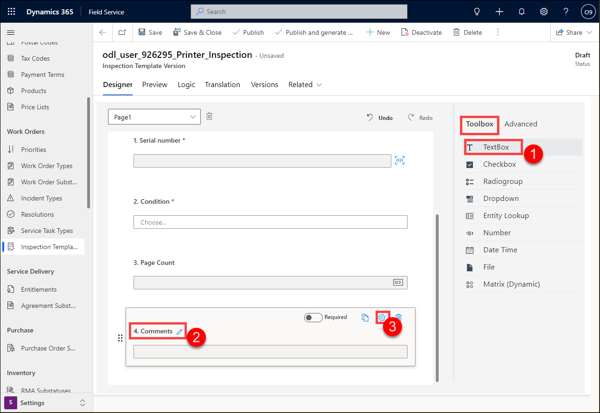

1. Select **Multiline** for the **Input type** drop-down.

    

1. Select the **Toolbox** tab.

1. Click on **File (1)** to add question.

1. Enter **Image** for **Question5 (2)** title.

1. Click the **Preview (3)** tab.

    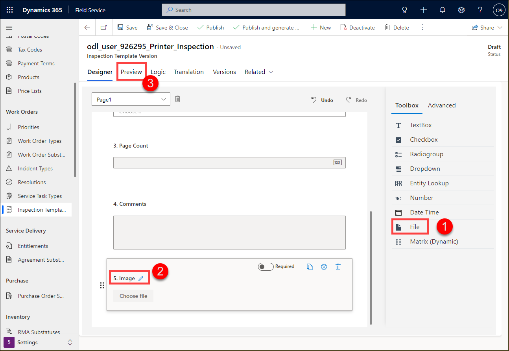

1. Click **Save**.

1. Click **Publish** and click **Publish** again.

    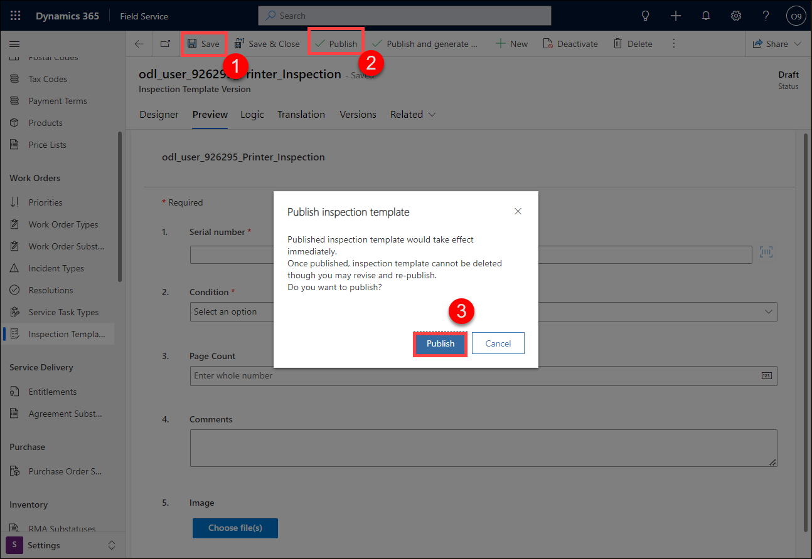

### Task 2 - Add Inspection Template to Service Type Task

1. In the **Work Orders** group select **Service Task Types**.

    

1. Click **+ New**.

1. Enter **odl_user_DID_Inspect_Printer** for **Name (1)**.

1. Enter **5 Minutes** for **Estimated Duration (2)**.

1. Toggle **Has Inspection (3)** to **Yes**.

1. Select the **odl_user_DID_Printer_Inspection** inspection template you created in Task 1 for **Inspection Template (4)**.

1. Click **Save (5)**.

    

1. In the **Work Orders** group select **Incident Types**.

1. Edit the **odl_user_DID_Service_Printer** incident type.

    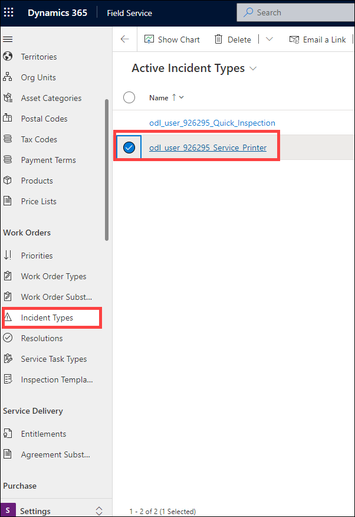

1. Select the **Service Tasks** tab.

1. Click **+ New Incident Type Service Task**.

    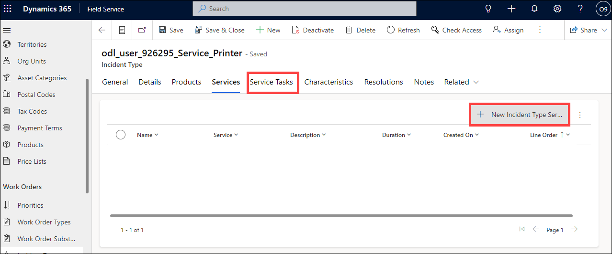

1. Enter **odl_user_DID_Inspect_Printer** for **Name (1)**.

1. Select the **odl_user_DID_Inspect_Printer** service task type you created in Task 2 for **Task Type (2)**.

1. Click **Save and Close (3)**.

    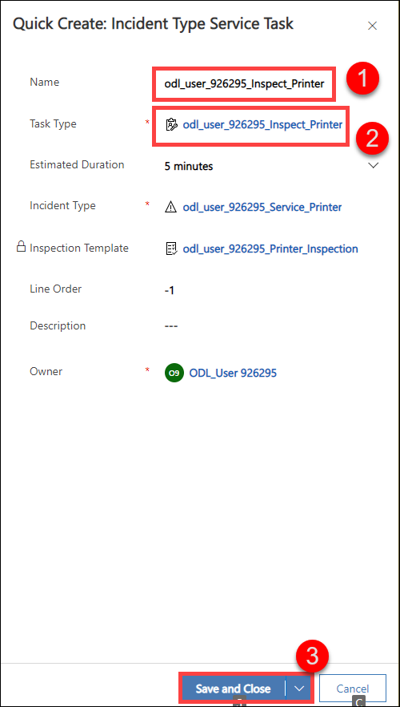

1. Click **Save & Close**.

### Task 3 – Download an image

1. In the browser, open Microsoft Bing and do an image search for printers.

1. Right click on the image of the printer and select **Save image as** and click **Save**.

### Task 4 – Create a new Work Order and view the inspection

1. In the **Dynamics 365 Field Service app**, click the **Settings (1)** area in the bottom-left of the sitemap, and select **Service (2)** from the list. 

    

1. In the **Scheduling** group select **Work Orders**.

1. Click **+ New**.

    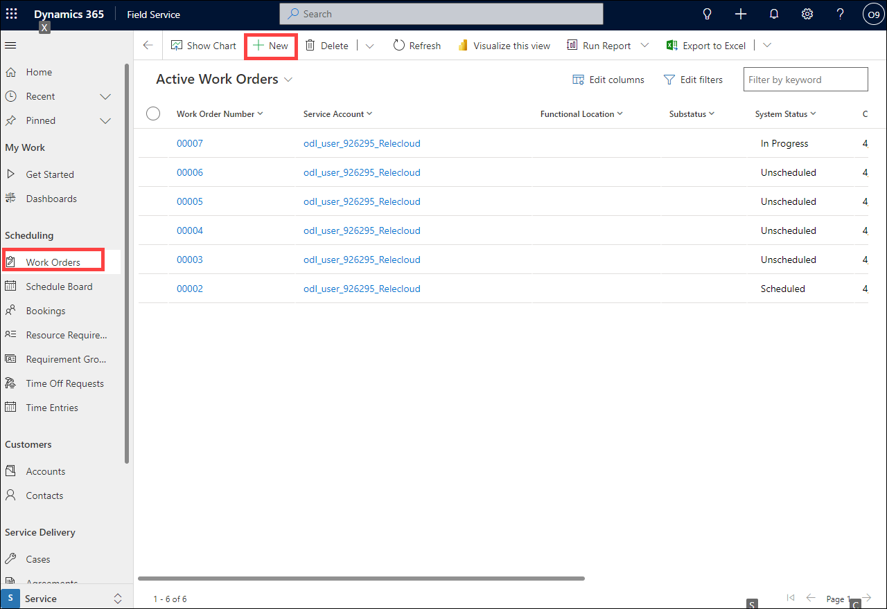

1. Select the **odl_user_DID_Relecloud** account you created in Task 1 for **Service Account**.

1. Select the **odl_user_DID_Service_Printer** incident type you created in a previous lab for **Primary Incident Type**.

    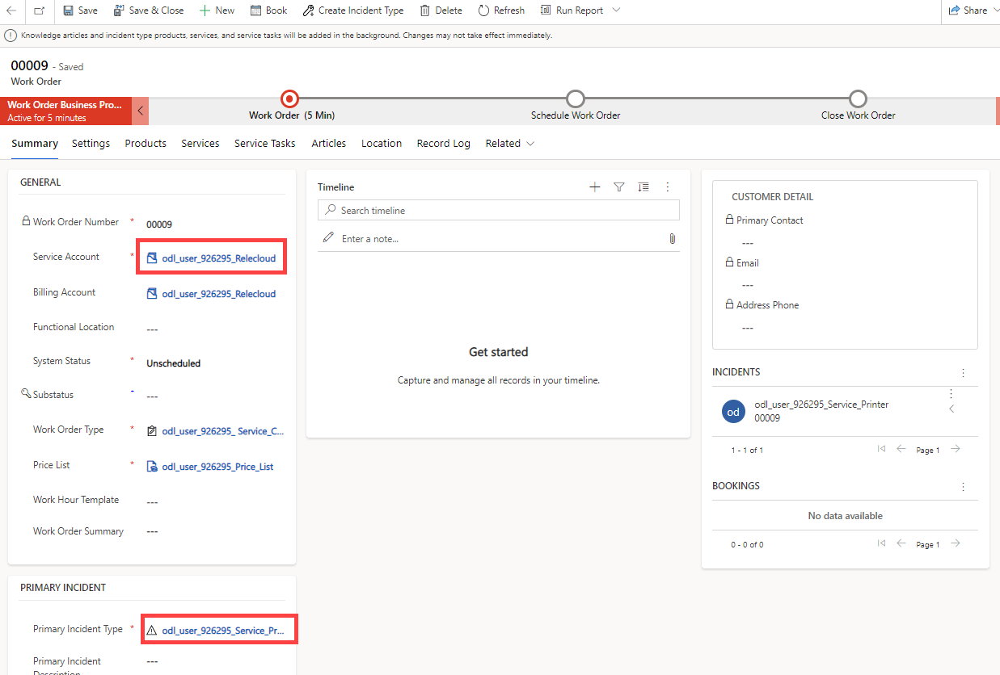

1. Click **Save**.

1. Wait about 30 seconds to a minute and click **Refresh** in the command bar.

1. Select the **Service Tasks** tab and verify that the four tasks were added.

    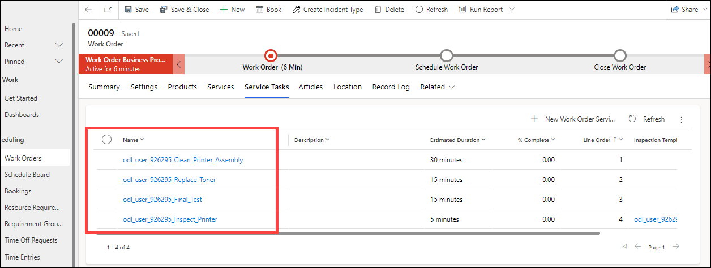

1. Open the **odl_user_DID_Inspect_Printer** work order service task.

1. Enter **122333** for **Serial number (1)**.

1. Select **Satisfactory** from the **Condition (2)** drop-down field.

1. Enter **999** for **Page Count (3)**.

1. Enter **No problems found** for **Comments (4)**.

1. Click on **Choose file(s)** and browse to the image you downloaded in Task 3 and click **Open (5)**.

1. Click **Save (6)**.

    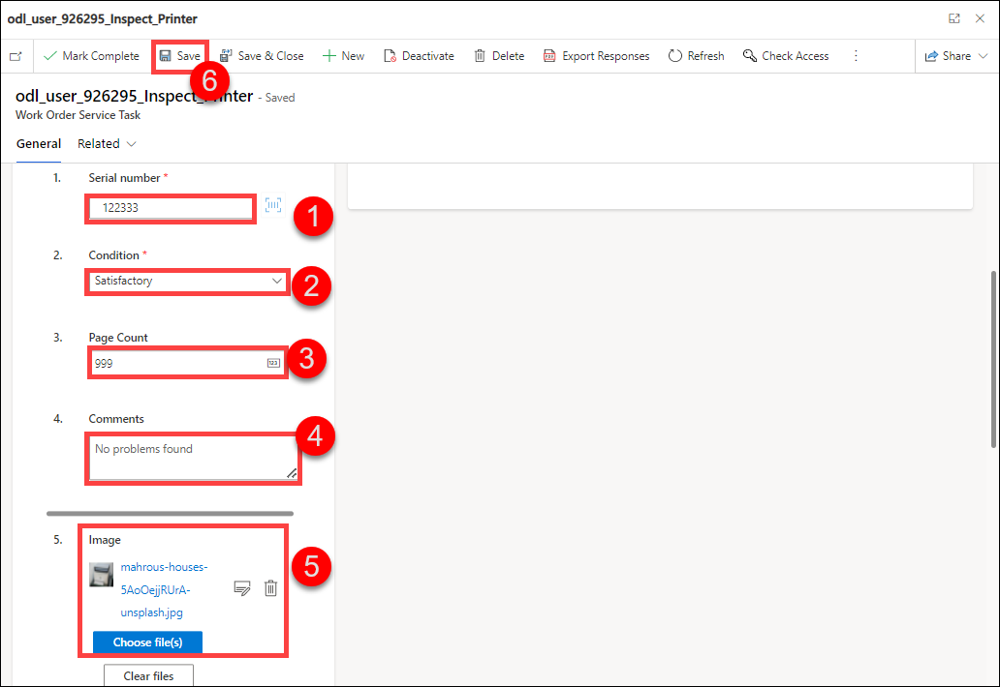

1. Select **Pass** for **Result (1)**.

1. Click **Mark Complete (2)**.

    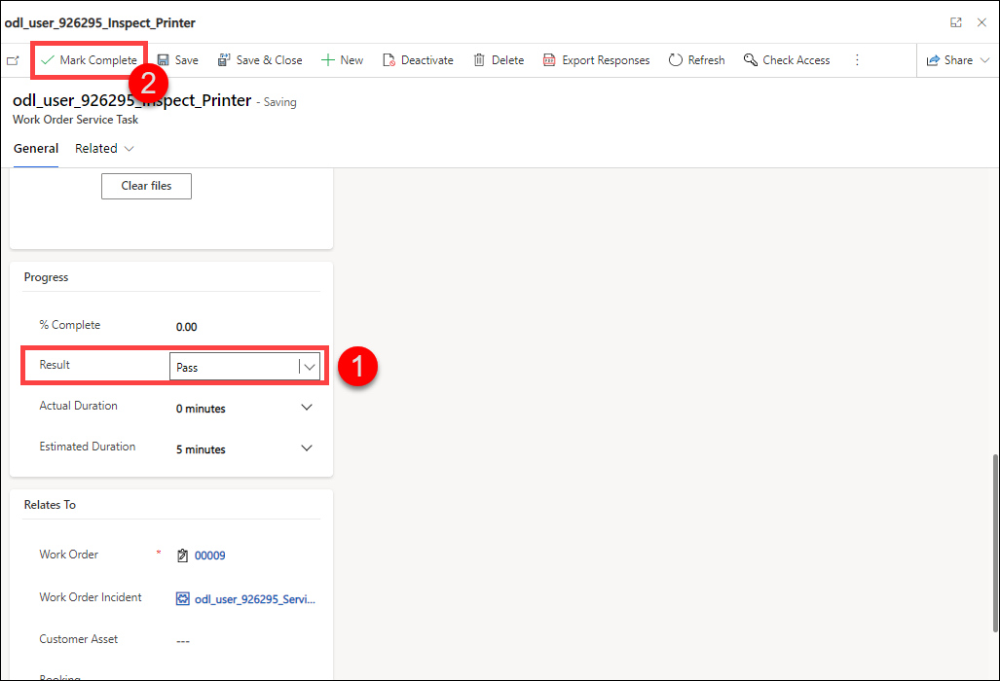