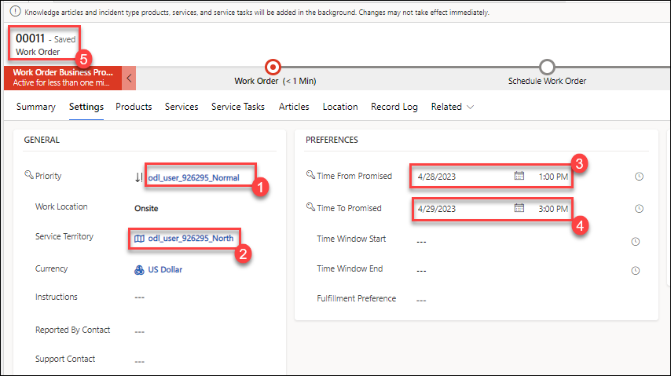
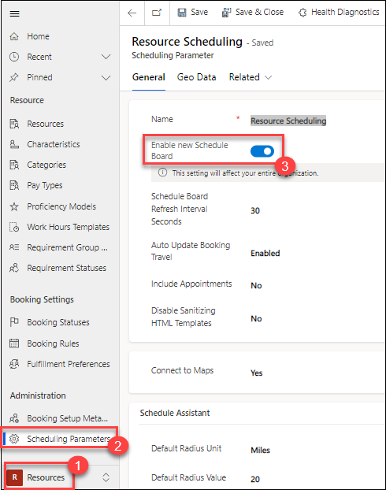
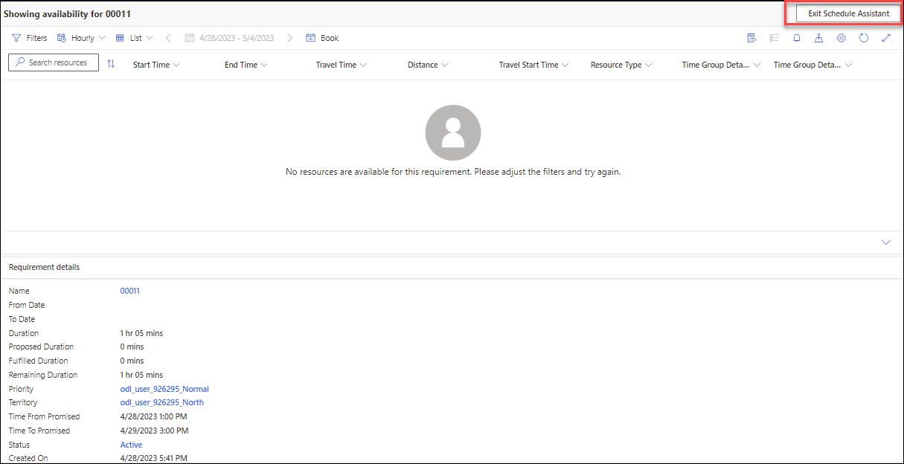
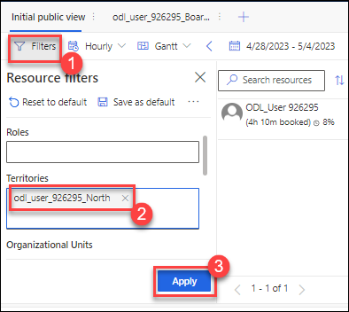
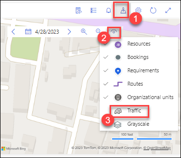
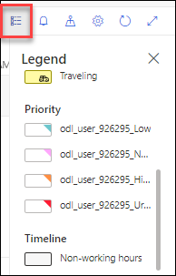
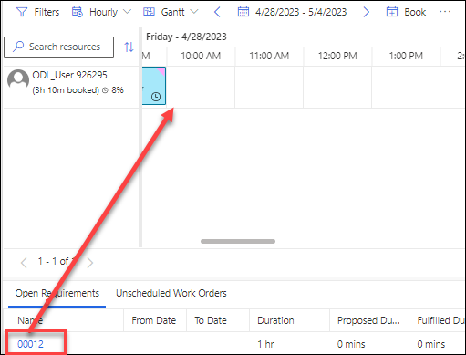
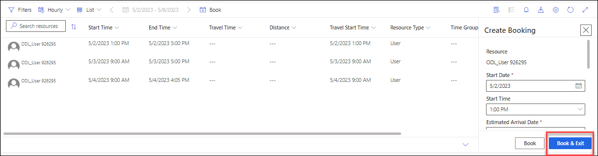

# Practice Lab 8 - Scheduling

## Exercise 1 - Schedule work orders with the schedule board

Out-of-the-box, Dynamics 365 for Field Service has the work order table enabled for use with the Resource Scheduling feature. In this exercise, we will be creating work orders that we can schedule using the application.

### Task 1 – Create work orders

1. In the **Dynamics 365 Field Service app**, click the **Service** area in the bottom-left of the sitemap, and in the **Scheduling** group select **Work Orders**.

1. Click **+ New**.

1. Select the **Relecloud** account you created in an earlier lab for **Service Account**.

1. Select the **Service Printer** incident type you created in a previous lab for **Primary Incident Type**.

1. Select the **Settings** tab.

   

1. Select the **Normal** priority you created in a previous lab for **Priority**.

1. Select the **North** territory you created in a previous lab for **Service Territory**.

1. Enter **Today \@ 1:00 PM** for **Time from Promised**.

1. Enter **Tomorrow \@ 3:00 PM** for **Time to Promised**.

   >Note: Ensure that you choose a date of the weekdays(**Not Saturday and Sunday**).

1. Click **Save**. (Make a note of the Work Order number).

   

1. Click **+ New**.

1. Select the **Relecloud** account you created in an earlier lab for **Service Account**.

1. Select the **Quick Inspection** incident type you created in a previous lab for **Primary Incident Type**.

1. Select the **Settings** tab.

1. Select the **Urgent** priority you created in a previous lab for **Priority**.

1. Select the **North** territory you created in a previous lab for **Service Territory**.

1. Click **Save**. (Make a note of the Work Order number.)

## Exercise 2 - Schedule work orders using the schedule board

Universal Resource Scheduling provides several items that can be used to assist in scheduling resources for specific items. The two primary components that are used are the Schedule Board and the Schedule Assistant. The Schedule Board provides the ability to manually schedule items, and the assistant offers suggestions on resources based on factors like location, skills, and availability. In this exercise, we will examine how you can use the schedule board to schedule items.

### Task 1 – Enable the new Schedule Board

1. In the **Dynamics 365 Field Service app**, click the **Resources** area in the bottom-left of the sitemap, and in the **Administration** group select **Scheduling Parameters**.

1. Click **Resource Scheduling**.

1. In the General tab, make sure **Enable new Schedule Board** is set to **On**.

   
   
   >Note: "If you do not see the option please proceed to the next part of the exercise".

### Task 2 – Schedule work orders

1. In the **Dynamics 365 Field Service app**, click the **Service** area in the bottom-left of the sitemap, and in the **Scheduling** group select **Schedule Board**.

1. The Schedule Board provides several options that can be used to schedule items, such as a filter, and a map view.

1. Select the **Unscheduled Work Orders** tab.

1. Select the **Urgent** work order that you created in Exercise 1 and drag it to an available time slot for your user's resource on the schedule board.

1. Release the mouse button and the item will be placed on the schedule board.

1. Select the **Normal** work order that you created in Exercise 1 and click **Find Availability**.

   

1. Dynamics 365 will analyze the requirements needed for this item and will factor in other items such as any skills required, work order & resource locations, and resource availability to create a list of suggested resources that would be able to work on this item.

1. Click **Exit Schedule Assistant**.

   

1. Click on the **Filters** icon.

1. Select the **North** in **territories** you created in a previous lab. 

1. Click **Apply**. Your resource should be listed.

   

1. Right-click on your resource cell in the Schedule Board and select **View resource card**.

1. Click on the **Map View** icon.

1. Select the **Normal** work order that you created in Exercise 1 and zoom in on the map.

1. Click on **View Settings** in the map and enable **Traffic**.

   

1. Click on the **Map View** icon to close the map pane.

1. Close the **Filters** pane.

1. Click on the **Legend** icon and examine the colors used on the board.

   

1. Click on the booking for the work order you dragged onto the schedule board earlier in this task. The tooltip for the booking will be displayed.

1. Click on the **Detail panel** icon. The details of the booking will be displayed in the details panel.

   

1. Select the **Normal** work order that you created in Exercise 1 from the **Unscheduled Work Orders** tab and click **Find Availability**.

1. Select your resource and click **Book & Exit**.

   
