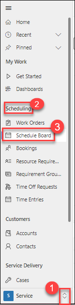
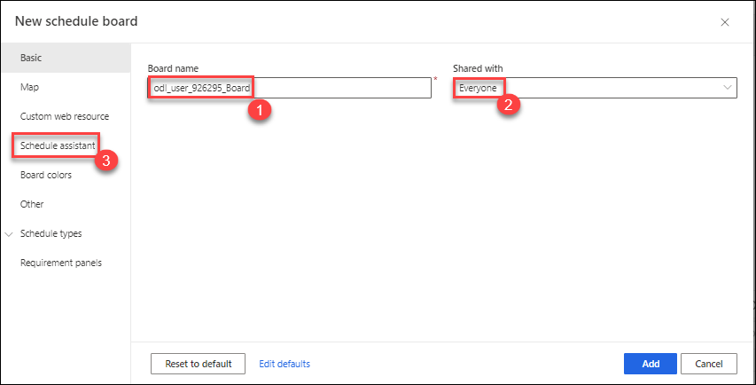
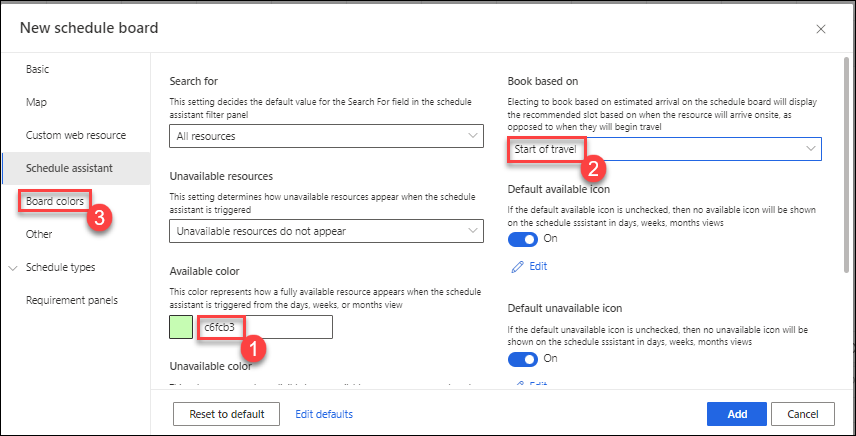
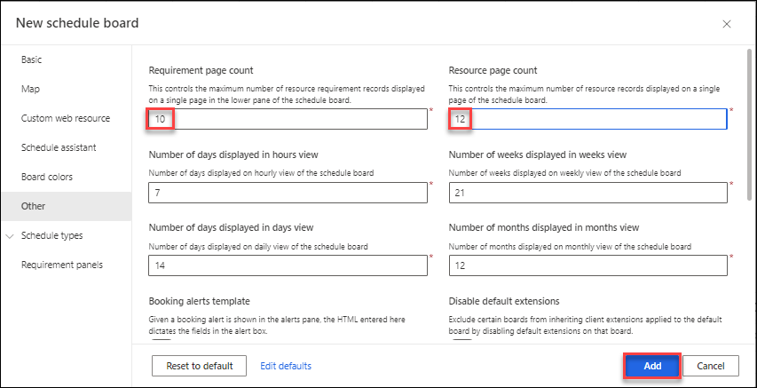

# Practice Lab 9 - Configure the Schedule Board

## Exercise 1 - Create and configure a new schedule board

You can create new schedule boards and configure them for your requirements. In this exercise, we will create and configure a schedule board.

### Task 1 – Create a schedule board

1. In the **Dynamics 365 Field Service app**, click the **Service (1)** area in the bottom-left of the sitemap, and in the **Scheduling (2)** group select **Schedule Board (3)**.

    

1. Click the **+** icon in the top-left of the schedule board to add a new schedule board tab.

1. Enter ** Board (1)** for **Board Name**.

1. Select **Everyone (2)** from the **Shared with** drop-down field.

1. Select the **Schedule Assistant (3)** tab.

    

1. Enter **c6fcb3** for **Available color (1)**.

1. Select **Start of travel (2)** from the **Book based on** drop-down field.

1. Select the **Board colors (3)** tab.

    

1. Enter **c6fcb3** for **Not booked (1)**.

1. Enter **bf2626** for **Current timeline (2)**.

1. Select the **Other (3)** tab.

    

1. Enter **10** for **Requirement page count**.

1. Enter **12** for **Resource page count**.

1. Click **Add**.

    

1. Select the  ** Board (1)** tab.

1. Click on the **Scheduler Settings (2)** gear icon on the Schedule Board.

1. Select your **Time Zone (3)**.

1. Select **8:00 AM to 6:00 PM** for **Working time (4)**.

1. Select **30 minutes** for **Time resolution (5)**.

    

1. Click on the **Filters (1)** icon.

1. Select **User** from the **Resource Types (2)** drop-down field.

1. Click **Apply (3)**.

1. Click **Save as default (4)**.

1. Close the **Filters (5)** pane.

    

> **Congratulations** on completing the task! Now, it's time to validate it. Here are the steps:
> - Select the **Lab Validation** tab located at the upper right corner of the lab guide section.
> - Hit the Validate button for the corresponding task. If you receive a success message, you can proceed to the next task. 
> - If not, carefully read the error message and retry the step, following the instructions in the lab guide.
> - If you need any assistance, please contact us at labs-support@spektrasystems.com. We are available 24/7 to help you out.

**Result:** You have successfully created and configured Schedule Boards according to your requirement.
