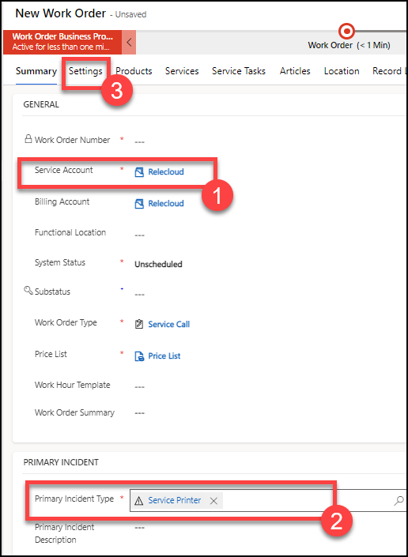
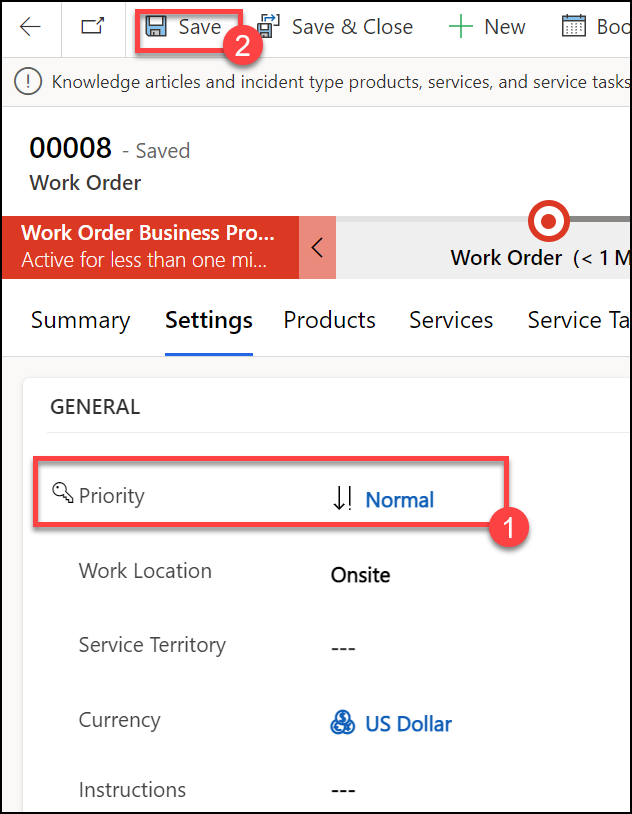
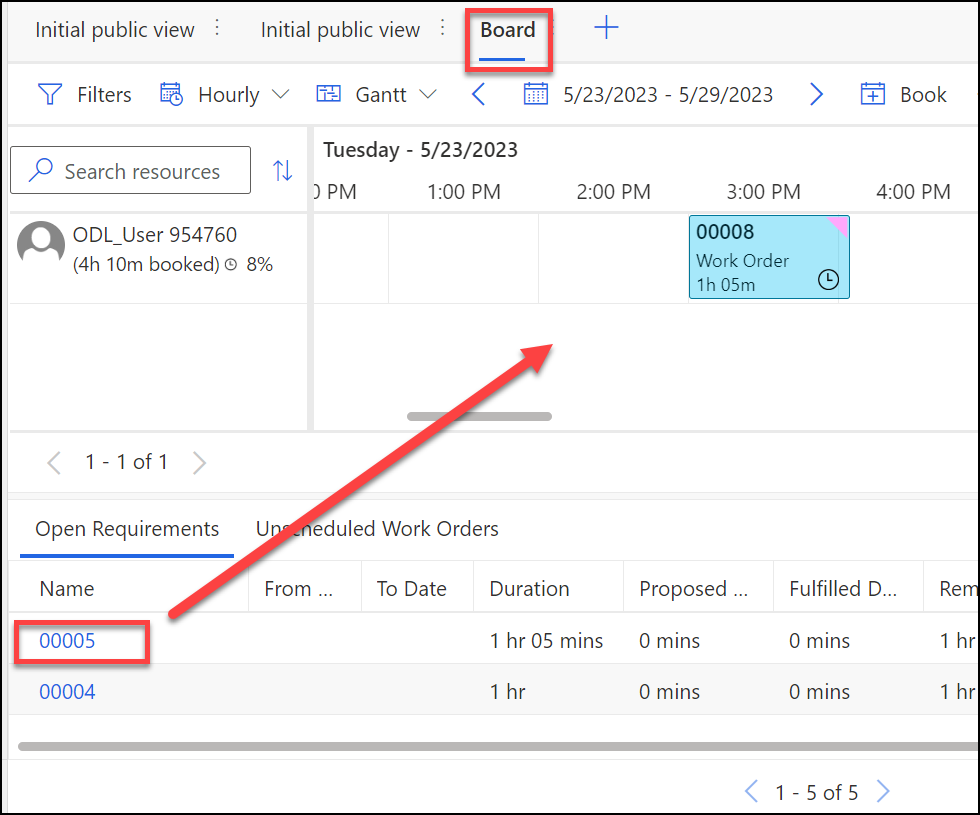
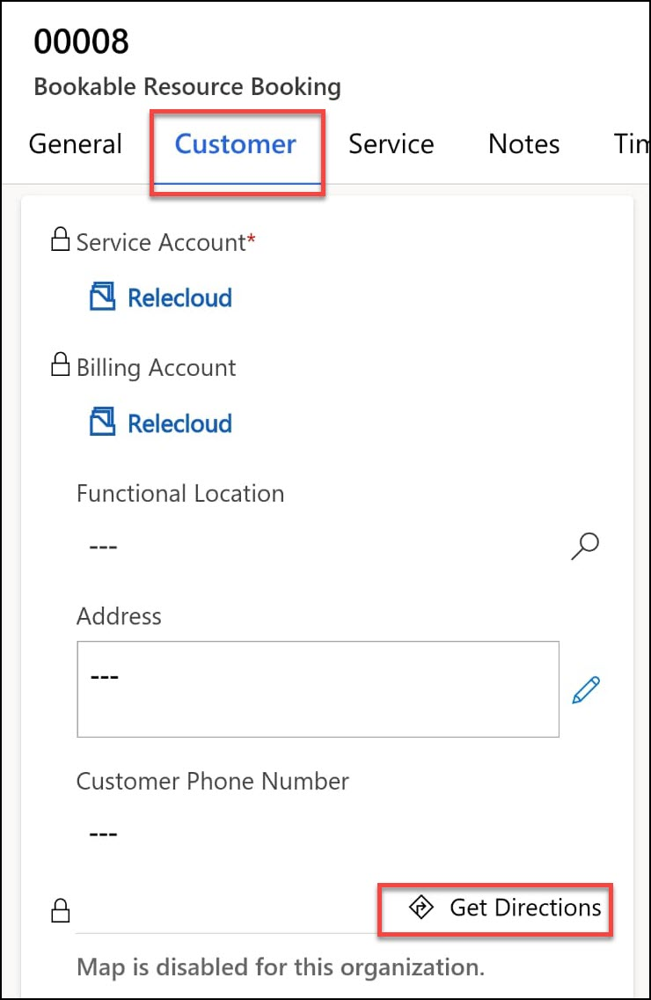
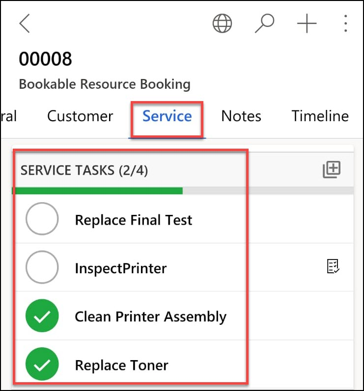
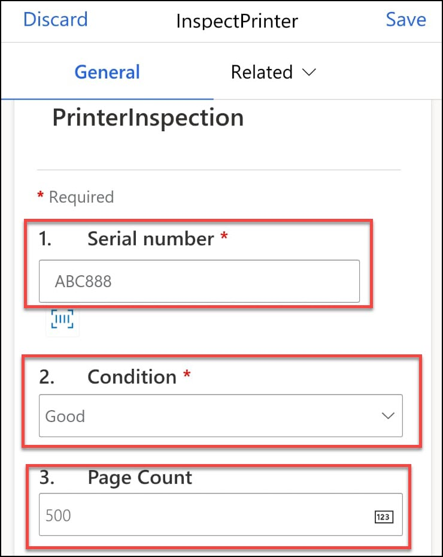
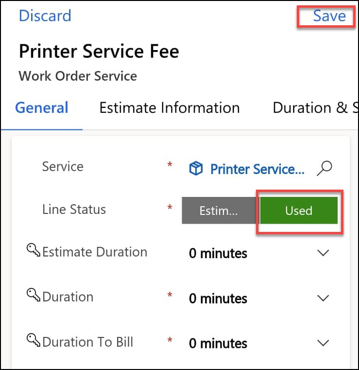
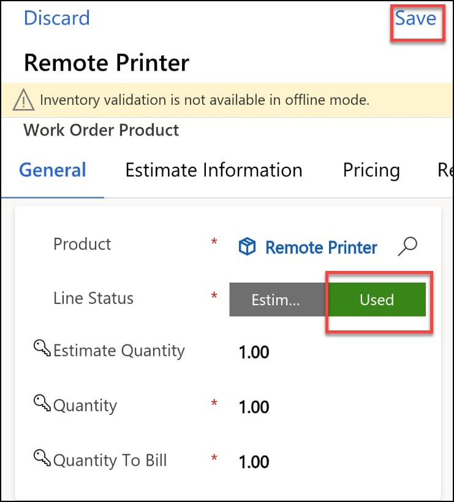

# Practice Lab 10 - Field Service mobile app

## Exercise 1 – Configure Field Service mobile app for frontline workers

In this exercise, you will configure settings for work orders including priorities and resolutions.

### Task 1 – Configure security and offline profile

1. In the **Dynamics 365 Field Service app**, click **Get Started** from My work panel.

1. Under Set up your frontline workers, click **Set up**.

    

1. Select your user for **Users (1)**.

1. Select your **Time Zone (2)**.

1. Click **Save and Close (3)**.

    

### Task 2 – Create work order

1. In the **Dynamics 365 Field Service app**, click the **Service (1)** area in the bottom-left of the sitemap, and in the **Scheduling** group select **Work Orders (2)**.

1. Click **+ New (3)**.

    

1. Select the **Relecloud** account you created in an earlier lab for **Service Account (1)**.

1. Select the **Service Printer** incident type you created in a previous lab for **Primary Incident Type (2)**.

1. Select the **Settings (3)** tab.

    

1. Select the **Normal** priority you created in a previous lab for **Priority**.

1. Click **Save**.

    

1. In the **Dynamics 365 Field Service app**, click the **Service** area in the bottom-left of the sitemap, and in the **Scheduling** group select **Schedule Board**.

1. Select the  **Board** tab.

1. Drag the requirement for the work order to an available slot for today or tomorrow for your resource.

    

> **Congratulations** on completing the task! Now, it's time to validate it. Here are the steps:
> - Select the **Lab Validation** tab located at the upper right corner of the lab guide section.
> - Hit the Validate button for the corresponding task. If you receive a success message, you can proceed to the next task. 
> - If not, carefully read the error message and retry the step, following the instructions in the lab guide.
> - If you need any assistance, please contact us at labs-support@spektrasystems.com. We are available 24/7 to help you out.

### Task 3 – Install the mobile app

>**`Note`**: From here all the tasks will be performed via a mobile app.

1. In your mobile devices app store, search for **Field Service Dynamics 365**.

1. Select the **Field Service (Dynamics 365)** app and install.

1. Open the app.

1. Tap **Sign in** and log in with your Dynamics 365 tenant credentials.

1. Verify that you can see the booking you made in Task 2.

### Task 4 – Process the booking

1. In this task to process the booking, Tap to open the booking.

1. Change **Booking Status** to **Traveling** and tap **Save**. The color of the booking on the schedule board will change.

    

1. Change **Booking Status** to **In Progress** and tap **Save**. The color of the booking on the schedule board will change.

1. Tap the **Customer** tab.

1. Tap **Get Directions**.

    

1. Close the mapping app.

1. Tap the **Service** tab.

1. Check the **Clean Printer Assembly** task.

1. Check the **Replace Toner** task.

1. Check the **Replace Final Test** task.

1. Tap to open the **Inspect Printer** task.

    

1. If you have a barcode available click on the barcode symbol and allow the app to use your device and scan a barcode.

1. If you do not have a barcode, enter **ABC888** for **Serial number**.

1. Select **Good** from the **Condition** drop-down field.

1. Enter **500** for **Page Count**.

    

1. Enter **All ok** for **Comments (1)**.

1. Tap on **Photo (2)** and allow the app to use your camera and take a photo.

1. Slide **% Complete (3)** to **100**.

1. Select **Pass** for **Result (4)**.

1. Set **Actual Duration (5)** to **15 minutes**.

1. Tap **Save (6)**.

    

1. Tap **<** to return to the booking.

1. Tap to open the **Printer Service Fee** service.

1. Tap **Used** for **Line Status**.

1. Tap **Save**.

    

1. Tap **<** to return to the booking.

1. Tap to open the **Remote Printer** product.

1. Tap **Used** for **Line Status**.

1. If a popup message appears that says you do not have quantity on hand, click **OK**.

1. Tap **Save**.

    

1. Tap **<** to return to the booking.

1. Tap the **General** tab.

1. Change **Booking Status** to **Completed** and tap **Save**.

1. Tap **<** to return to the agenda.

**Result:** You have successfully configured Field Service mobile app for frontline workers by creating work orders including priorities and resolutions.
