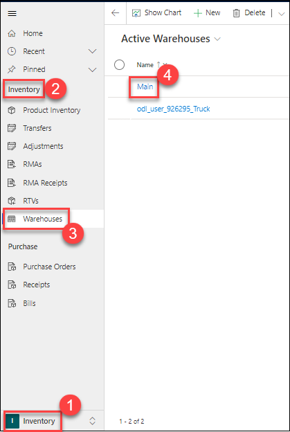
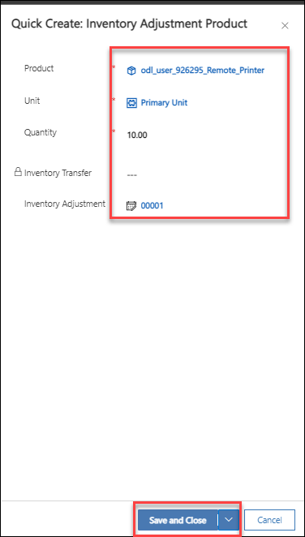
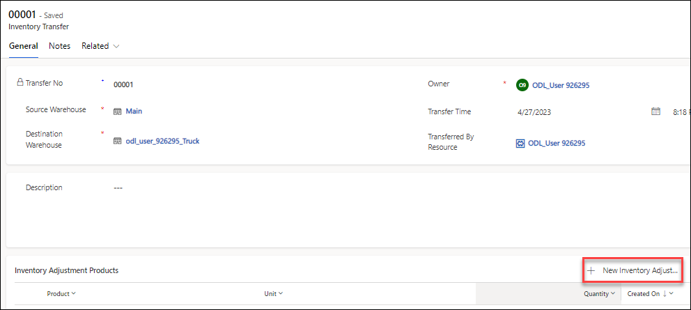
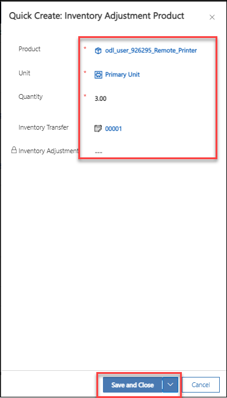

# Practice Lab 11 - Inventory

## Exercise 1 – Manage inventory

In this exercise, you will add inventory to a warehouse and then transfer it to a truck.

### Task 1 – Setup inventory in Warehouse

1. In the **Dynamics 365 Field Service app**, click the **Inventory (1)** area in the bottom-left of the sitemap, and in the **Inventory (2)** group select **Warehouses (3)**.

1. Edit the **Main (4)** warehouse.

    

1. Click **Related** and select **Product Inventory**.

   

1. Click **+ New Product Inventory**.

1. Select the **Remote Printer** product you created in a previous lab for **Product**.

1. Select the **Primary Unit** for **Unit**.

1. Click **Save & Close**

### Task 2 – Inventory adjustment

1. In the **Dynamics 365 Field Service app**, click the **Inventory** area in the bottom-left of the sitemap, and in the **Inventory** group select **Adjustments (1)**.

1. Click **+ New (2)**.

    

1. Select **Main** for **Warehouse**.

1. Click **Save**.

1. Select the **Products** tab.

    

1. Click **+ New Inventory Adjustment Product**.

1. Select the **Remote Printer** product you created in a previous lab for **Product**.

1. Select the **Primary Unit** for **Unit**.

1. Enter **10** for **Quantity**.

1. Click **Save and Close**.

    

1. Click **Save & Close** from the command bar.

### Task 3 – Inventory transfer

1. In the **Dynamics 365 Field Service app**, click the **Inventory** area in the bottom-left of the sitemap, and in the **Inventory** group select **Transfers**.

1. Click **+ New**.

    

1. Select **Main** for **Source Warehouse**.

1. Select **Truck** for **Destination Warehouse**.

1. Click **Save**.

    

1. Click **+ New Inventory Adjustment Product**.

    

1. Select the **Remote Printer** product you created in a previous lab for **Product**.

1. Select the **Primary Unit** for **Unit**.

1. Enter **3** for **Quantity**.

1. Click **Save and Close**.

    

1. Click **Save & Close** from the command bar.

1. In the **Dynamics 365 Field Service app**, click the **Inventory** area in the bottom-left of the sitemap, and in the **Inventory** group select **Product Inventory** and review the inventory lines.
