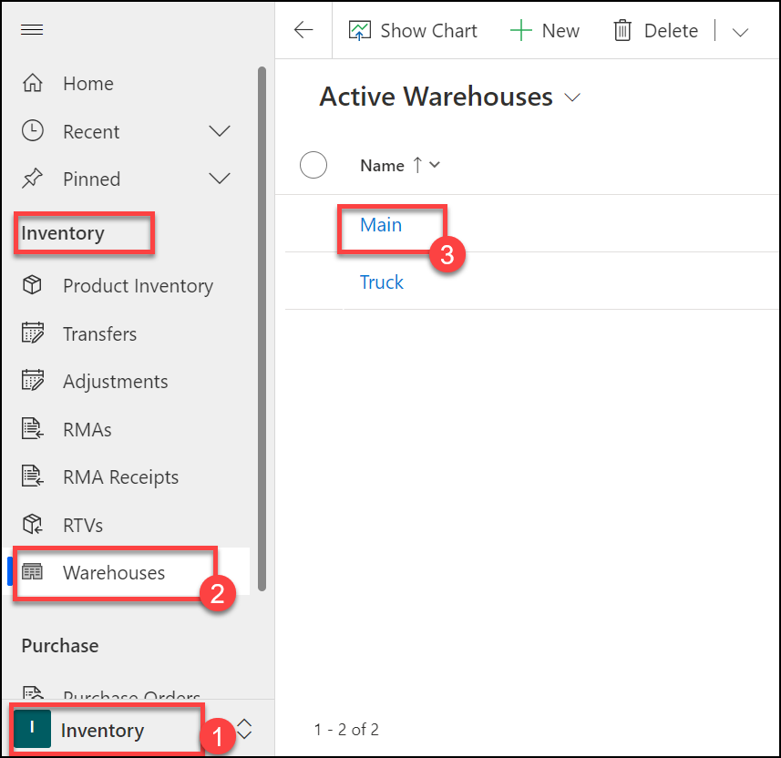
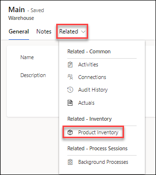
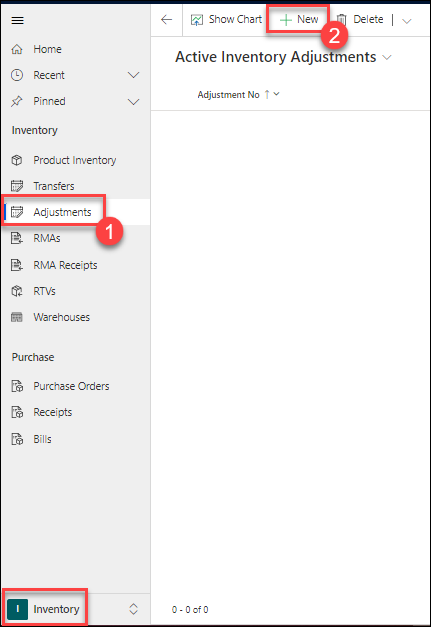
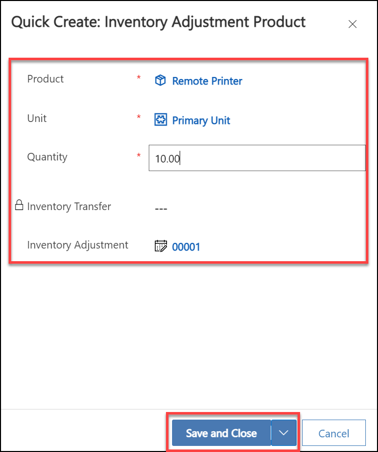
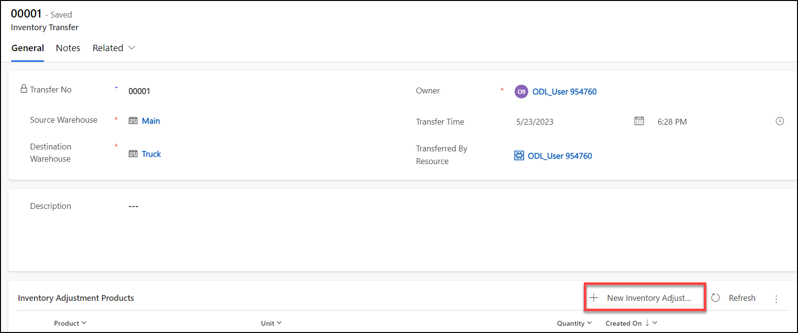
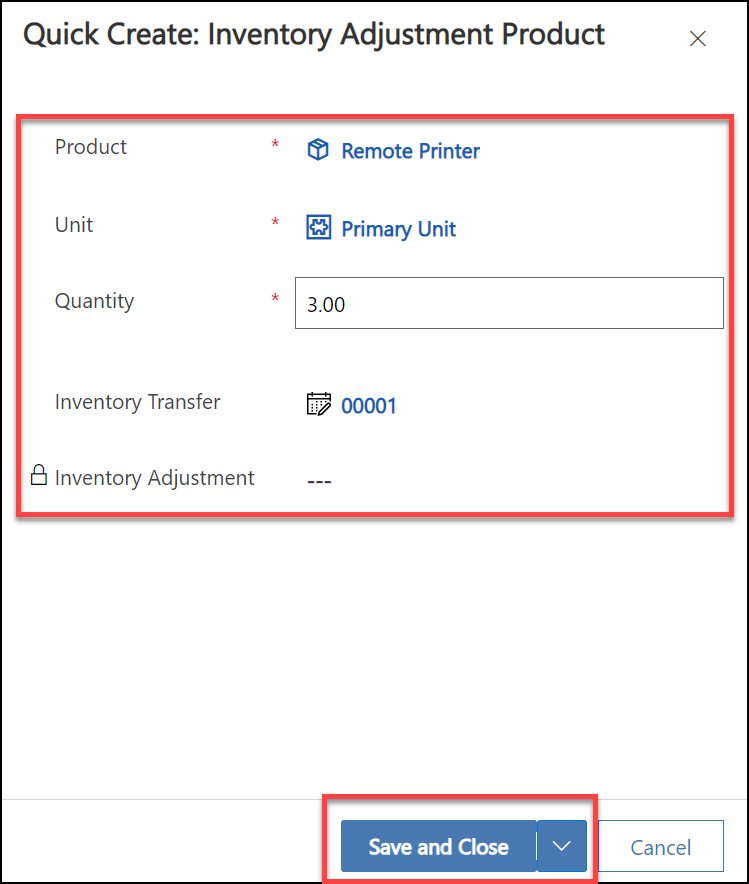

# Practice Lab 11 - Inventory

## Lab scenario
Exploring and practice inventory tracking in Microsoft Dynamics 365. The focus will be on effectively managing and monitoring inventory levels, movements, and transactions within the Dynamics 365 environment, learn how to create and manage products, set up warehouses, perform stock transfers, record adjustments, and generate inventory reports.

## Lab objective
In this lab, you will perform:
+ Exercise 1 – Manage inventory

## Estimated timing: 10 minutes

## Exercise 1 – Manage inventory

In this exercise, you will add inventory to a warehouse and then transfer it to a truck.

### Task 1 – Setup inventory in Warehouse

1. In the **Dynamics 365 Field Service app**, click the **Inventory (1)** area in the bottom-left of the sitemap, and in the **Inventory (2)** group select **Warehouses (3)**.

1. Edit the **Main (4)** warehouse.

    

1. Click **Related** and select **Product Inventory**.

   

1. Click **+ New Product Inventory**.

1. Select the **Remote Printer** product you created in a previous lab for **Product**.

1. Select the **Primary Unit** for **Unit**.

1. Click **Save & Close**

### Task 2 – Inventory adjustment

1. In the **Dynamics 365 Field Service app**, click the **Inventory** area in the bottom-left of the sitemap, and in the **Inventory** group select **Adjustments (1)**.

1. Click **+ New (2)**.

    

1. Select **Main** for **Warehouse**.

1. Click **Save**.

1. Select the **Products** tab.

    

1. Click **+ New Inventory Adjustment Product**.

1. Select the **Remote Printer** product you created in a previous lab for **Product**.

1. Select the **Primary Unit** for **Unit**.

1. Enter **10** for **Quantity**.

1. Click **Save and Close**.

    

1. Click **Save & Close** from the command bar.

> **Congratulations** on completing the task! Now, it's time to validate it. Here are the steps:
> - Select the **Lab Validation** tab located at the upper right corner of the lab guide section.
> - Hit the Validate button for the corresponding task. If you receive a success message, you can proceed to the next task. 
> - If not, carefully read the error message and retry the step, following the instructions in the lab guide.
> - If you need any assistance, please contact us at labs-support@spektrasystems.com. We are available 24/7 to help you out.

### Task 3 – Inventory transfer

1. In the **Dynamics 365 Field Service app**, click the **Inventory** area in the bottom-left of the sitemap, and in the **Inventory** group select **Transfers**.

1. Click **+ New**.

1. Select **Main** for **Source Warehouse**.

1. Select **Truck** for **Destination Warehouse**.

1. Click **Save**.

1. Click **+ New Inventory Adjustment Product**.

    

1. Select the **Remote Printer** product you created in a previous lab for **Product**.

1. Select the **Primary Unit** for **Unit**.

1. Enter **3** for **Quantity**.

1. Click **Save and Close**.

    

1. Click **Save & Close** from the command bar.

1. In the **Dynamics 365 Field Service app**, click the **Inventory** area in the bottom-left of the sitemap, and in the **Inventory** group select **Product Inventory** and review the inventory lines.

**Result:** You have successfully added an inventory to a warehouse and then transferred it to a truck.

### Review
In this lab, you have completed:
- Setup inventory in Warehouse
- Inventory adjustment and Inventory transfer

### **Proceed with the next Lab.**
