# Practice Lab 12 - Customer assets

Customer assets in Dynamics 365, businesses can improve their ability to deliver high-quality service to their customers. They can also gather data on asset performance, which can be used to identify trends and make informed decisions about future service and maintenance schedules.

   >Note: The **[DeploymentId]/[DID] can be found under the environment details tab in the user name (example: `odl_user_xxxxxx.onmicrosoft.com`) **xxxxxx** is the [DeploymentID]**.

## Exercise 1 – Convert product to customer asset

In this exercise you will set the products to convert to customer assets.

### Task 1 – Product settings

1. In the **Dynamics 365 Field Service app**, click the **Settings** area in the bottom-left of the sitemap, and in the **General** group select **Products**.

1. Edit the **odl_user_DID_Remote Printer** product you created in an earlier lab.

    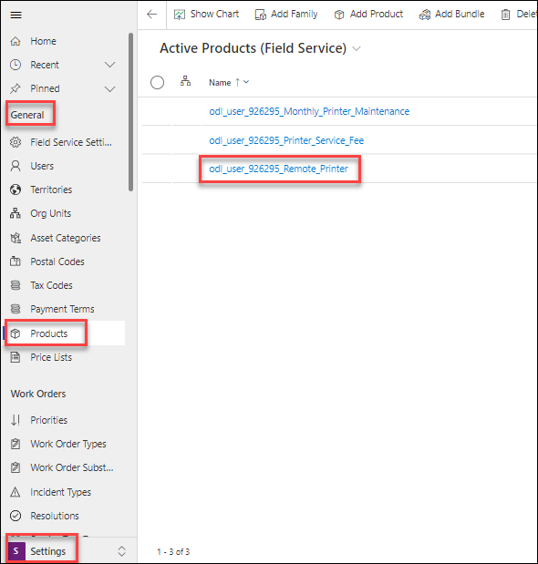

1. Select the **Field Service** tab.

1. Select **Yes** from the **Convert to Customer Asset** drop-down field.

1. Click **Save & Close**.

    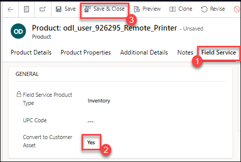

## Exercise 2 – Create assets

In this exercise you will create the assets for a customer.

### Task 1 – Asset categories

1. In the **Dynamics 365 Field Service app**, click the **Settings** area in the bottom-left of the sitemap, and in the **General** group select **Asset Categories**.

1. Click **+ New**.

    

1. Enter **odl_user_DID_Printer** for **Name**.

1. Click **Save & Close**.

    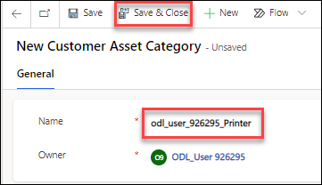

1. In the **Dynamics 365 Field Service app**, click the **Settings** area in the bottom-left of the sitemap, and in the **Asset Properties** group select **Property Definitions**.

1. Click **+ New**.

    

1. Enter **odl_user_DID_Model** for **Name**.

1. Select **String** from the **Property Type** drop-down field.

1. Click **Save & Close**.

1. In the **Dynamics 365 Field Service app**, click the **Settings** area in the bottom-left of the sitemap, and in the **Asset Properties** group select **Templates for Properties**.

1. Click **+ New**.

1. Enter **odl_user_DID_Printer Properties** for **Name**.

1. Click **Save**.

    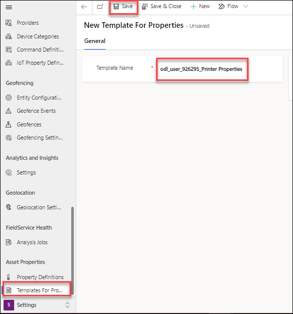

1. Click **+ New Property Template Association**.

    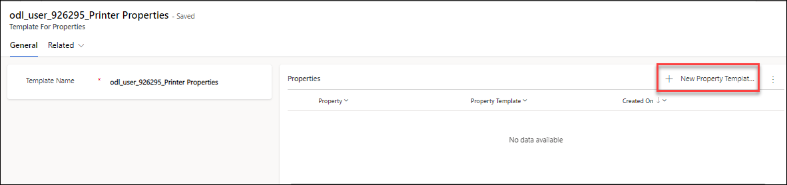

1. Select the **odl_user_DID_Model** property definition you created for **Property**.

1. Click **Save and Close**.

1. Click **+ New Asset Category Template Association**.

1. Select the **odl_user_DID_Printer** asset category you created for **Customer Asset Category**.

1. Click **Save and Close**.

1. Click **Save & Close**.

    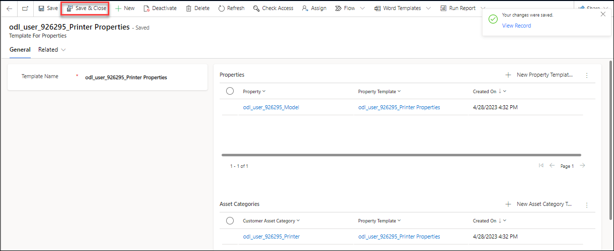

### Task 2 – Assets

1. In the **Dynamics 365 Field Service app**, click the **Service** area in the bottom-left of the sitemap, and in the **Assets** group select **Assets**.

1. Click **+ New**.

    

1. Enter **odl_user_DID_Printer_122333** for **Name**.

1. Select the **odl_user_DID_Printer** asset category you created for **Category**.

1. Select the **odl_user_DID_Remote_Printer** product you created in an earlier lab for **Product**.

1. Select the **odl_user_DID_Relecloud** account you created in an earlier lab for **Account**.

1. Click **Save & Close**.

    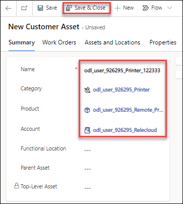

### Task 3 – Asset hierarchy

1. In the **Dynamics 365 Field Service app**, click the **Service** area in the bottom-left of the sitemap, and in the **Assets** group select **Assets**.

1. Click **+ New**.

1. Enter **odl_user_DID_Printer_Drum_122333** for **Name**.

1. Select the **odl_user_DID_Printer** asset category you created for **Category**.

1. Select the **odl_user_DID_Relecloud** account you created in an earlier lab for **Account**.

1. Select the **odl_user_DID_Printer_122333** asset you created **Parent Asset**.

1. Click **Save & Close**.

1. Click **+ New**.

1. Enter **odl_user_DID_Printer_Fuser_Unit_122333** for **Name**.

1. Select the **odl_user_DID_Printer** asset category you created for **Category**.

1. Select the **odl_user_DID_Relecloud** account you created in an earlier lab for **Account**.

1. Select the **odl_user_DID_Printer_122333** asset you created **Parent Asset**.

1. Click **Save & Close**.

    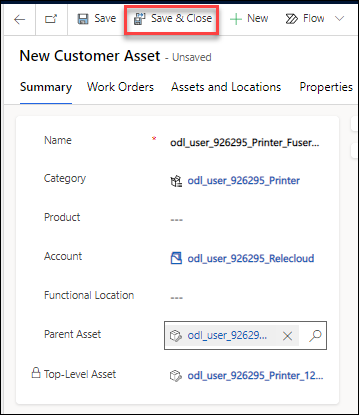

## Exercise 3 – Functional locations

In this exercise you will create functional locations for an account and associate assets with the locations.

### Task 1 – Create functional locations

1. In the **Dynamics 365 Field Service app**, click the **Service** area in the bottom-left of the sitemap, and in the **Customers** group select **Accounts**.

1. Open the **odl_user_DID_Relecloud** account you created in an earlier lab.

1. Select the **Assets and Locations** tab.

1. Click on the ellipsis (...) alongside **odl_user_DID_Relecloud** and select + **New location**.

    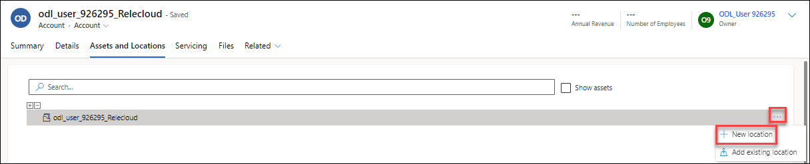

1. Enter **odl_user_DID_Advanta_A** for **Name**.

1. Click on the pencil icon and enter **3009 160th Avenue Southeast, Bellevue, WA 98008, USA** for Address.

1. Click **Save and Close**.

    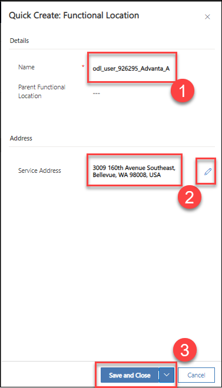

1. Click on the ellipsis (...) alongside **odl_user_DID_Relecloud** and select + **New location**.

1. Enter **odl_user_DID_Advanta_B** for **Name**.

1. Click on the pencil icon and enter **3007 160th Ave SE, Bellevue, WA 98008, USA** for Address.

1. Click **Save and Close**.

1. Click on the ellipsis (...) alongside **odl_user_DID_Relecloud** and select + **New location**.

1. Enter **odl_user_DID_Advanta_C** for **Name**.

1. Click on the pencil icon and enter **3005 160th Ave SE, Bellevue, WA 98008, USA** for Address.

1. Click **Save and Close**.

    

1. In the **Dynamics 365 Field Service app**, click the **Service** area in the bottom-left of the sitemap, and in the **Assets** group select **Functional Locations**.

1. Verify that the functional locations have latitude and longitude set.

    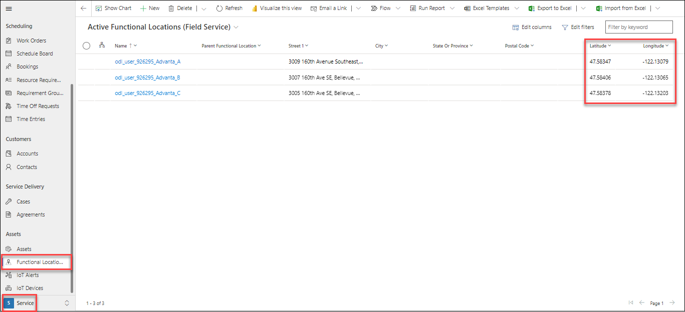

### Task 2 – Associate assets with functional locations

1. In the **Dynamics 365 Field Service app**, click the **Service** area in the bottom-left of the sitemap, and in the **Customers** group select **Accounts**.

1. Open the **odl_user_DID_Relecloud** account you created in an earlier lab.

1. Select the **Assets and Locations** tab.

1. Select the check box **Show Assets**

1. Drag the **odl_user_DID_Printer_122333** asset you created in Exercise 2 to **odl_user_DID_Advanta_B**.

    

## Exercise 4 – Associate assets with work orders

In this exercise you will create a work order linked to the customer asset and functional location.

### Task 1 – Create work order with a customer asset

1. In the **Dynamics 365 Field Service app**, click the **Service** area in the bottom-left of the sitemap, and in the **Scheduling** group select **Work Orders**.

1. Click **+ New**.

1. Select the **odl_user_DID_Relecloud** account you created in an earlier lab for **Service Account**.

1. Select the **odl_user_DID_Service_Printer** incident type you created in a previous lab for **Primary Incident Type**.

1. Select the **odl_user_DID_Printer_122333** asset you created for **Primary Incident Customer Asset**.

1. Click **Save**.

    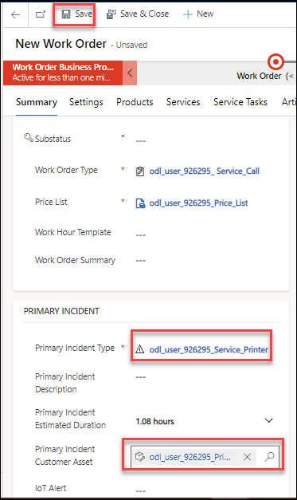

1. Select the **Location** tab and verify the address has been copied from the functional location.

1. Select the **Products** tab.

1. Open the work order product and in the **General** tab, verify the customer asset is populated.

    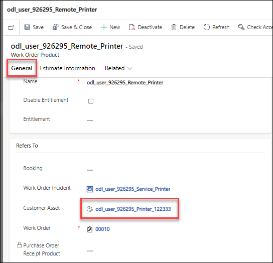
