# Practice Lab 12 - Customer assets

Customer assets in Dynamics 365, businesses can improve their ability to deliver high-quality service to their customers. They can also gather data on asset performance, which can be used to identify trends and make informed decisions about future service and maintenance schedules.

## Estimated timing: 30 minutes

## Exercise 1 – Convert product to customer asset

In this exercise, you will set the products to convert to customer assets.

### Task 1 – Product settings

1. In the **Dynamics 365 Field Service app**, click the **Settings** area in the bottom-left of the sitemap, and in the **General** group select **Products**.

1. Edit the **Remote Printer** product you created in an earlier lab.

    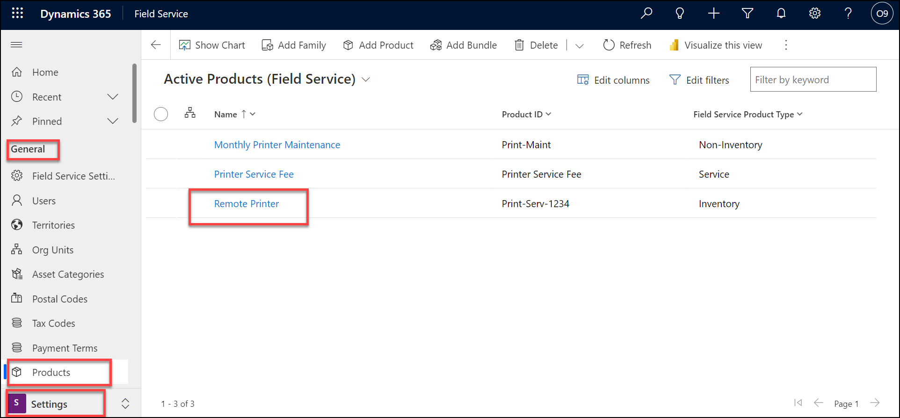

1. Select the **Field Service** tab.

1. Select **Yes** from the **Convert to Customer Asset** drop-down field.

1. Click **Save & Close**.

    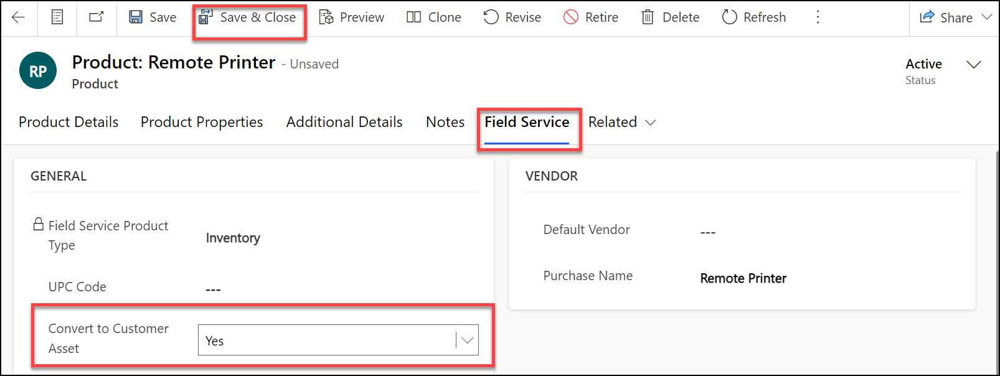

## Exercise 2 – Create assets

In this exercise, you will create the assets for a customer.

### Task 1 – Asset categories

1. In the **Dynamics 365 Field Service app**, click the **Settings** area in the bottom-left of the sitemap, and in the **General** group select **Asset Categories**.

1. Click **+ New**.

    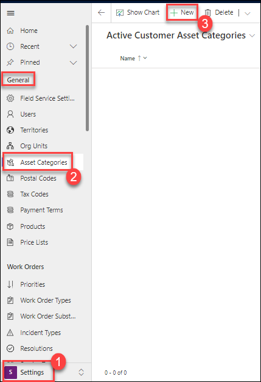

1. Enter **Printer** for **Name**.

1. Click **Save & Close**.

    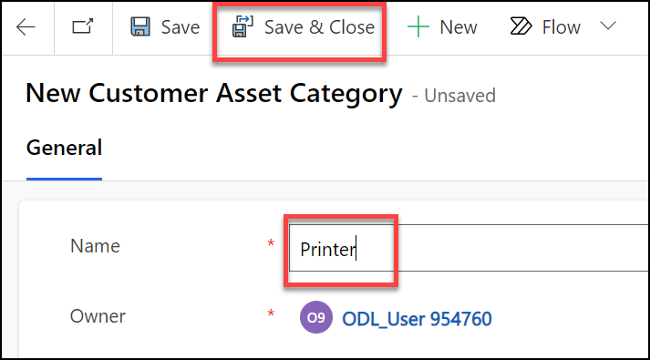

1. In the **Dynamics 365 Field Service app**, click the **Settings** area in the bottom-left of the sitemap, and in the **Asset Properties** group select **Property Definitions**.

1. Click **+ New**.

    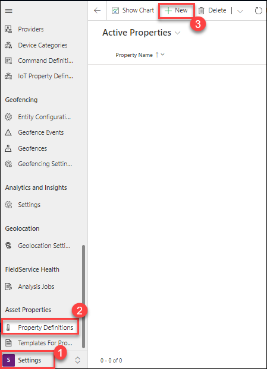

1. Enter **Model** for **Name**.

1. Select **String** from the **Property Type** drop-down field.

1. Click **Save & Close**.

1. In the **Dynamics 365 Field Service app**, click the **Settings** area in the bottom-left of the sitemap, and in the **Asset Properties** group select **Templates for Properties**.

1. Click **+ New**.

1. Enter **Printer Properties** for **Name**.

1. Click **Save**.

    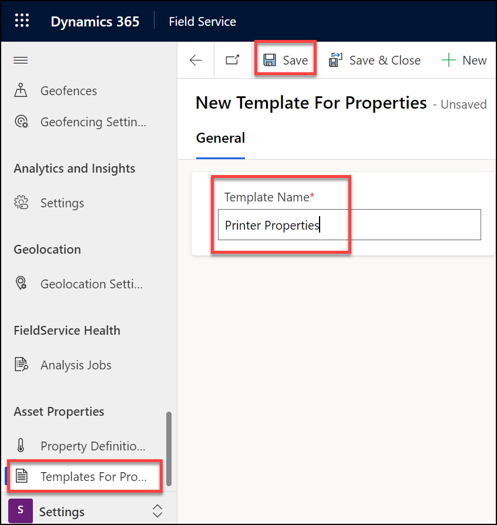

1. Click **+ New Property Template Association**.

    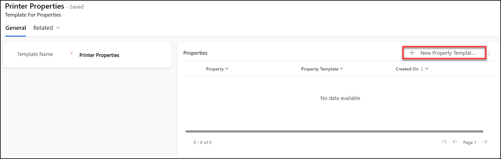

1. Select the **Model** property definition you created for **Property**.

1. Click **Save and Close**.

1. Click **+ New Asset Category Template Association**.

1. Select the **Printer** asset category you created for **Customer Asset Category**.

1. Click **Save and Close**.

1. Click **Save & Close**.

    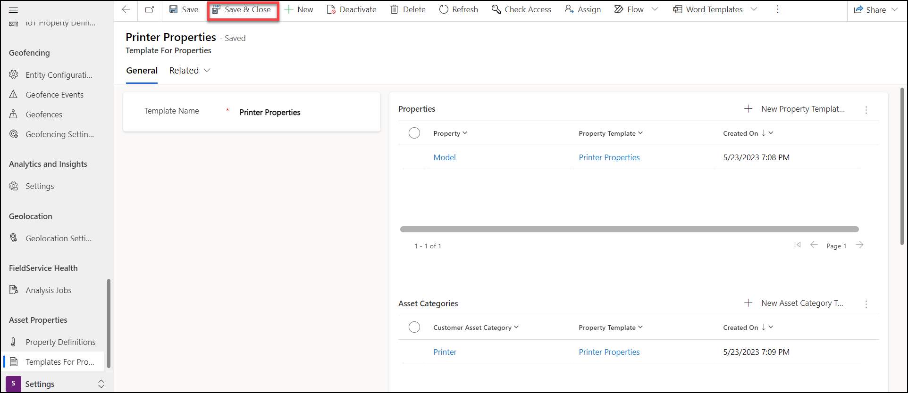

### Task 2 – Assets

1. In the **Dynamics 365 Field Service app**, click the **Service** area in the bottom-left of the sitemap, and in the **Assets** group select **Assets**.

1. Click **+ New**.

    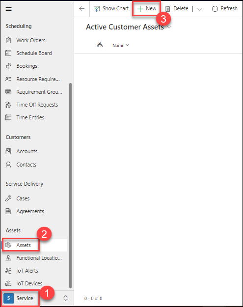

1. Enter **Printer 122333** for **Name**.

1. Select the **Printer** asset category you created for **Category**.

1. Select the **Remote Printer** product you created in an earlier lab for **Product**.

1. Select the **Relecloud** account you created in an earlier lab for **Account**.

1. Click **Save & Close**.

    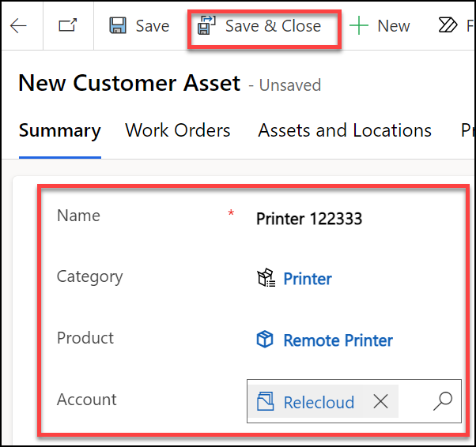

> **Congratulations** on completing the task! Now, it's time to validate it. Here are the steps:
> - Select the **Lab Validation** tab located at the upper right corner of the lab guide section.
> - Hit the Validate button for the corresponding task. If you receive a success message, you can proceed to the next task. 
> - If not, carefully read the error message and retry the step, following the instructions in the lab guide.
> - If you need any assistance, please contact us at labs-support@spektrasystems.com. We are available 24/7 to help you out.

### Task 3 – Asset hierarchy

1. In the **Dynamics 365 Field Service app**, click the **Service** area in the bottom-left of the sitemap, and in the **Assets** group select **Assets**.

1. Click **+ New**.

1. Enter **Printer Drum 122333** for **Name**.

1. Select the **Printer** asset category you created for **Category**.

1. Select the **Relecloud** account you created in an earlier lab for **Account**.

1. Select the **Printer 122333** asset you created **Parent Asset**.

1. Click **Save & Close**.

1. Click **+ New**.

1. Enter **Printer Fuser Unit 122333** for **Name**.

1. Select the **Printer** asset category you created for **Category**.

1. Select the **Relecloud** account you created in an earlier lab for **Account**.

1. Select the **Printer 122333** asset you created **Parent Asset**.

1. Click **Save & Close**.

    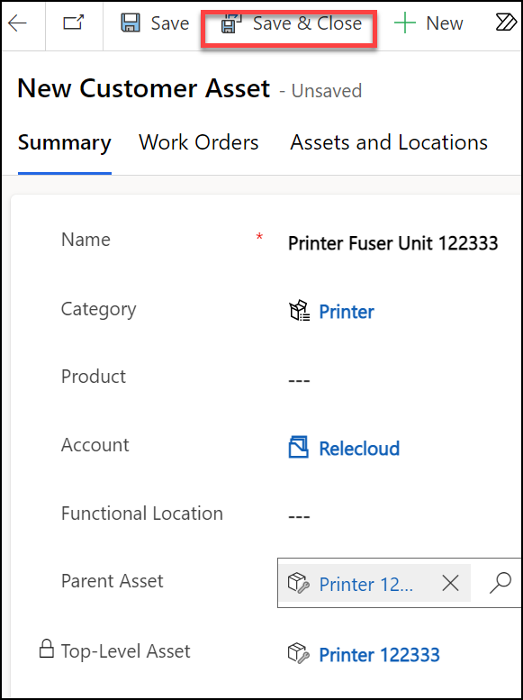

## Exercise 3 – Functional locations

In this exercise, you will create functional locations for an account and associate assets with the locations.

### Task 1 – Create functional locations

1. In the **Dynamics 365 Field Service app**, click the **Service** area in the bottom-left of the sitemap, and in the **Customers** group select **Accounts**.

1. Open the **Relecloud** account you created in an earlier lab.

1. Select the **Assets and Locations** tab.

1. Click on the ellipsis (...) alongside **Relecloud** and select + **New location**.

    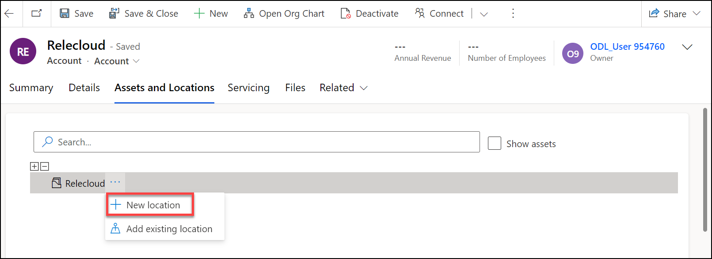

1. Enter **Advanta A** for **Name**.

1. Click on the pencil icon and enter **3009 160th Avenue Southeast, Bellevue, WA 98008, USA** for Address.

1. Click **Save and Close**.

    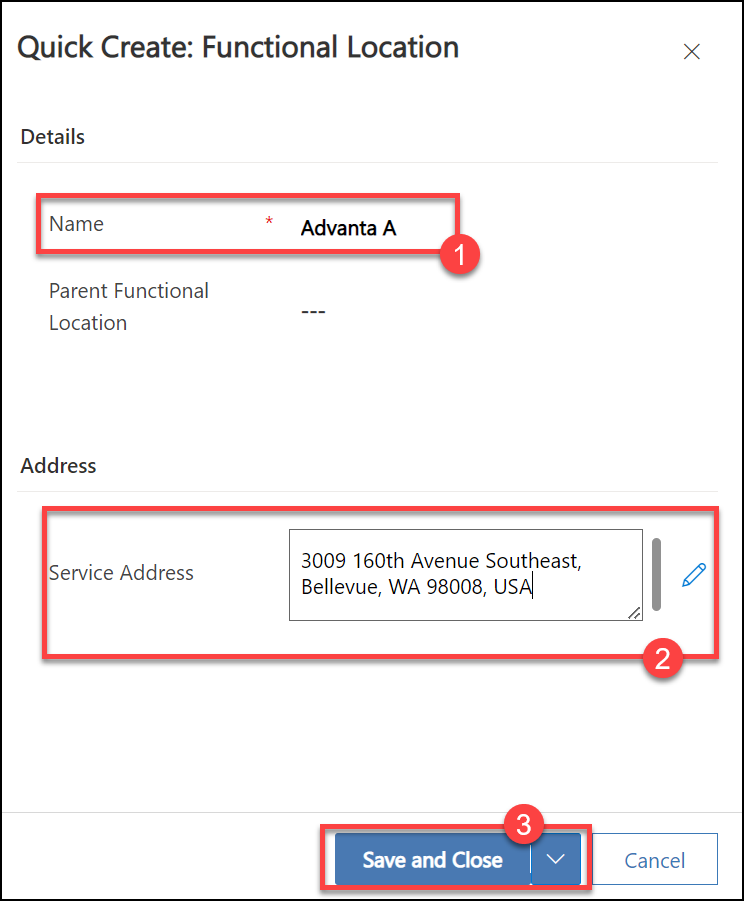

1. Click on the ellipsis (...) alongside **Relecloud** and select + **New location**.

1. Enter **Advanta B** for **Name**.

1. Click on the pencil icon and enter **3007 160th Ave SE, Bellevue, WA 98008, USA** for Address.

1. Click **Save and Close**.

1. Click on the ellipsis (...) alongside **Relecloud** and select + **New location**.

1. Enter **Advanta C** for **Name**.

1. Click on the pencil icon and enter **3005 160th Ave SE, Bellevue, WA 98008, USA** for Address.

1. Click **Save and Close**.

    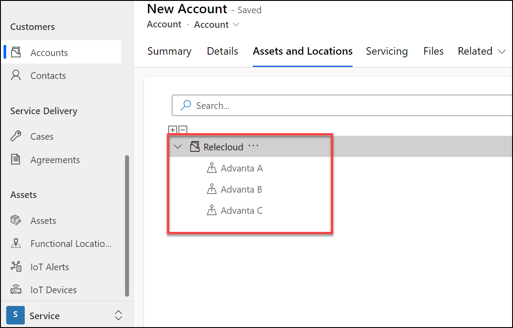

1. In the **Dynamics 365 Field Service app**, click the **Service** area in the bottom-left of the sitemap, and in the **Assets** group select **Functional Locations**.

1. Verify that the functional locations have latitude and longitude set.

    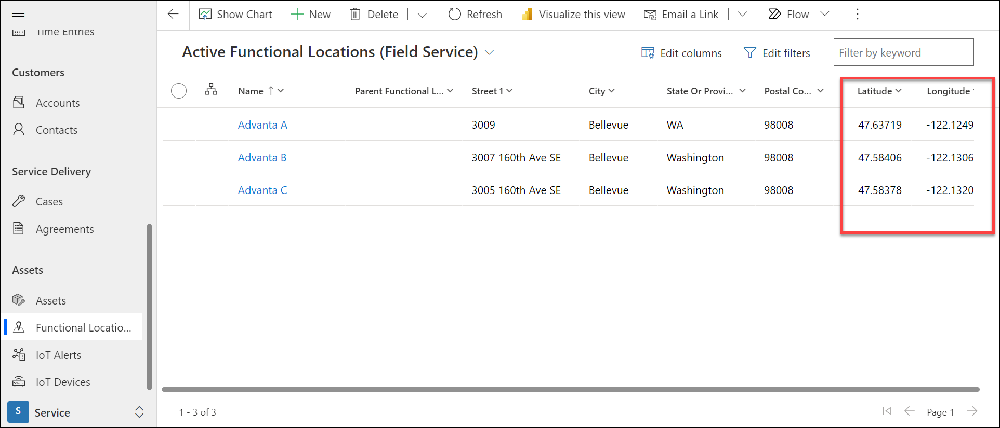

> **Congratulations** on completing the task! Now, it's time to validate it. Here are the steps:
> - Select the **Lab Validation** tab located at the upper right corner of the lab guide section.
> - Hit the Validate button for the corresponding task. If you receive a success message, you can proceed to the next task. 
> - If not, carefully read the error message and retry the step, following the instructions in the lab guide.
> - If you need any assistance, please contact us at labs-support@spektrasystems.com. We are available 24/7 to help you out.

### Task 2 – Associate assets with functional locations

1. In the **Dynamics 365 Field Service app**, click the **Service** area in the bottom-left of the sitemap, and in the **Customers** group select **Accounts**.

1. Open the **Relecloud** account you created in an earlier lab.

1. Select the **Assets and Locations** tab.

1. Select the check box **Show Assets**

1. Drag the **Printer 122333** asset you created in Exercise 2 to **Advanta B**.

    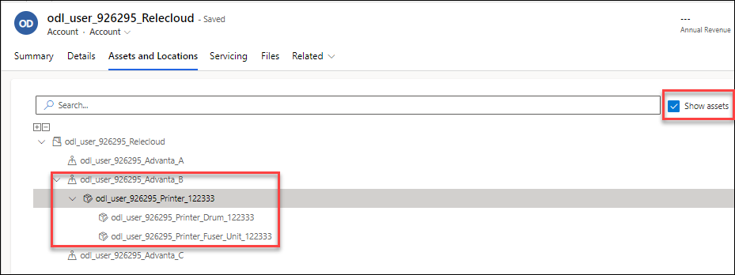

## Exercise 4 – Associate assets with work orders

In this exercise, you will create a work order linked to the customer asset and functional location.

### Task 1 – Create work order with a customer asset

1. In the **Dynamics 365 Field Service app**, click the **Service** area in the bottom-left of the sitemap, and in the **Scheduling** group select **Work Orders**.

1. Click **+ New**.

1. Select the **Relecloud** account you created in an earlier lab for **Service Account**.

1. Select the **Service Printer** incident type you created in a previous lab for **Primary Incident Type**.

1. Select the **Printer 122333** asset you created for **Primary Incident Customer Asset**.

1. Click **Save**.

    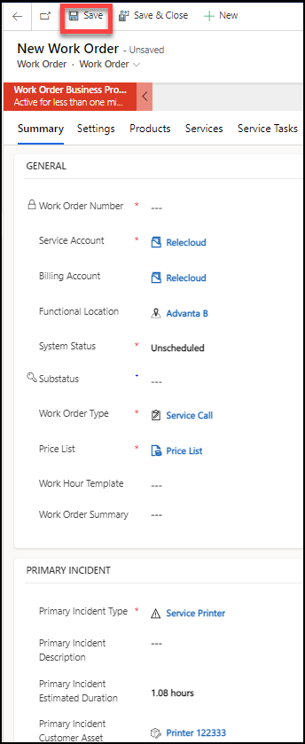

1. Select the **Location** tab and verify the address has been copied from the functional location.

1. Select the **Products** tab.

1. Open the work order product and in the **General** tab, verify the customer asset is populated.

**Result:** You have successfully learned how to convert products to customer assets and created assets. Also, you have created functional locations. Finally, you have created work orders and linked them to the customer asset and functional location.

### **Proceed with the next Lab.**
