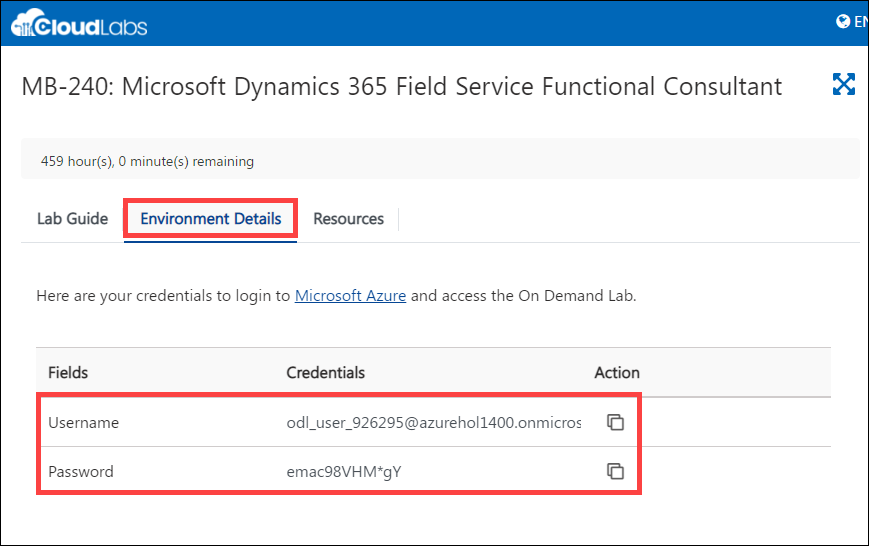
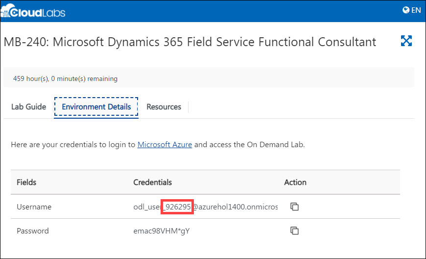
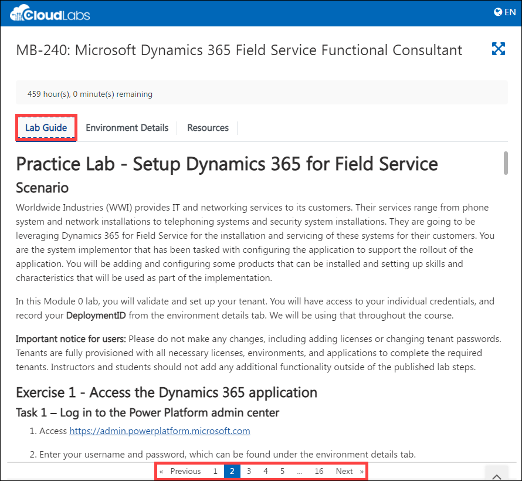

# Getting Started

1. Select the **Environment Details** tab. This contains your user credentials for the lab.

    **Username:** <inject key="AzureAdUserEmail" />

    **Password:** <inject key="AzureAdUserPassword" />

    

1. The **[DeploymentId]/[DID]** can be found under the environment details tab in the user name (example: `odl_user_xxxxxx.onmicrosoft.com`) **xxxxxx** is the **[DeploymentID]**.

    

1. The **Lab Guide** tab contains the instructions for the lab. You will be using it throughout the workshop to perform the lab. Click on Next from the bottom right and follow the instructions to perform the lab.

    
